# Devlog

Screenshots from building Exiled Casual with Claude Code, in order. Each shot is the
visible result of one slice of work. The early days are the sim and character; the later
ones are the HUD and items. Also posted as a running "Day N" series on
[r/ClaudeAI](https://www.reddit.com/r/ClaudeAI/comments/1v4nqeh).

For the design behind each step see [`../docs/specs/`](../docs/specs/) and the
implementation plans in [`../docs/plans/`](../docs/plans/).

## 2026-07-20 - a character that moves

The box actor becomes a real rigged humanoid, animated and lit.

<table>
<tr>
<td width="33%">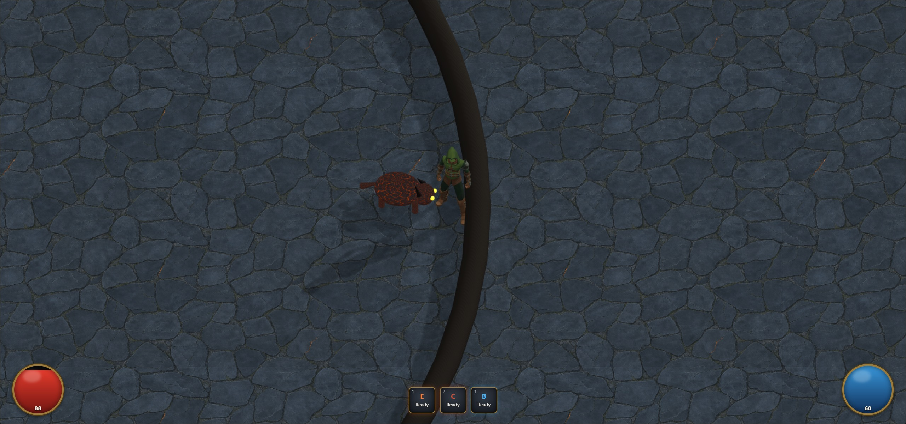 <b>Rigged player</b> - a CC0 Quaternius character replaces the primitive box actor.</td>
<td width="33%">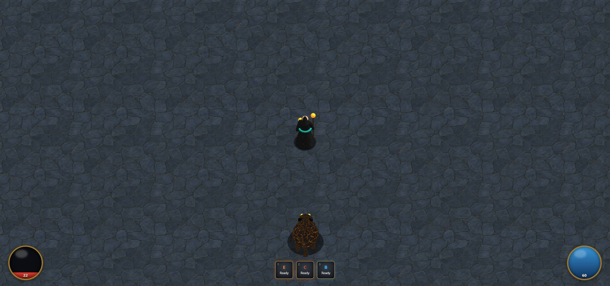 <b>Walk cycle</b> - animation clips from the Universal Animation Library retargeted onto the rig by bone name.</td>
<td width="33%"> <b>Skinned actors under lighting</b> - multiple skinned actors, zoomed in to check shading.</td>
</tr>
<tr>
<td width="33%"> <b>Cast shadows</b> - real-time shadows grounding the actors in the scene.</td>
<td width="33%"> <b>Run loop and portals</b> - the map run loop with entry/exit portals.</td>
<td width="33%">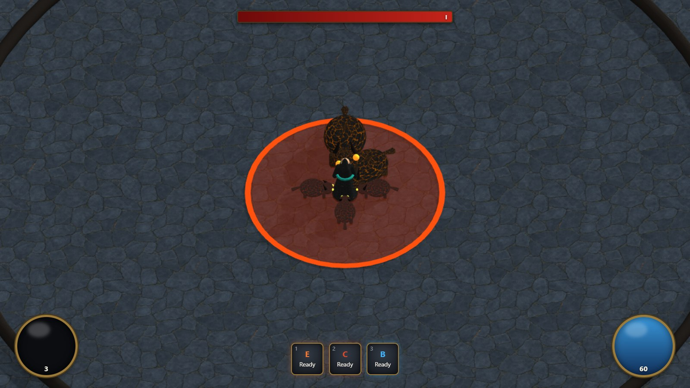 <b>Boss telegraph</b> - a readable ground telegraph before a boss attack lands.</td>
</tr>
<tr>
<td width="33%">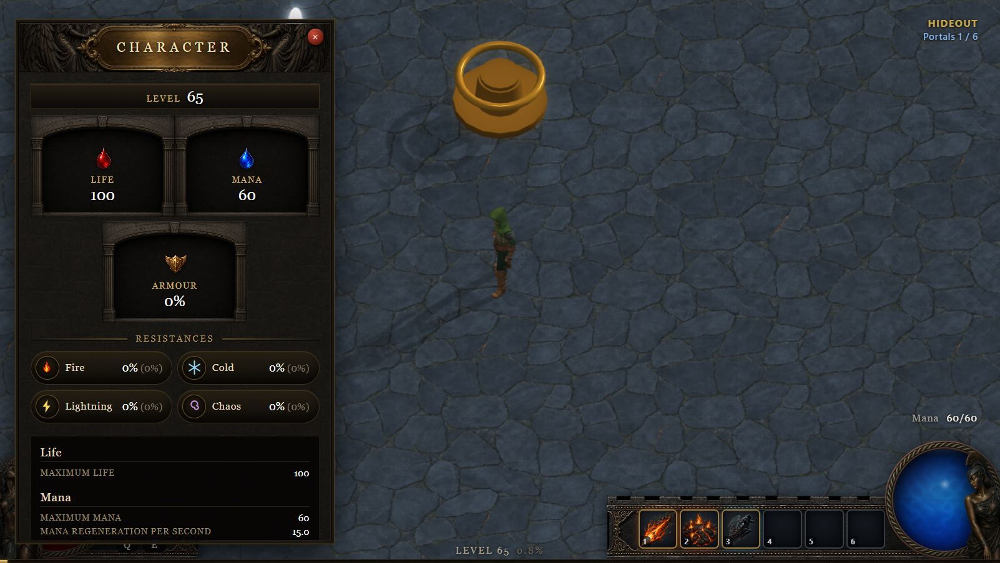 <b>The character starts keeping score</b> - the protocol had no level and no experience in it at all, so a kill paid nothing and every map was worth exactly as much as every other one. The character now starts at <code>65</code>, which is where PoE2 opens its endgame and, more to the point, the only level that makes sense in a game whose lowest area is already level 64: a level-1 character here would fight thirty levels above itself forever and the level-difference penalty would read as a permanent tax rather than a choice. A kill is worth its area level, times eight for a rare and forty for a boss, after PoE's penalty for the gap between your level and the area's - symmetric, so farming a tier you have outgrown pays as badly as overreaching one, which is the whole reason the Atlas has tiers. That penalty is what the next slice needs: with sustain and node tiers, pushing deeper becomes the way to keep earning rather than a flavour choice. Levelling itself grants little, six life and two mana, because gear is where this game's power lives and a percentage would compound with every affix; it enters the stat fold as two ordinary flat mods, so a level and a chest piece are added by the same code and cannot drift apart. The bar is the thin trough across the very bottom edge that both PoE games use - the one bar you are never meant to look at directly - with the level printed in the gap between the two panels, and the sheet takes the reference's identity plate (<code>character-stats.png</code>: "Level 80 Invoker"), minus the portrait, the class and the league, since there is one of each.</td>
</tr>
<tr>
<td width="33%">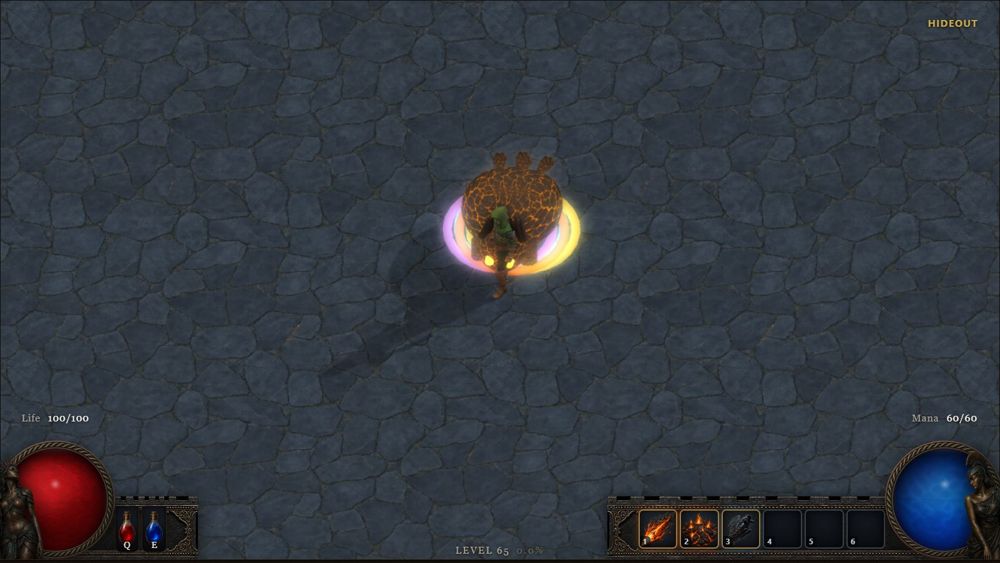 <b>A rare says which resistance it wants</b> - every rare converts its whole hit to one element and resists that element, so the answer to a pack is decided before it reaches you, and nothing on screen said which answer. It was the same orange imp whether it was about to hit for cold or for chaos, which quietly made the four numbers on the character sheet a guess. Each rare now stands in a ring lit with its element: fire orange, cold blue, lightning yellow, chaos violet, the same tints the sheet gives its resistance glyphs. On the floor rather than around the body, because an isometric camera eats a body glow and a ground ring survives it - all four themes are stacked on one tile in the shot, which is the lab walking the templates one press at a time. The ring is held at 0.6 emissive: at full strength the scene's glow layer bloomed every colour to the same white band, which is a tell that tells you nothing. The material is per-rare rather than shared by mesh kind, so two rares on screen can disagree.</td>
</tr>
<tr>
<td width="33%">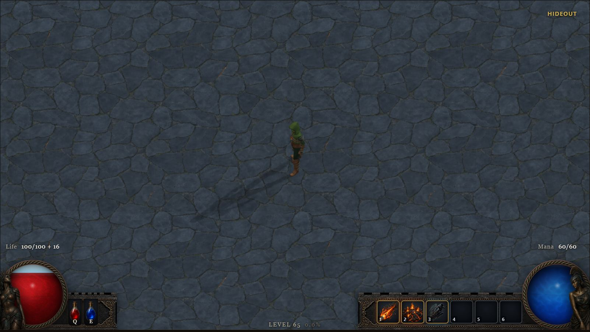 <b>Energy shield stops being a number on a tooltip</b> - two affixes rolled it, the tooltip printed it, the sheet had no row for it and the sim had no idea it existed: a Ghostly robe was a blank robe. It is now the pool it is supposed to be, on PoE2's numbers (<code>poe2wiki.net/wiki/Energy_Shield</code>): it takes a hit before life does, stops recharging for four seconds every time anything touches it, then refills at 12.5% of its maximum a second. That shape is the whole reason it is not just more life - life stays gone until a flask pays for it, energy shield is free but only if you can stop being hit for four seconds, which is a different question to ask of a fight. Chaos drains it at double rate, PoE2's rule and the one thing that stops a big shield from answering every element at once. On the globe it rides on top of the liquid the way PoE1 stacks it: the well holds life plus shield, and the pale band is the part a hit eats first, so the waterline still means "how much is left before you die". The readout says <code>100/100 + 16</code> rather than folding the two together. The sheet gets the reference's own energy-shield niche and a detail block with the recharge rate and delay, and both appear only when gear grants a pool - a row frozen at zero would advertise a mechanic switched off rather than a character with no shield gear. The crest is drawn rather than sprited: the icon sheet is a fixed 2x2 and a fifth stat would mean reflowing it for one glyph.</td>
</tr>
<tr>
<td width="33%">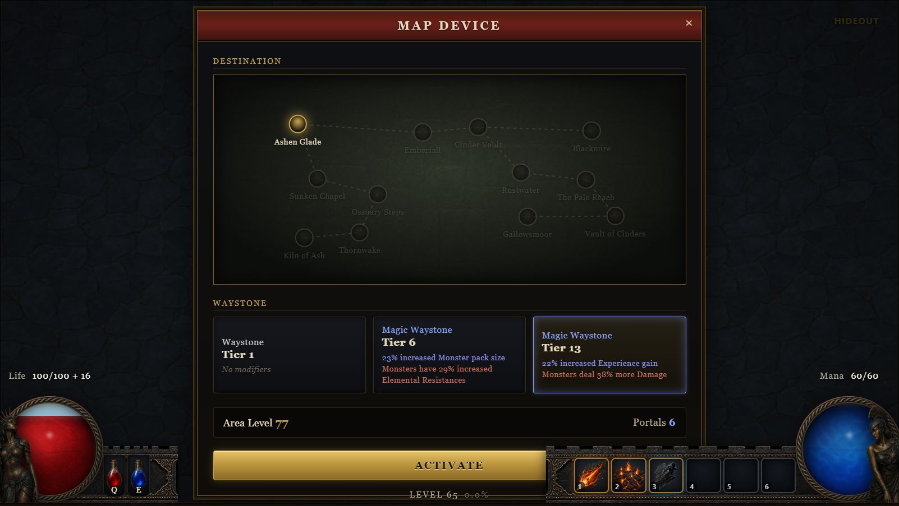 <b>A Waystone stops being a tier number</b> - three stones, distinguishable only by the tier printed on them, and the tier moved monster life and damage and nothing else: two runs of the same map were the same run. Stones now roll rarity and modifiers the way PoE does, on PoE's own 0 / 1+1 / 2+2 ladder - a normal stone is bare, a magic one carries one prefix and one suffix, a rare two of each - and the prefix/suffix split is load-bearing rather than decorative: <b>a prefix pays you and a suffix charges you</b>, so a rare stone is always both a better run and a harder one. Six modifiers, and every one of them changes what happens rather than what is printed: pack size puts more monsters on the layout's own sockets (the generator still owns where a fight can stand, so a big roll can never wedge one inside a wall), experience scales the kill after the level penalty, monster life and damage multiply onto the tier rather than adding to it, monsters gain elemental resistance against the element you brought, and the classic <code>Players have -X% to all Elemental Resistances</code> is taken on the way in and given back on the way out, because it is a property of where you are standing rather than of what you are wearing. The panel prints the lot before the portal opens - reward in the tooltip's affix blue, danger in red - which is what makes the middle stone a decision instead of a number. Rarity is rolled off the stone's own seed, not off its tier, which is what makes a low-tier rare worth keeping and a high-tier normal worth running when you are behind. The session stores one number, the stone's seed, and re-derives everything from it, so what the sim runs can never drift from what the Map Device showed.</td>
</tr>
<tr>
<td width="33%">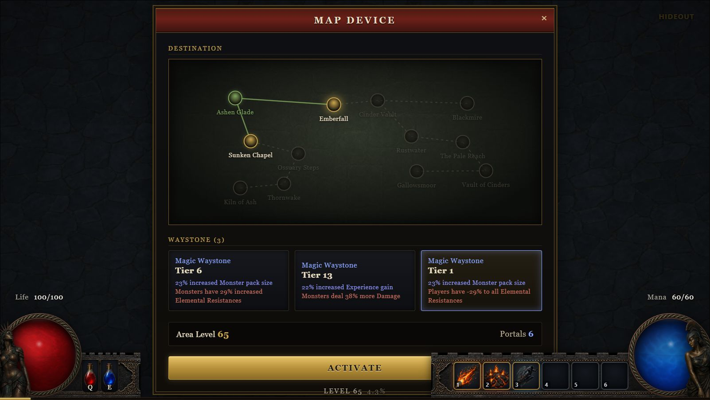 <b>Waystones become a resource instead of a menu</b> - the three stones were conjured from the atlas seed every time the device opened, which meant they were infinite, identical forever, and could never be spent. Nothing could be gated behind a tier either, because running out was impossible and therefore so was earning anything. A character now <i>owns</i> its stones: opening a map spends the one that opened it, and clearing a map hands stones back - one for a plain run, two for one taken on a stone that carried modifiers, the second a tier higher. That asymmetry is the whole loop: farming plain stones at your own tier is break-even and can be done forever, and the only way up is to take a stone that will hurt you. The shot is one full circuit - Ashen Glade cleared (green, its two neighbours now out of fog), the plain Tier 1 stone gone, and a Magic Tier 1 in its place that the clear paid out, carrying <code>23% increased Monster pack size</code> against <code>Players have -29% to all Elemental Resistances</code>. The session stores the stock and persists it, so a run survives a reload; the stone's id is its index in that stock and the sim re-resolves it against its own copy rather than trusting the client to name a stone the character does not have. Known gap: while a map is open the device refuses to reopen, so the stock cannot be inspected mid-run.</td>
</tr>
<tr>
<td width="33%">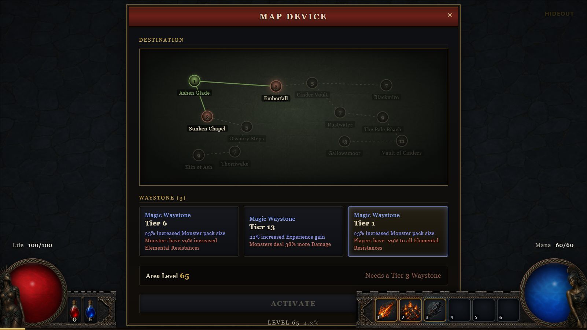 <b>The world gets a shape you have to earn</b> - the map drew twelve places, all equally open once the fog lifted, so a route was a matter of taste: any stone opened any place. Each place now demands a Waystone of its own tier, stamped in its medallion - one at the start, two more a hop, so the far corner of the world wants Tier 13 - which is what the reference's Atlas does and what turns a graph into progression rather than a set of doors. This could not have shipped before the previous slice: gating places behind tiers when the three starting stones were all a character would ever own was a way to hard-lock it, and only sustain (a cleared modified stone pays back a tier higher) makes the far side reachable by playing toward it. The medallion now has four states rather than three, because "out of fog" and "will not take the stone in your hand" are different problems and have to look like different problems: fog stays dim, an open place is gold, a cleared one green, and one that refuses the stone turns rust-red with the footer saying which tier it wants. Hovering any of them says the rest in a line. The rule lives in the sim as well as in the greyed-out button, like the fog does, because the client is untrusted - and a refused activation does not burn the stone. Two smaller fixes ride along: labels sit on a dark plate now (twelve places on a jittered grid means some seeds run a dashed route straight through a name), and the panel refuses to fire an intent the sim would only drop.</td>
</tr>
</table>

## 2026-07-21 - maps and a boss fight

Procedural interiors get walls and textures, and the Warden encounter takes shape.

<table>
<tr>
<td width="33%"> <b>Indoor mapgen wired in</b> - procedural indoor generation connected to the client.</td>
<td width="33%">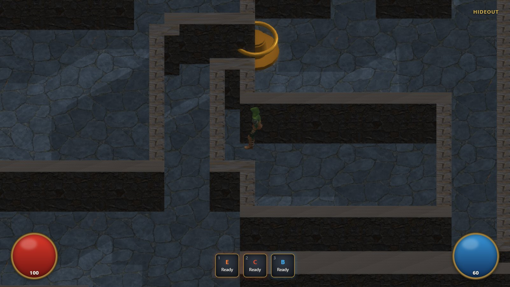 <b>Textured dungeon walls</b> - the boundary walls get color and normal maps.</td>
<td width="33%"> <b>Casting slows movement</b> - casting applies a per-skill movement penalty instead of freezing the legs.</td>
</tr>
<tr>
<td width="33%">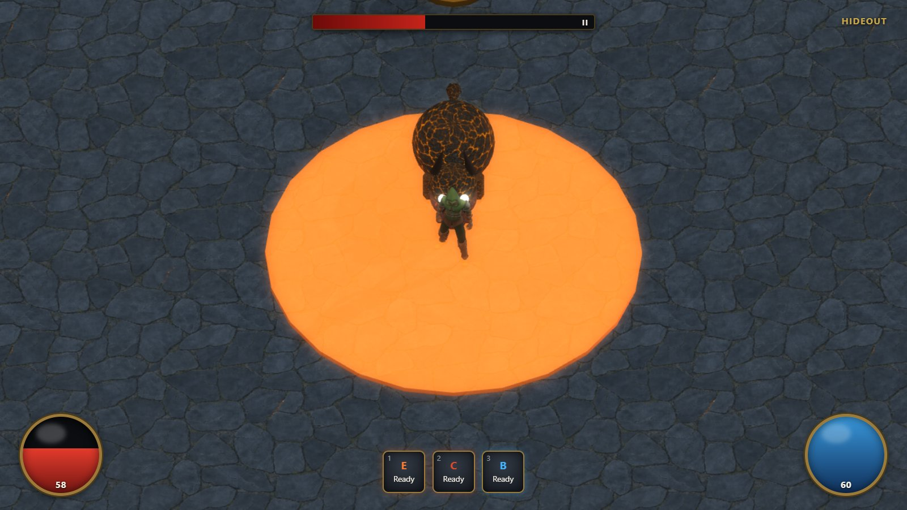 <b>Warden phase 2, burning slam</b> - the Warden boss in its second phase.</td>
<td width="33%"></td>
<td width="33%"></td>
</tr>
</table>

## 2026-07-22 - loot and preparation

Items start dropping, and the pre-map screen appears.

<table>
<tr>
<td width="33%"> <b>First loot</b> - item drops as server-authored world entities.</td>
<td width="33%">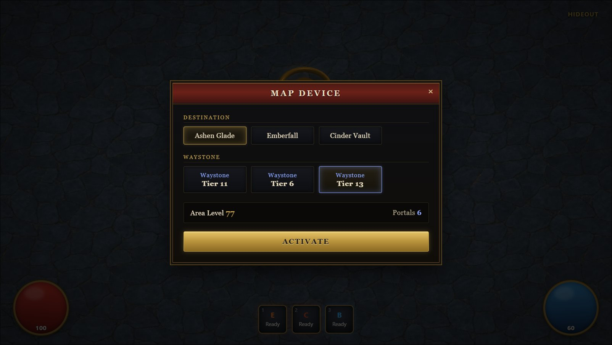 <b>Preparation panel</b> - the pre-run panel for setting up a map.</td>
<td width="33%"></td>
</tr>
</table>

## 2026-07-23 - the HUD comes together

Matching the Path of Exile 2 HUD against the reference screenshots.

<table>
<tr>
<td width="33%">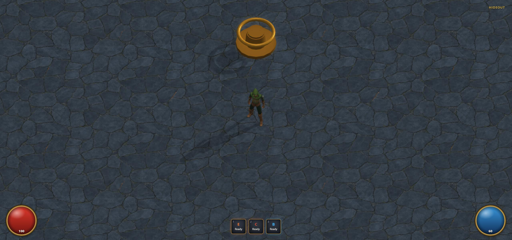 <b>Life and mana orbs</b> - glossy framed orbs beside the skill bar.</td>
<td width="33%"> <b>Flask row</b> - 3 life and 2 mana flasks next to the life orb, keys 1-5.</td>
<td width="33%">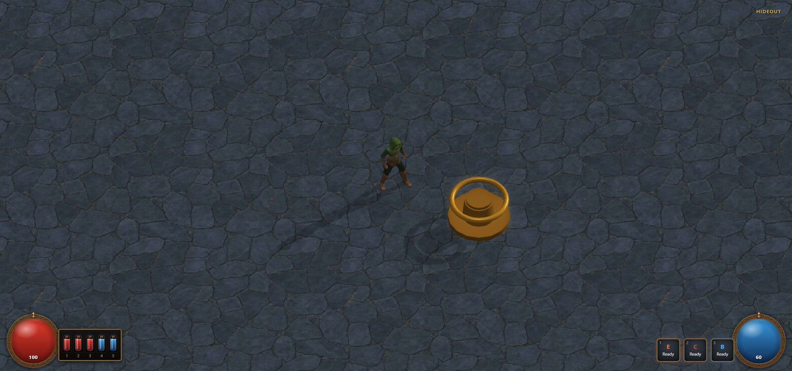 <b>Ornate orb frames</b> - generated gold filigree frames replacing the CSS bevel.</td>
</tr>
<tr>
<td width="33%"> <b>Item tooltip</b> - a full item tooltip with base stats and requirements.</td>
<td width="33%"></td>
<td width="33%"></td>
</tr>
</table>

## 2026-07-24 - uniques and item art

Named pool items land, and every base gets painted inventory art.

<table>
<tr>
<td width="33%">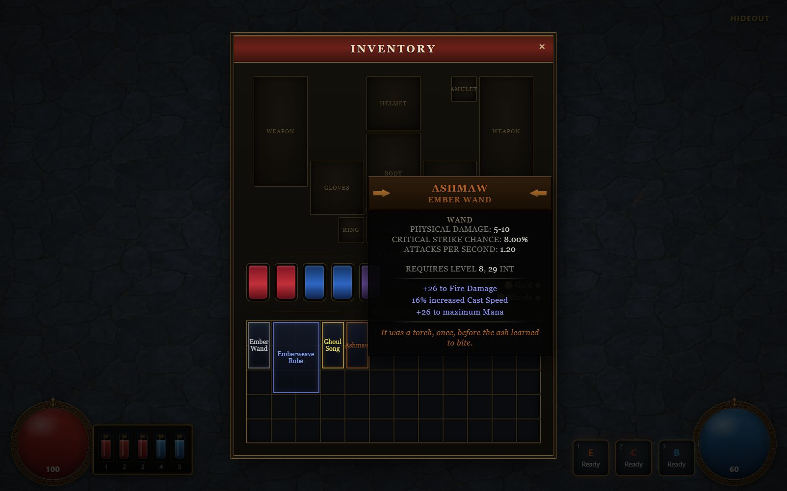 <b>Unique items</b> - Ashmaw, a named pool item with its own mods and flavour line. Numpad6 drops one debug item per press, cycling normal to magic to rare to unique.</td>
<td width="33%">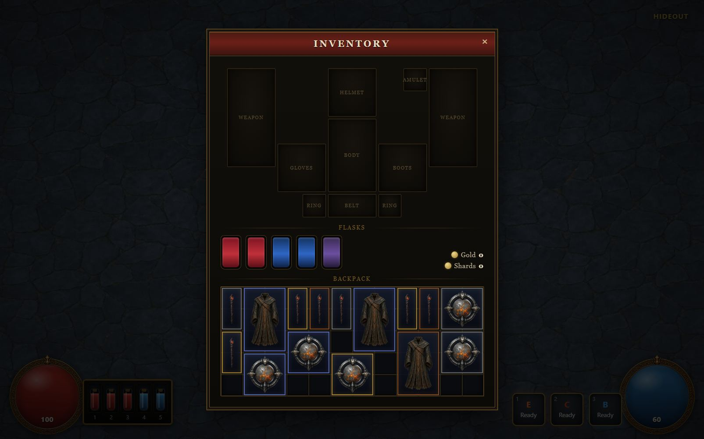 <b>Item art</b> - every base carries painted inventory art, sized to its grid footprint. The item name stays as the fallback for bases without an icon.</td>
<td width="33%">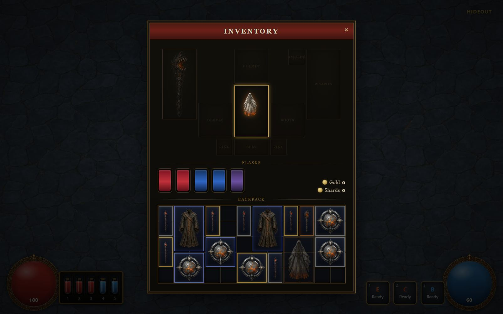 <b>Drag to equip</b> - mid-drag: legal slots glow gold and the rest fade back. Releasing over the world behind the panel puts the item back on the floor, where it can be picked up again.</td>
</tr>
<tr>
<td width="33%">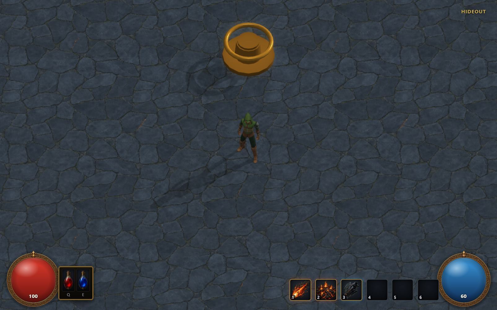 <b>Flasks on Q and E</b> - two painted flasks instead of five vials, and the skill bar becomes six icon slots on keys 1-6. PoE2 has it the other way round (flasks on digits, skills on QWERT); this keeps the flasks under the movement hand.</td>
<td width="33%">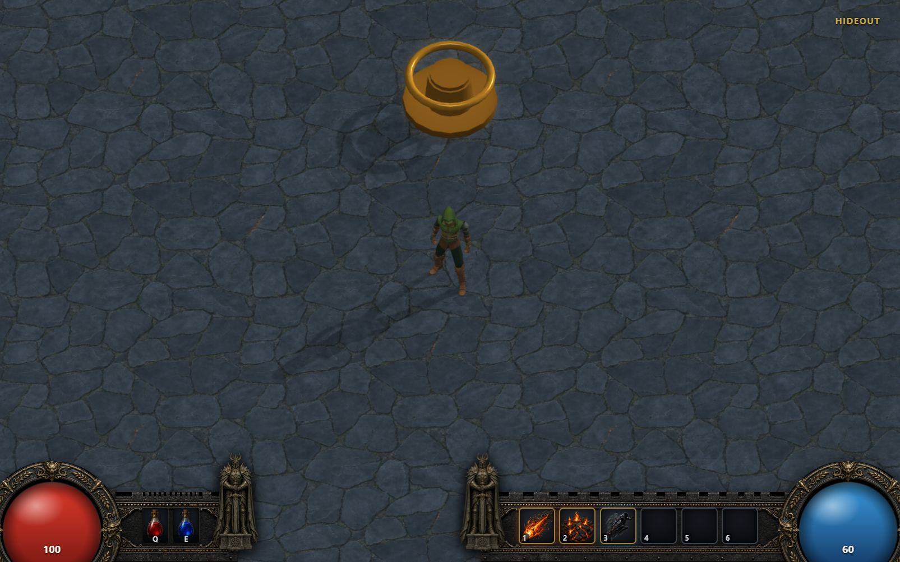 <b>The corners close up</b> - orbs sink into the screen corners behind new gargoyle ring frames, and the flask and skill bars run out from under them on a 9-sliced iron panel, each capped by a bronze guardian.</td>
<td width="33%">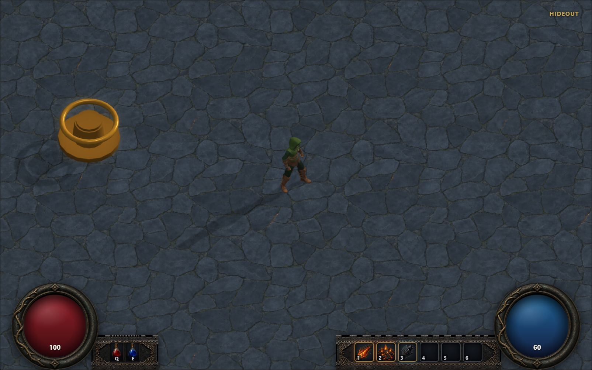 <b>Orbs, measured</b> - sphere size, corner margin and liquid colours read straight off floor#2.webp: 8.4% of the screen wide, ring flush with the bottom edge, deep crimson falling to near-black at the base. The gaudy frame gave way to a slim blackened-bronze one and the guardians went away.</td>
</tr>
</table>

## 2026-07-25 - painted globes

The orbs stop being CSS.

<table>
<tr>
<td width="33%"> <b>Painted globes</b> - the liquid is generated art now, pinned to the bottom of the well and revealed up to the current life or mana, so draining uncovers the dark glass instead of shrinking a gradient. A CSS ball was never going to read like PoE2's.</td>
<td width="33%">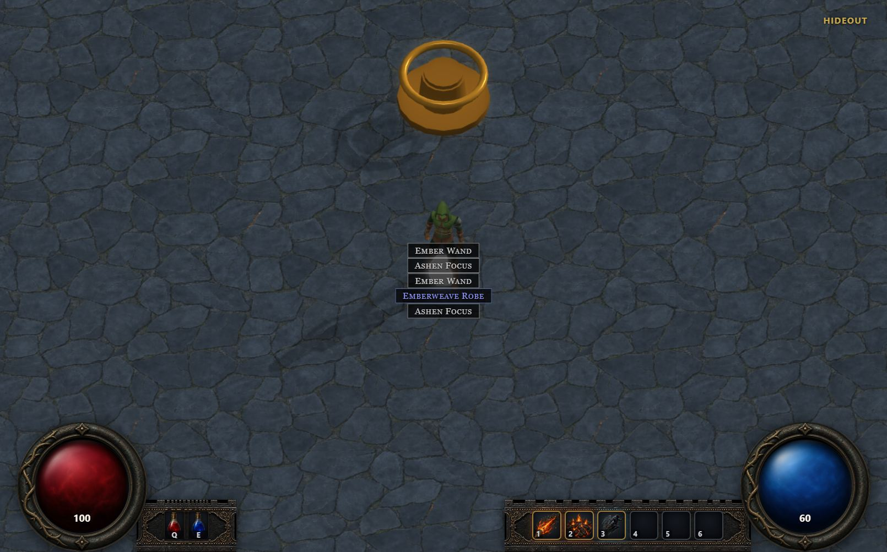 <b>Loot has names</b> - every drop wears a persistent plate with its name in its rarity colour, and the beacon under it takes the same tint. Drops that land on one tile stack into a readable column instead of hiding behind each other.</td>
<td width="33%">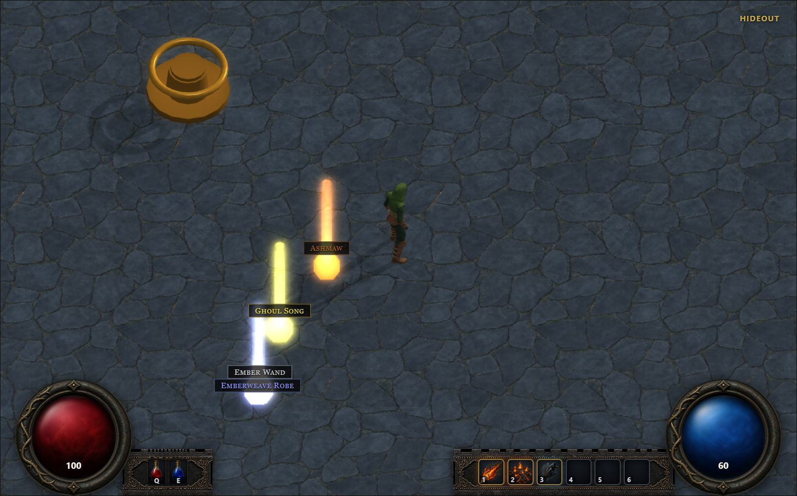 <b>Beams and a noise</b> - each drop stands a light beam in its rarity colour, dim for junk and bright for a unique, and clicking its plate walks you over and picks it up. The drop chime is tiered the way a NeverSink filter tiers alerts: a struck-metal body over a noise transient, with a sub gong under the good stuff.</td>
</tr>
<tr>
<td width="33%">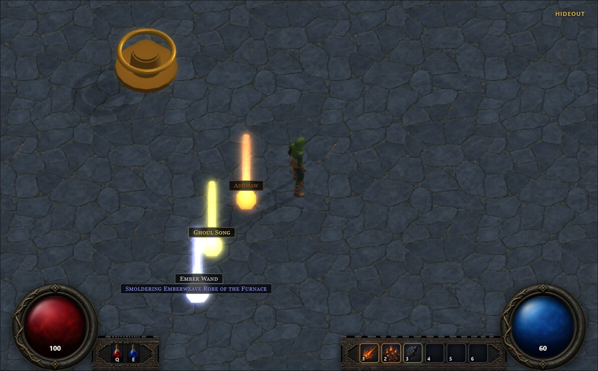 <b>Magic items get their names back</b> - every affix is now a prefix or a suffix, capped per side the way PoE does it (magic 1+1, rare 3+3), and a magic item borrows a word from each: "Smoldering Emberweave Robe of the Furnace" instead of a bare base name. The name is built once at roll time, so plates, tooltips and the backpack all agree.</td>
<td width="33%">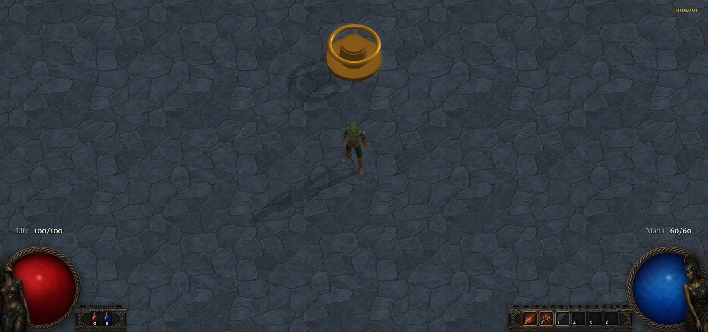 <b>Globes rebuilt from PoE 1</b> - this one borrows from PoE1, not PoE2: a sphere 10.3% of the screen wide inside a thin braided rope ring, a bronze statue leaning on its outer side, and the value as a label above the globe instead of a number floating inside it. Sizes, ring thickness and the liquid's brightness ramp were measured off the reference shot, not eyeballed, and the geometry is in vw so it holds at any resolution.</td>
<td width="33%">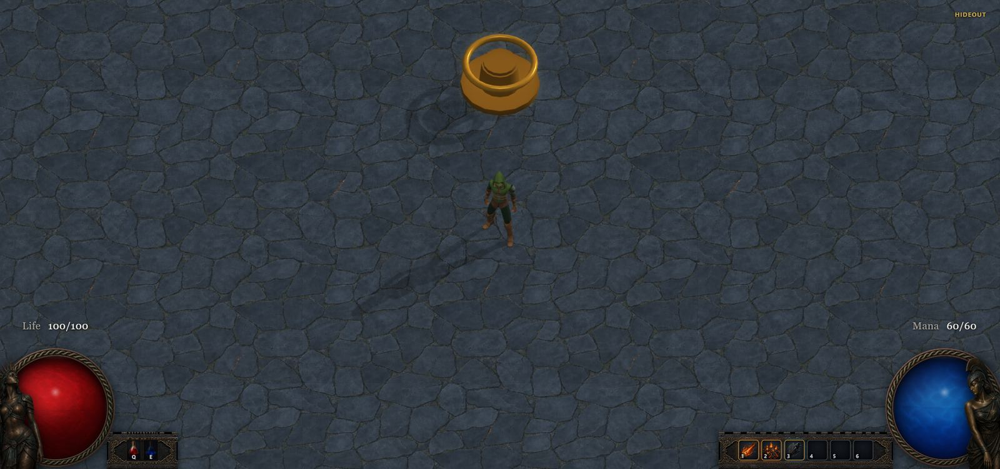 <b>Flasks stop being decoration</b> - Q and E now drink for real: seven charges each, a third of your life or mana back per swig, one charge returned per kill, and a full pool refuses the flask instead of wasting it. The spent part of the vial goes dark from the neck down, so the mana flask above is sitting at three charges of seven.</td>
</tr>
<tr>
<td width="33%">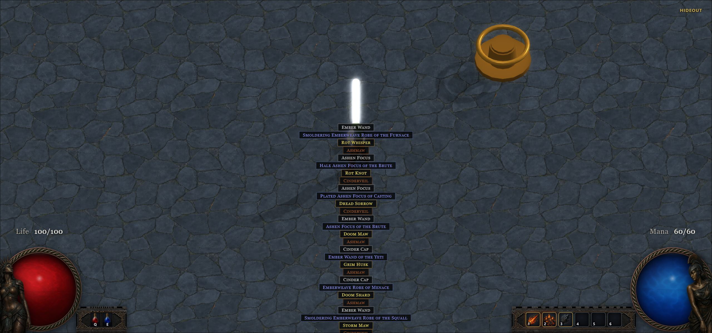 <b>The suffix side fills up</b> - a rare was capped at 3+2 because only two suffixes existed. Six more join them, worded the way poe2db lists PoE2's: cold, lightning and chaos resistance, Strength, mana regeneration rate and critical strike chance. Three are eligible from level 1, so a rare can now actually fill its 3+3, and magic names finally vary: of the Brute, of the Yeti, of Menace, of the Squall.</td>
<td width="33%">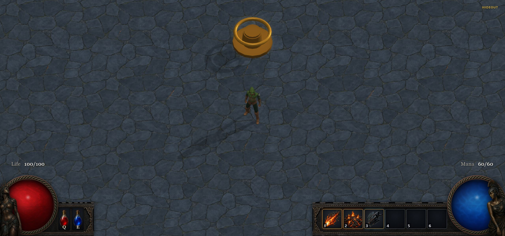 <b>The bars join the globes</b> - the flask and skill panels were fixed-pixel boxes parked beside the globes, so they shrank against them as the window widened. Both now run off the screen side and pass behind the braided ring, and their height and slots are fractions of the sphere (0.65 and 0.38 of its diameter) measured off the same PoE1 crop. Hotkeys sit at the vial's foot in the serif face instead of on a label plate.</td>
<td width="33%">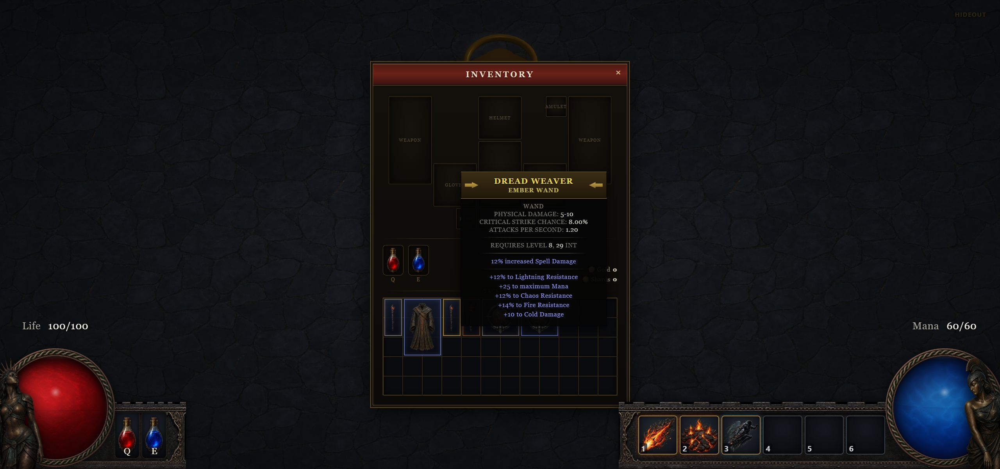 <b>Bases keep their own line</b> - every wand now carries a fixed implicit above the rolled mods, set off by a gap the way PoE prints it, and the mod pool is cut per item class: a wand can no longer roll Armour or maximum Life, a chest can no longer roll cast speed. Five new prefixes (energy shield, increased armour and energy shield, spell damage, cold damage) keep every class at four eligible prefixes from level 1, so the 3+3 a rare wants still fits whatever dropped. The wand's implicit is PoE1's Goat's Horn line, since PoE2 wand implicits all grant a skill and nothing here can grant one yet; the robe's is PoE2's Enlightened Robe.</td>
</tr>
<tr>
<td width="33%">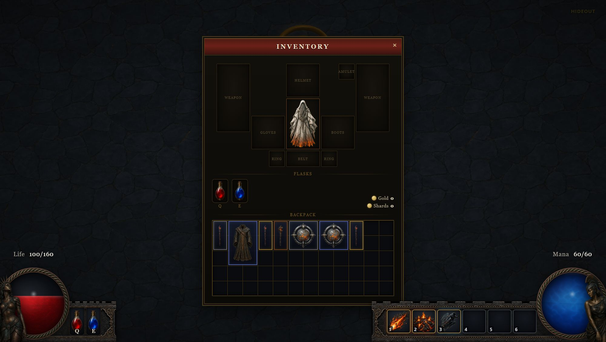 <b>Mods stop being text</b> - an affix was a tooltip line and nothing else. Every implicit and affix on an equipped item now folds into the player: maximum life and mana, armour (flat roll first, then the percent increase on the sum, which is PoE's order), fire resistance, mana regeneration rate, and increased spell damage on the hit itself. Cinderveil's +60 life grows the pool without filling it, so the globe reads 100/160 and leaves you to top it up, exactly as PoE does. Energy shield, the other three resistances, attributes, crit and cast speed still roll and still render, but nothing in the sim can honour them yet, so they land as deliberate no-ops instead of being quietly mapped onto whichever stat is nearby.</td>
<td width="33%">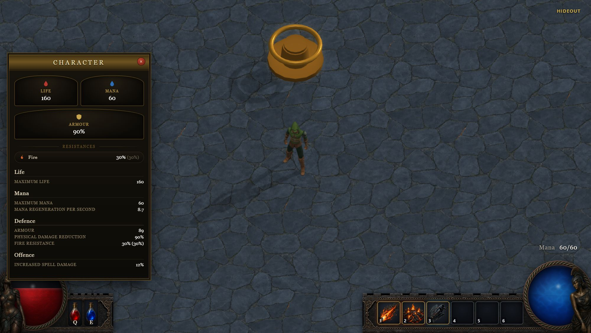 <b>C opens the sheet</b> - armour and resistance totals existed but were invisible: only the two globes were legible. The character sheet takes PoE2's shape from the reference shot - carved header band with a gold cartouche, wide arched stone niches, a resistance pill band, then a label/value detail list. The stone, the header relief, the arches and the four stat icons are generated art rather than CSS approximations, because the reference's weight comes almost entirely from that carving and no gradient stack was going to stand in for it. The sheet prints armour the way PoE2 does, as the share of a physical hit it actually stops rather than the raw rating. That number comes from the same curve damage resolution uses, so the sheet cannot drift from the fight. Fire resistance reads "30% (30%)", capped beside uncapped, which is where overcapping past 75 will show up. The identity row, the attribute plate, energy shield, spirit, evasion, block and three of the four resistances are left off: no mechanic backs them, and a row frozen at zero would advertise a system that is not there. Offence is a PoE1 borrow, since PoE2 moved those onto skill tooltips and we have no skill tooltip yet.</td>
<td width="33%">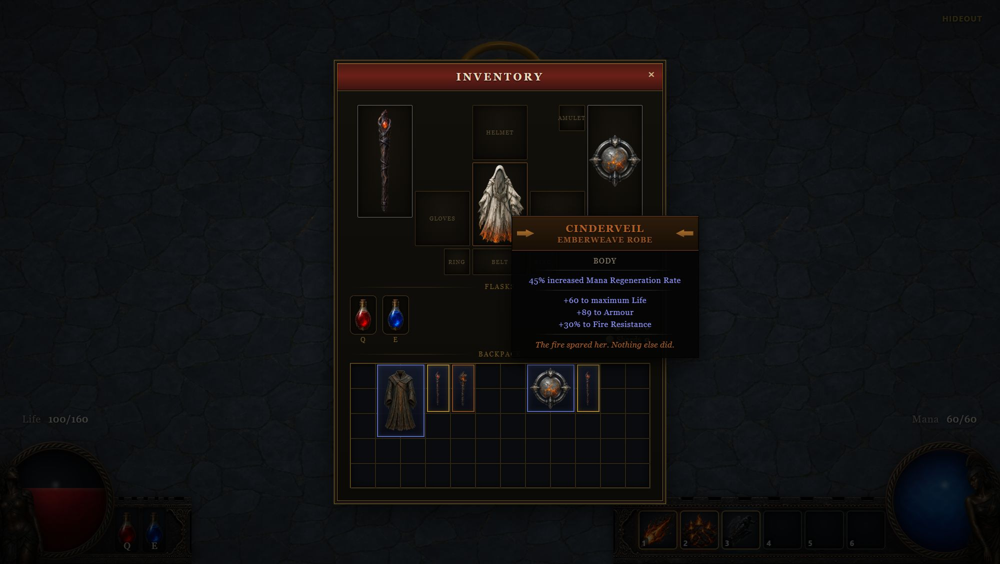 <b>Worn gear can be read</b> - hovering a backpack cell showed a tooltip; hovering the thing you were actually wearing showed nothing, so the only way to check what a slot was granting was to take it off. Equipped slots now use the same tooltip, which is how the sheet's numbers can be traced back: Cinderveil's +60 life, +89 armour and +30% fire resistance are exactly the 160, 89 and 30% next door.</td>
</tr>
<tr>
<td width="33%">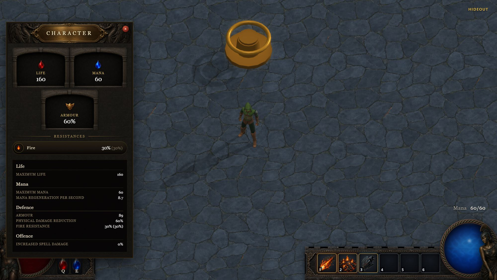 <b>Armour stops being a flat 90%</b> - one chest piece was eating 90% of every hit, boss slam included, because the curve had no damage term in it at all: <code>armour/(armour+10)</code> takes the same share whatever lands. PoE2's real curve puts the hit in the denominator, <code>armour / (armour + 10 x hit)</code>, hard-capped at 90%, and that is the whole reason armour is a defence distinct from flat reduction: strong against many small hits, weak against one large one. The same 89 armour now stops 60% of a Cinder Imp's swipe, 47% of the Warden's attack and 24% of its slam. PoE1 uses the identical shape with a multiplier of 5, a gentler curve; the harsher PoE2 number is the one taken here. Since the share now depends on the hit, the sheet's single Armour percent has to name one, so it quotes the Imp's basic attack, the way PoE2 quotes a hit sized to your level (which is why an endgame character there reads 7%).</td>
<td width="33%">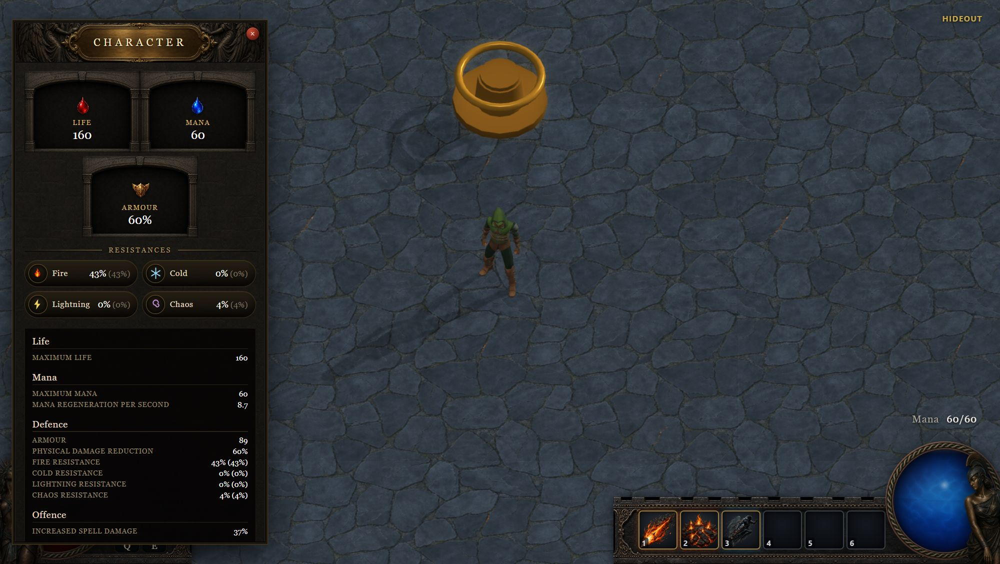 <b>Cold, lightning and chaos start mattering</b> - three of the four resistances rolled on gear, printed on the tooltip, and then did nothing, because the only damage in the game was fire and physical. Wiring them alone would have been a defence against damage that could not occur, so the damage types and a source for them landed in the same slice. Rares now carry an elemental theme, which is PoE's own answer to pack variety: a rare converts its whole hit to its element and resists that element by 30, so a Storm-Touched pack is answered by lightning resistance and not by armour, and the map's seed fixes which theme it rolls. Each element resists only itself and the 75 cap applies per element rather than to their sum. The sheet takes the reference's 2x2 grid, fire and cold over lightning and chaos, each capped beside uncapped. The cold, lightning and chaos glyphs are drawn rather than sprited - the icon sheet was cut when fire was the only resistance, and three more PNGs for three small marks was not worth the download.</td>
<td width="33%">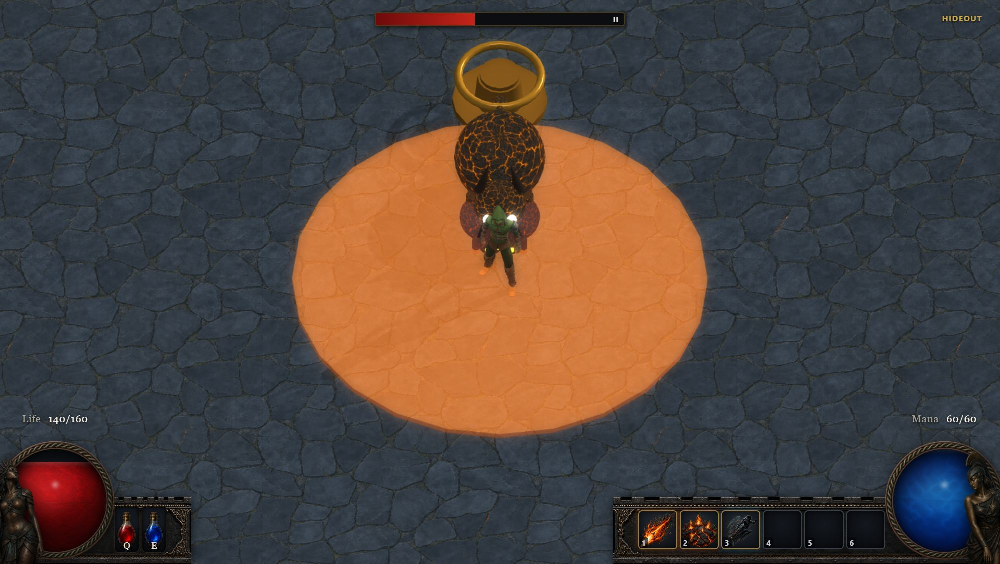 <b>The fight gets measured</b> - two slices had moved difficulty (armour by hit size, then elemental resistances) with nothing watching, and none of it had been playtested. A headless harness now drives the real sim with real content, player standing still and playing its best rotation, and reports time-to-kill and time-to-death for every encounter, so pacing is a number rather than a feeling. It found three things. A rare died in <code>0.9s</code>, quicker than a five-imp pack, and landed one 9-damage hit in its whole life, so the resistance it demands could never be felt: <code>600%</code> life carries it past the player's opening 60-mana burst and <code>300%</code> damage makes one hit about a sixth of a base pool. The Warden's phase-2 patch was doing <code>60</code> damage a second, not the 12 its content line reads, because dps is per stack and the patch reapplies every 6 ticks, so you sit at 5 stacks within a second: at <code>fp(4)</code> it is 20 a second, a patch you can react to instead of pre-dodge, which is the moment in the shot, 140/160 and standing in it. And the Warden itself needed <code>56s</code> of mana-starved poking, hidden until the harness stopped letting the player die, because death refills mana and was handing the fight a fresh burst every ten seconds; 750 life behind 40% fire resistance is 1250 effective against a kit that is entirely fire, so it drops to 420 behind 25% and dies in <code>20s</code>, PoE2's range for an act boss.</td>
</tr>
<tr>
<td width="33%">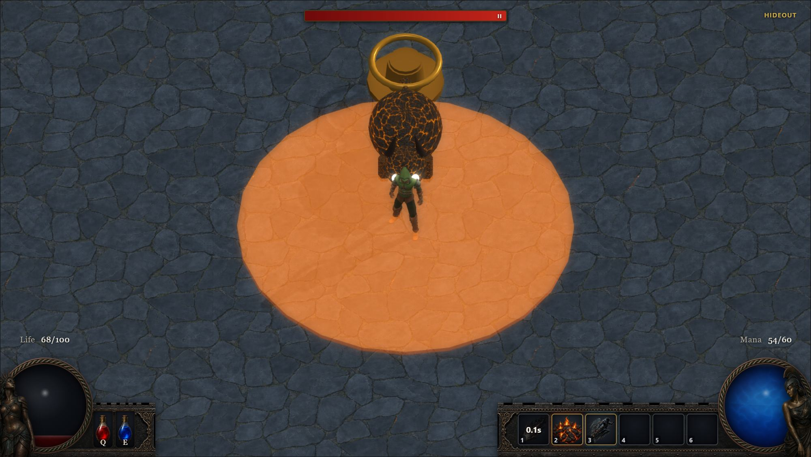 <b>The fight stops being mostly waiting</b> - the last slice fixed how long a fight lasts and left alone what happens inside it. Measured, the Warden was 20 seconds in which the player got to cast <code>1.05</code> times a second against a ceiling of 3.75: a 60-mana pool spent in the opening two seconds, then a bolt every 1.3s as 6 mana a second trickled back. The harness now counts landed casts as well as ticks, because a fight can be exactly the right length and still be spent watching a bar refill. Regeneration goes to <code>15</code> a second and the reading becomes <code>2.18</code>. Both PoE games regenerate a percentage of the pool instead - PoE2 4% a second, PoE1 1.75% - and that is deliberately not copied: the percentage only works there because the pool grows all game while a skill's cost barely does, so a level-1 PoE2 caster really does earn one spell every six seconds and really is meant to stand there. Nothing here grows, so copying the rate would copy act 1's starvation and never the endgame that pays it off; what is matched is the outcome, roughly two casts a second, which is where a PoE2 caster lands once its build works. Monster life then follows player damage rather than the other way around: the Warden goes to <code>840</code> so the fight is the same 20 seconds it was, and rares to <code>900%</code> because at 600 a non-fire rare fell in 1.63s, back under the pack it is supposed to outlast.</td>
<td width="33%">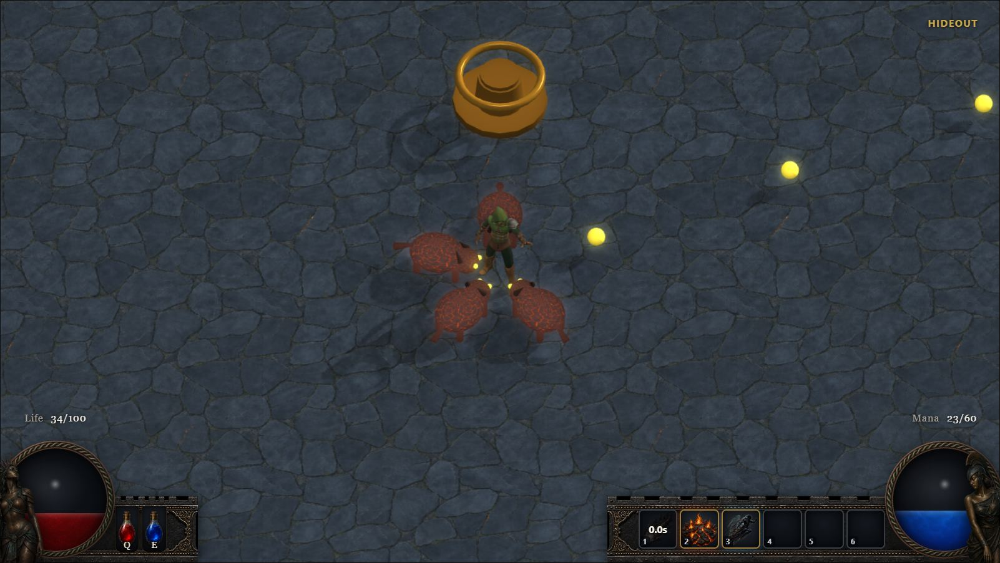 <b>The globes stop lying about the level</b> - a half-full life globe read as nearly empty, and the reflex was to go looking for a HUD that had lost track of the number. It had not: the fill is exactly <code>life/maxLife</code> of the well's height, measured at 40/100 as 164.8px of 412. The lie was in the paint. The liquid is a rendered sphere lit from above, so its lower hemisphere falls to about 0.6 of the equator, and since the fill is pinned to the bottom of the well, draining it uncovers nothing but that shadow: at 90 you see the bright band and the globe reads full, at 68 you see the dark underside and it reads dead. The art now carries a colour-dodge ramp pinned to the same well, identity against the bright half and about 1.7x at the very bottom, so the liquid is one colour at every level and the waterline alone tells you where you stand - which is what PoE1's globes do in the reference crop, where the roundness comes from the gloss over the liquid rather than from the liquid itself. Two orbs at 34/100 and 23/60 in the shot, both legible at a glance.</td>
<td width="33%">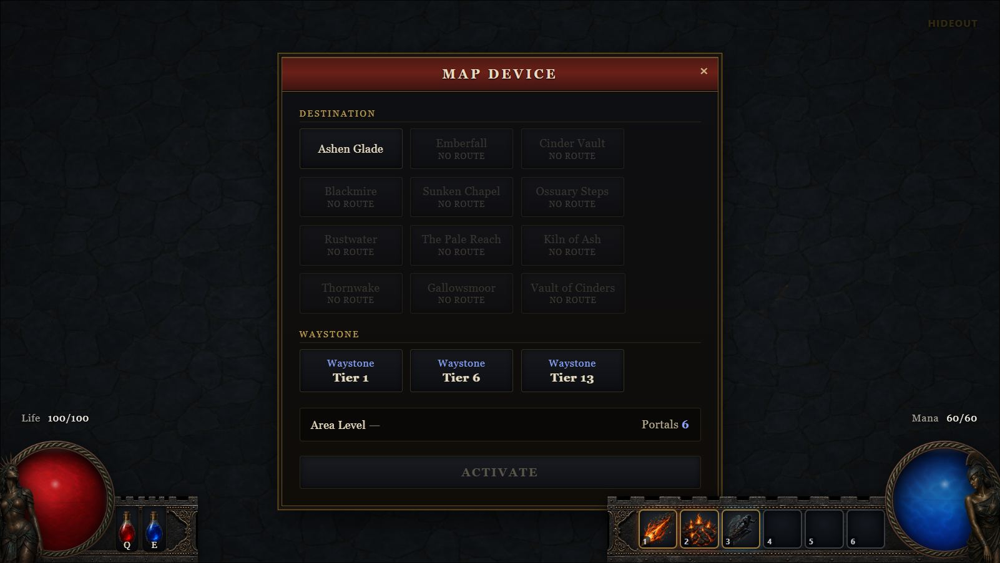 <b>The Atlas becomes a place, not a dropdown</b> - three hardcoded node names sat in a list, and the one you picked was written to <code>activeNodeId</code>, read back when the boss died to tick it off, and touched nothing else: not the seed, not the monsters, not the loot. Choosing Emberfall over Cinder Vault changed a label. Now the world is generated from the character's <code>atlasSeed</code>: twelve places on a jittered grid, joined by a minimum spanning tree so nothing is ever stranded, plus every remaining short pair so there are loops and a choice of route rather than one forced chain. Fog is the PoE2 rule, one hop at a time: you may run the first node, or anywhere a route leads from somewhere you have cleared, which is what turns a list into a decision. The rule lives in the sim, not in the greyed-out button, because the client is untrusted. And the place is now half the map seed, so the same Waystone taken to two nodes draws two different dungeons while one place keeps its own. What is deliberately not on a node yet is difficulty: the Waystone still brings the tier. Gating a node behind a tier would hard-lock a character today, since the three offers are fixed by the atlas seed forever and nothing drops a replacement. Sustain first, then the tier belongs on the region. The panel is still a wall of tiles; the painted world map from <code>atlas-maps.webp</code> is the next slice.</td>
<td width="33%">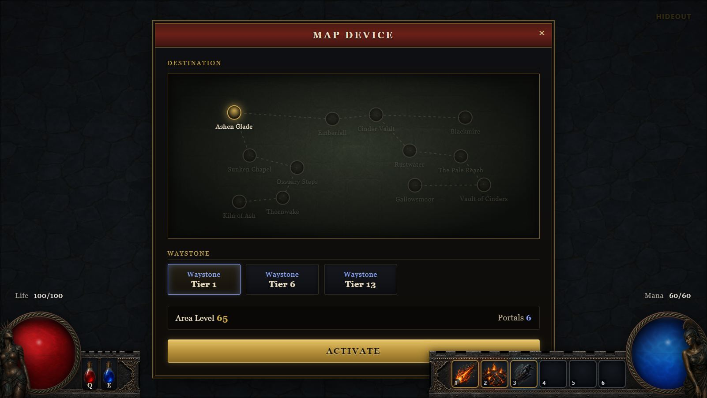 <b>The graph gets drawn</b> - the world existed but arrived as twelve buttons in a row, which told you nothing about where anywhere was or which place opens next. The Map Device now draws it the way the reference does: places sit at their own coordinates, routes are drawn between linked ones, and state is read at a glance rather than from a label. Ashen Glade is lit gold because it is the one you can enter; everything else sits in fog at a fraction of the brightness with its route dashed. A route to somewhere cleared turns solid green, so the road already walked separates itself from the one ahead. The field is the carved stone the character sheet uses, tinted and vignetted rather than painted terrain, because a region per node is art that does not exist yet and a bare panel would have read as a form. The <code>NO ROUTE</code> caption is gone with the tiles: fog says it better than a word does.</td>
<td width="33%">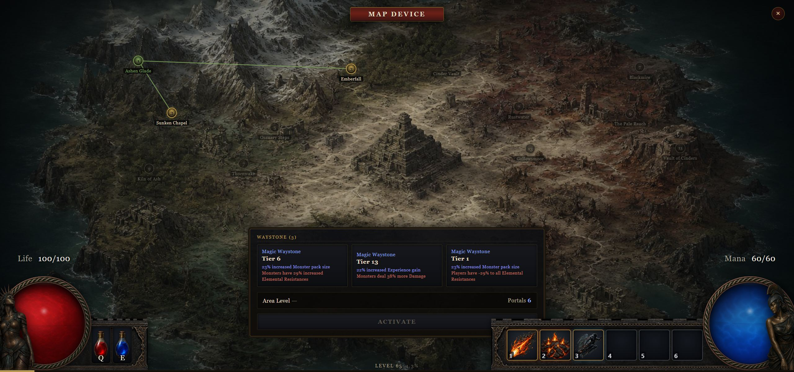 <b>The Atlas takes the whole screen</b> - the world map was drawn inside a 720px card with a 300px field, so twelve places and their labels fought over a strip the size of a dialog. It is fullscreen now, the way <code>atlas-maps.webp</code> is: the map is the screen, the title banner floats over it instead of capping a frame, the close button sits in the corner, and everything you choose from (stones, area level, ACTIVATE) docks in one bar at the bottom, held clear of the flask row and skill bar. The world behind it is painted now too: one 1920x1080 continent - snowed ridges upper-left, bone-sand flats and a stepped ziggurat through the middle, blighted red scrub east, teal ocean at every edge - shipped as a 400KB JPEG and layered over the carved stone the sheet uses, so a missing file still degrades to stone rather than to black. Fogged place names moved to a darker plate and a lighter grey once there was pale sand under them.</td>
</tr>
<tr>
<td width="33%">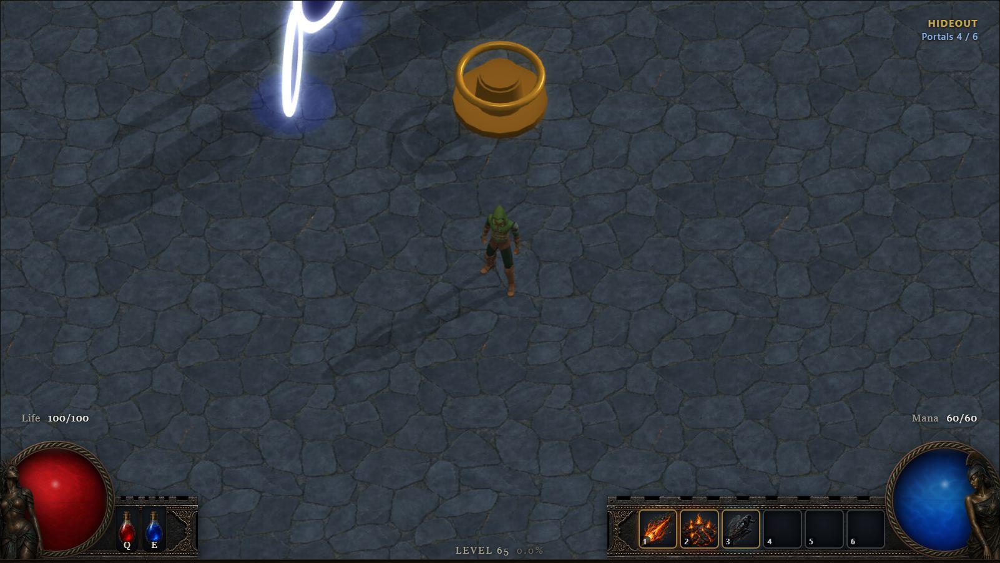 <b>A map stops being one fight at the door</b> - opening a map put seven monsters, the rare among them, in contact by <code>4.0s</code>, and a character who stood still died at <code>12.3s</code> on Tier 2 and <code>7.1s</code> on Tier 5. None of that was a balance number. <code>monsterAI</code> had no aggro radius at all, so every monster in the area beelined for the player from the tick the area was built, and a dungeon of rooms resolved as a single mob at the entrance; <code>balance.test.ts</code> never caught it because the lab rig places its own monsters 6 units away on purpose. A monster now stays <code>idle</code> beyond <code>9</code> units, just under the ortho camera's view height, so a pack wakes as it comes on screen rather than before you see it. Being hit wakes it too, or a bolt would clear a sleeping room from off screen. Waking is one-way and rides the existing <code>state</code> field, so there is no new component and nothing new serialized, and a pulled pack follows you out of its room instead of leashing back - PoE leashes bosses and not trash, and the Warden is leashed already. In the shot, a Tier 1 entered and walked west: one imp pulled, <code>74/100</code>, and the rest of the map still asleep behind it.</td>
<td width="33%"> <b>Cast speed stops being a word on a wand</b> - <code>of Casting</code> has been rolling on wands and foci since item level 12, printing <code>% increased Cast Speed</code> on the tooltip, and nothing anywhere read the number. It is real now, by PoE's own arithmetic rather than an invented one: cast speed is the reciprocal of cast time, and increases from gear add together before they divide, so two suffixes of 9 and 6 are 15% and never 15.5%. Ember Bolt's 8-tick recovery becomes <code>trunc(800 / 115)</code>, 6 ticks, and the floor of one tick means no roll can make a spell instant. The skill's cooldown is deliberately untouched, which is also PoE's rule and not a shortcut - cast speed shortens the animation you are locked in, not the timer that says when the spell is available again. That leaves a real ceiling on the stat: Ember Bolt casts in 8 ticks against a 6-tick cooldown, so recovery is what binds it and cast speed pays out until the two meet, while Cinder Ground at 15 ticks against 30 is cooldown-bound and only ever gets its recovery back. The sheet grew a second Offence row beside spell damage, reading <code>0%</code> here because the character wears nothing that rolls it. Still inert on the same shelf: Strength, Dexterity, Intelligence, crit chance, and added fire and cold damage.</td>
<td width="33%">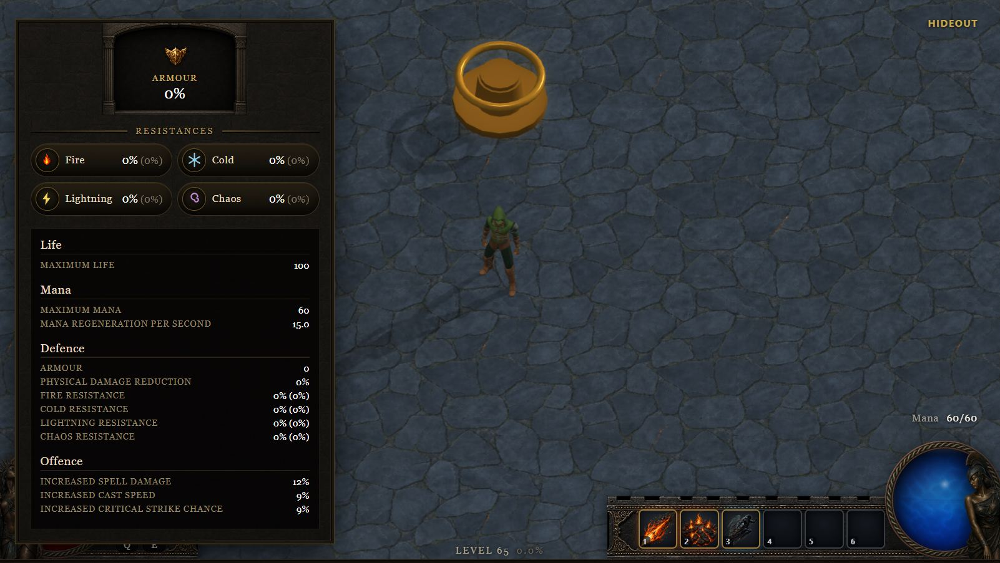 <b>Critical strikes</b> - <code>of Menace</code> was the last combat suffix reading zero. Crit needs two numbers and PoE keeps them in different places: the skill owns the base chance and gear only multiplies it, so Ember Bolt's <code>7%</code> (PoE2's Fireball, where fire spells sit lowest) with a <code>+9%</code> focus is 7.63% and not 16%. The roll is in hundredths of a percent so that fraction survives integer math, and a crit deals <code>200%</code> of the hit, which is PoE's base Critical Damage Bonus of 100% rather than a number picked here. It draws from its own named stream that is only touched when a skill has a base chance at all, so a kit that cannot crit consumes no randomness and older replays still check out. One roll per cast is exactly one roll per hit today, because a bolt damages the first monster it touches and is spent; that stops being true the day something pierces. Ailments are left out, on the same rule that keeps spell damage off burning ground. What a crit does not do yet is <em>look</em> like anything: there are no floating damage numbers, and the snapshot the client renders from carries no events at all, only state, so a crit reads as a health bar dropping faster and nothing more. The channel that would carry it is its own slice. The shot is the whole offence block finally showing gear: 12% spell damage, 9% cast speed, 9% crit, off an Ember Wand of Casting and an Ashen Focus of Menace.</td>
</tr>
</table>
