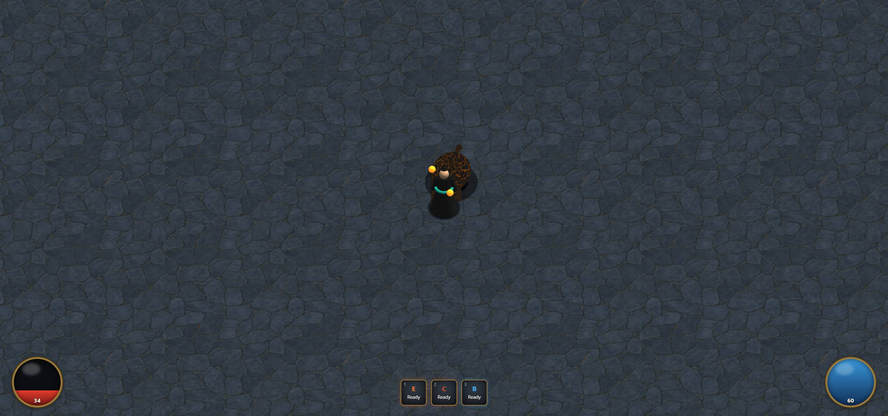
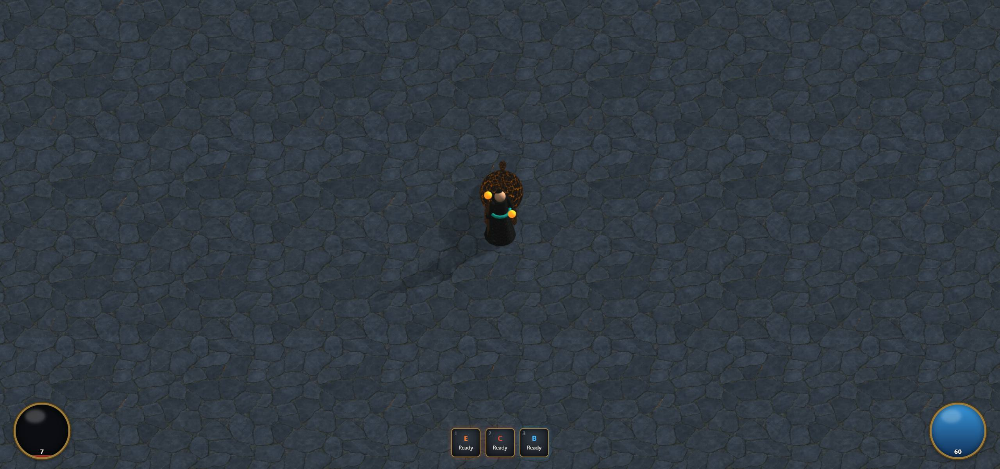
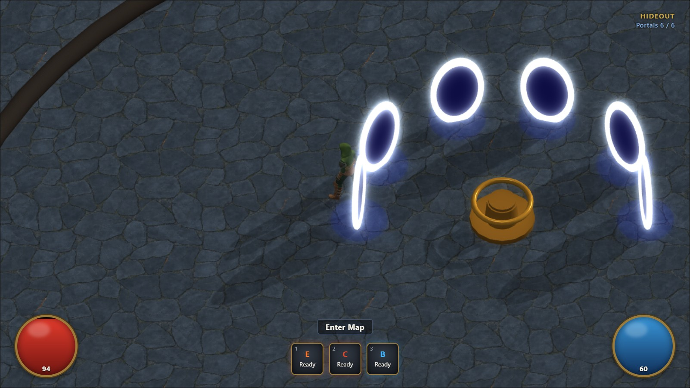
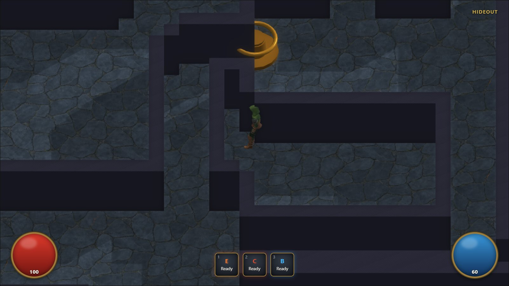
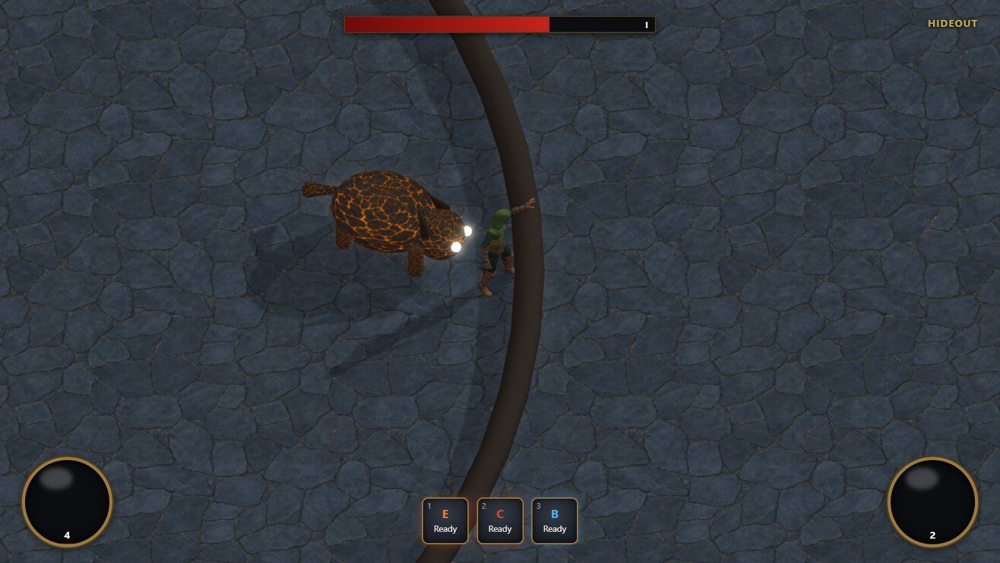
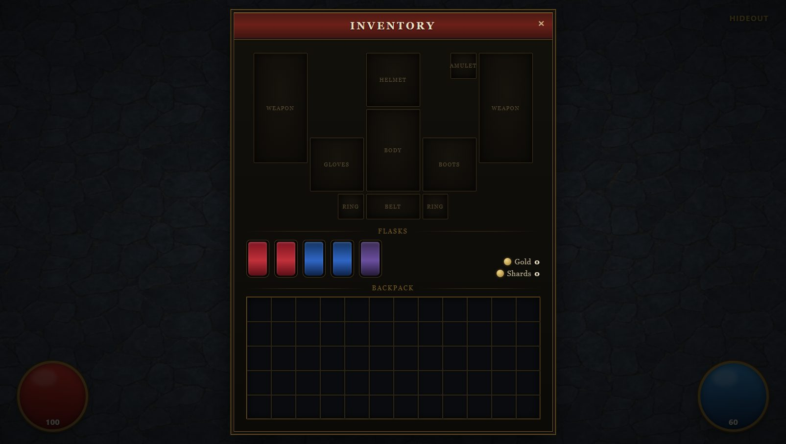
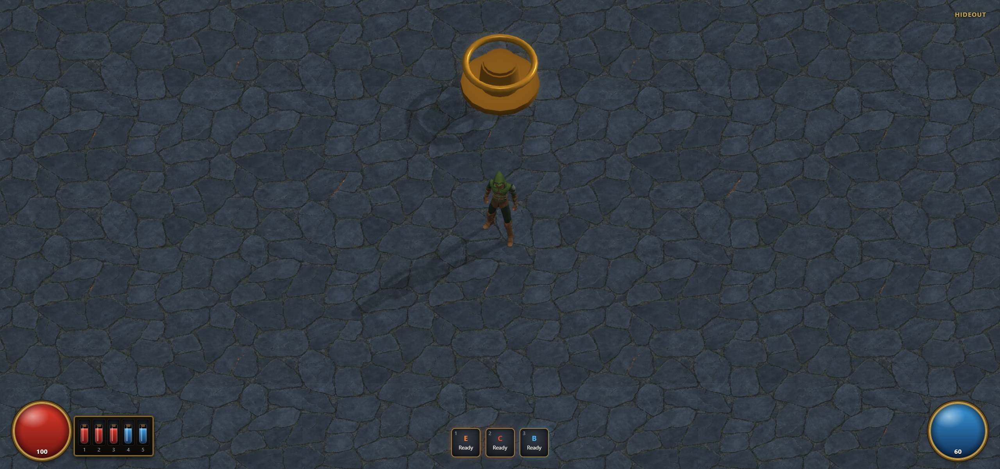
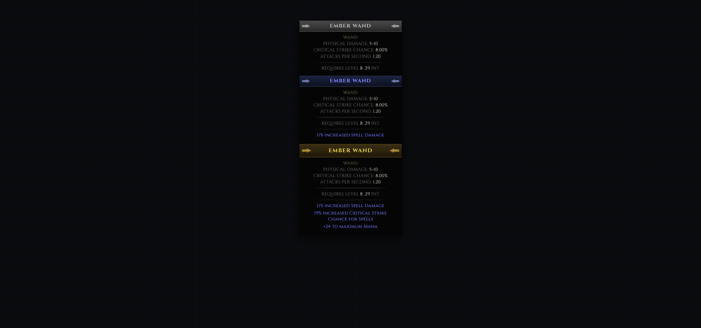

# Devlog

Screenshots from building Exiled Casual with Claude Code, in order. Each shot is the
visible result of one slice of work. The early days are the sim and character; the later
ones are the HUD and items. Also posted as a running "Day N" series on
[r/ClaudeAI](https://www.reddit.com/r/ClaudeAI/comments/1v4nqeh).

For the design behind each step see [`../docs/specs/`](../docs/specs/) and the
implementation plans in [`../docs/plans/`](../docs/plans/).

## 2026-07-20 - a character that moves

The box actor becomes a real rigged humanoid, animated and lit.

**Rigged player** - a CC0 Quaternius character replaces the primitive box actor.

**Walk cycle** - animation clips from the Universal Animation Library retargeted onto the rig by bone name.

**Skinned actors under lighting** - multiple skinned actors, zoomed in to check shading.

**Cast shadows** - real-time shadows grounding the actors in the scene.

**Run loop and portals** - the map run loop with entry/exit portals.

**Boss telegraph** - a readable ground telegraph before a boss attack lands.

## 2026-07-21 - maps and a boss fight

Procedural interiors get walls and textures, and the Warden encounter takes shape.

**Indoor mapgen wired in** - procedural indoor generation connected to the client.

**Textured dungeon walls** - the boundary walls get color and normal maps.

**Casting slows movement** - casting applies a per-skill movement penalty instead of freezing the legs.

**Warden phase 2, burning slam** - the Warden boss in its second phase.

## 2026-07-22 - loot and preparation

Items start dropping, and the pre-map screen appears.

**First loot** - item drops as server-authored world entities.

**Preparation panel** - the pre-run panel for setting up a map.

## 2026-07-23 - the HUD comes together

Matching the Path of Exile 2 HUD against the reference screenshots.

**Life and mana orbs** - glossy framed orbs beside the skill bar.

**Flask row** - 3 life and 2 mana flasks next to the life orb, keys 1-5.

**Ornate orb frames** - generated gold filigree frames replacing the CSS bevel.

**Item tooltip** - a full item tooltip with base stats and requirements.

**Unique items** - Ashmaw, a named pool item with its own mods and flavour line. Numpad6 drops
one debug item per press, cycling normal to magic to rare to unique.

