# Devlog

Screenshots from building Exiled Casual with Claude Code, in order. Each shot is the
visible result of one slice of work. The early days are the sim and character; the later
ones are the HUD and items. Also posted as a running "Day N" series on
[r/ClaudeAI](https://www.reddit.com/r/ClaudeAI/comments/1v4nqeh).

For the design behind each step see [`../docs/specs/`](../docs/specs/) and the
implementation plans in [`../docs/plans/`](../docs/plans/).

## 2026-07-20 - a character that moves

The box actor becomes a real rigged humanoid, animated and lit.

<table>
<tr>
<td width="33%"> <b>Rigged player</b> - a CC0 Quaternius character replaces the primitive box actor.</td>
<td width="33%"> <b>Walk cycle</b> - animation clips from the Universal Animation Library retargeted onto the rig by bone name.</td>
<td width="33%"> <b>Skinned actors under lighting</b> - multiple skinned actors, zoomed in to check shading.</td>
</tr>
<tr>
<td width="33%"> <b>Cast shadows</b> - real-time shadows grounding the actors in the scene.</td>
<td width="33%"> <b>Run loop and portals</b> - the map run loop with entry/exit portals.</td>
<td width="33%"> <b>Boss telegraph</b> - a readable ground telegraph before a boss attack lands.</td>
</tr>
</table>

## 2026-07-21 - maps and a boss fight

Procedural interiors get walls and textures, and the Warden encounter takes shape.

<table>
<tr>
<td width="33%"> <b>Indoor mapgen wired in</b> - procedural indoor generation connected to the client.</td>
<td width="33%"> <b>Textured dungeon walls</b> - the boundary walls get color and normal maps.</td>
<td width="33%"> <b>Casting slows movement</b> - casting applies a per-skill movement penalty instead of freezing the legs.</td>
</tr>
<tr>
<td width="33%"> <b>Warden phase 2, burning slam</b> - the Warden boss in its second phase.</td>
</tr>
</table>

## 2026-07-22 - loot and preparation

Items start dropping, and the pre-map screen appears.

<table>
<tr>
<td width="33%"> <b>First loot</b> - item drops as server-authored world entities.</td>
<td width="33%"> <b>Preparation panel</b> - the pre-run panel for setting up a map.</td>
</tr>
</table>

## 2026-07-23 - the HUD comes together

Matching the Path of Exile 2 HUD against the reference screenshots.

<table>
<tr>
<td width="33%"> <b>Life and mana orbs</b> - glossy framed orbs beside the skill bar.</td>
<td width="33%"> <b>Flask row</b> - 3 life and 2 mana flasks next to the life orb, keys 1-5.</td>
<td width="33%"> <b>Ornate orb frames</b> - generated gold filigree frames replacing the CSS bevel.</td>
</tr>
<tr>
<td width="33%"> <b>Item tooltip</b> - a full item tooltip with base stats and requirements.</td>
</tr>
</table>

## 2026-07-24 - uniques and item art

Named pool items land, and every base gets painted inventory art.

<table>
<tr>
<td width="33%"> <b>Unique items</b> - Ashmaw, a named pool item with its own mods and flavour line.</td>
<td width="33%"> <b>Item art</b> - every base carries painted inventory art, sized to its grid footprint.</td>
<td width="33%"> <b>Drag to equip</b> - mid-drag: legal slots glow gold and the rest fade back.</td>
</tr>
<tr>
<td width="33%"> <b>Flasks on Q and E</b> - two painted flasks instead of five vials, and the skill bar becomes six icon slots on keys 1-6.</td>
<td width="33%"> <b>The corners close up</b> - orbs sink into the screen corners behind new gargoyle ring frames.</td>
<td width="33%"> <b>Orbs, measured</b> - sphere size, corner margin and liquid colours read straight off floor#2.webp: 8.4% of the screen wide.</td>
</tr>
</table>

## 2026-07-25 - painted globes, and a game underneath them

The orbs stop being CSS, and the sim grows levels, resistances, Waystones and an Atlas.

<table>
<tr>
<td width="33%"> <b>The character starts keeping score</b> - the protocol had no level and no experience in it at all.</td>
<td width="33%"> <b>A rare says which resistance it wants</b> - every rare converts its whole hit to one element and resists that element.</td>
<td width="33%"> <b>Energy shield stops being a number on a tooltip</b> - two affixes rolled it, the tooltip printed it, the sheet had no row for it and the sim had no idea it existed.</td>
</tr>
<tr>
<td width="33%"> <b>A Waystone stops being a tier number</b> - three stones, distinguishable only by the tier printed on them, and the tier moved monster life and damage and nothing else.</td>
<td width="33%"> <b>Waystones become a resource instead of a menu</b> - the three stones were conjured from the atlas seed every time the device opened, which meant they were infinite.</td>
<td width="33%"> <b>The world gets a shape you have to earn</b> - the map drew twelve places, all equally open once the fog lifted, so a route was a matter of taste: any stone opened any place.</td>
</tr>
<tr>
<td width="33%"> <b>Painted globes</b> - the liquid is generated art now, pinned to the bottom of the well and revealed up to the current life or mana.</td>
<td width="33%"> <b>Loot has names</b> - every drop wears a persistent plate with its name in its rarity colour, and the beacon under it takes the same tint.</td>
<td width="33%"> <b>Beams and a noise</b> - each drop stands a light beam in its rarity colour, dim for junk and bright for a unique.</td>
</tr>
<tr>
<td width="33%"> <b>Magic items get their names back</b> - every affix is now a prefix or a suffix, capped per side the way PoE does it (magic 1+1, rare 3+3).</td>
<td width="33%"> <b>Globes rebuilt from PoE 1</b> - this one borrows from PoE1, not PoE2: a sphere 10.3% of the screen wide inside a thin braided rope ring.</td>
<td width="33%"> <b>Flasks stop being decoration</b> - Q and E now drink for real: seven charges each, a third of your life or mana back per swig, one charge returned per kill.</td>
</tr>
<tr>
<td width="33%"> <b>The suffix side fills up</b> - a rare was capped at 3+2 because only two suffixes existed.</td>
<td width="33%"> <b>The bars join the globes</b> - the flask and skill panels were fixed-pixel boxes parked beside the globes, so they shrank against them as the window widened.</td>
<td width="33%"> <b>Bases keep their own line</b> - every wand now carries a fixed implicit above the rolled mods, set off by a gap the way PoE prints it.</td>
</tr>
<tr>
<td width="33%"> <b>Mods stop being text</b> - an affix was a tooltip line and nothing else.</td>
<td width="33%"> <b>C opens the sheet</b> - armour and resistance totals existed but were invisible: only the two globes were legible.</td>
<td width="33%"> <b>Worn gear can be read</b> - hovering a backpack cell showed a tooltip; hovering the thing you were actually wearing showed nothing.</td>
</tr>
<tr>
<td width="33%"> <b>Armour stops being a flat 90%</b> - one chest piece was eating 90% of every hit, boss slam included, because the curve had no damage term in it at all.</td>
<td width="33%"> <b>Cold, lightning and chaos start mattering</b> - three of the four resistances rolled on gear, printed on the tooltip, and then did nothing.</td>
<td width="33%"> <b>The fight gets measured</b> - two slices had moved difficulty (armour by hit size, then elemental resistances) with nothing watching.</td>
</tr>
<tr>
<td width="33%"> <b>The fight stops being mostly waiting</b> - the last slice fixed how long a fight lasts and left alone what happens inside it.</td>
<td width="33%"> <b>The globes stop lying about the level</b> - a half-full life globe read as nearly empty, and the reflex was to go looking for a HUD that had lost track of the number.</td>
<td width="33%"> <b>The Atlas becomes a place, not a dropdown</b> - three hardcoded node names sat in a list, and the one you picked was written to <code>activeNodeId</code>.</td>
</tr>
<tr>
<td width="33%"> <b>The graph gets drawn</b> - the world existed but arrived as twelve buttons in a row.</td>
<td width="33%"> <b>The Atlas takes the whole screen</b> - the world map was drawn inside a 720px card with a 300px field.</td>
<td width="33%"> <b>A map stops being one fight at the door</b> - opening a map put seven monsters, the rare among them, in contact by <code>4.0s</code>.</td>
</tr>
<tr>
<td width="33%"> <b>Cast speed stops being a word on a wand</b> - <code>of Casting</code> has been rolling on wands and foci since item level 12.</td>
<td width="33%"> <b>Critical strikes</b> - <code>of Menace</code> was the last combat suffix reading zero.</td>
<td width="33%">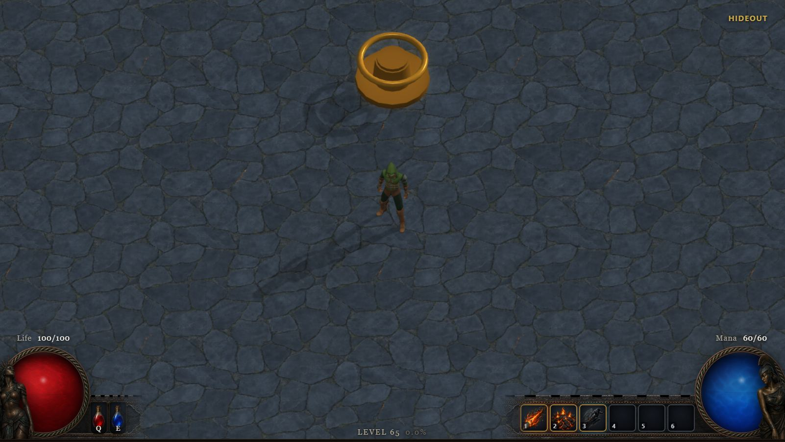 <b>The bottom bar stops looking cut</b> - the flask and skill panels are 9-sliced from one piece of art, and that art was flush-cut at both image edges.</td>
</tr>
<tr>
<td width="33%">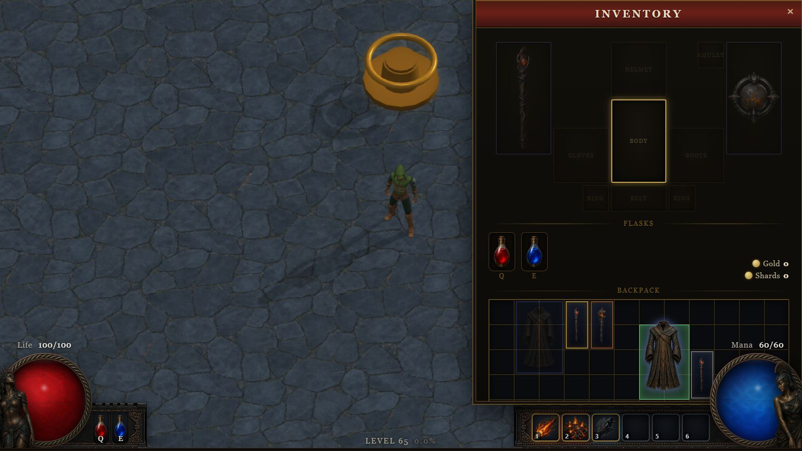 <b>The inventory docks and the drag gets a shadow</b> - the panel was a box in the middle of a dimmed screen, which is a web dialog, not <code>inventory+equipment.png</code>.</td>
<td width="33%"> <b>The inventory takes the whole side, the bar takes the mouse</b> - both halves of this come off two PoE1 screenshots, <code>inventory.png</code> and <code>poe1-lower-bar.png</code>.</td>
</tr>
</table>

## 2026-07-26 - a stash, and somewhere to spend it

The hideout gets storage, quick transfer, and a bench that turns leftovers into currency.

<table>
<tr>
<td width="33%">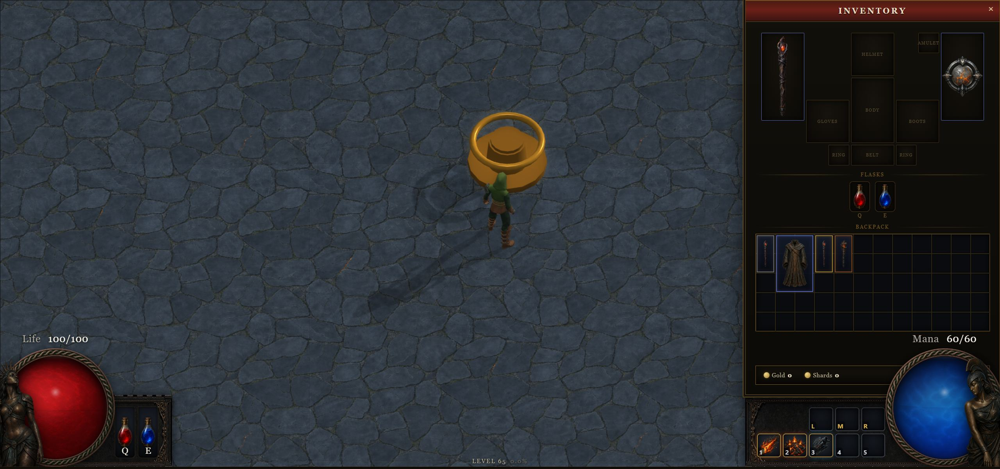 <b>The bar and the panel share one left edge</b> - the inventory dropped further left than the skill panel below it.</td>
<td width="33%"> <b>A skill says what it costs</b> - hovering a socket now opens the PoE1 gem tooltip above the bar: name in gold on the left.</td>
<td width="33%">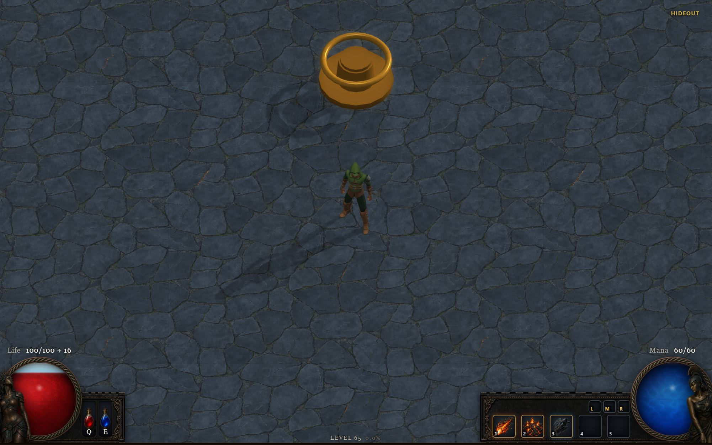 <b>The bar goes back to the reference</b> - side by side with <code>poe1-lower-bar.png</code> ours had three things wrong.</td>
</tr>
<tr>
<td width="33%">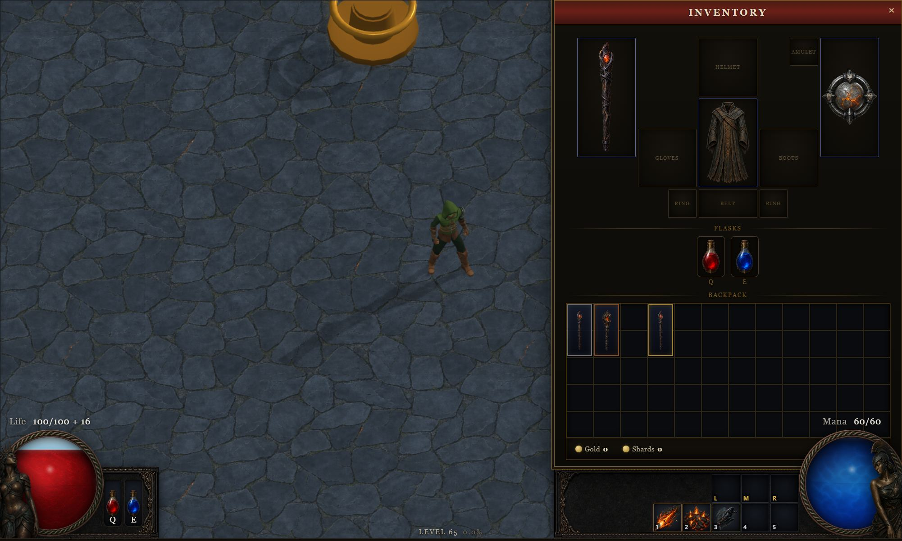 <b>Both pieces move out to the same line</b> - the shared left edge was where a red line drawn over a screenshot said it should not be, so the whole right-hand column grew.</td>
<td width="33%"> <b>Both bars sit lower</b> - <code>poe1-lower-bar.png</code> turns out to be a 16:9 fullscreen grab 2558px wide, so its pixels convert straight into vw.</td>
<td width="33%">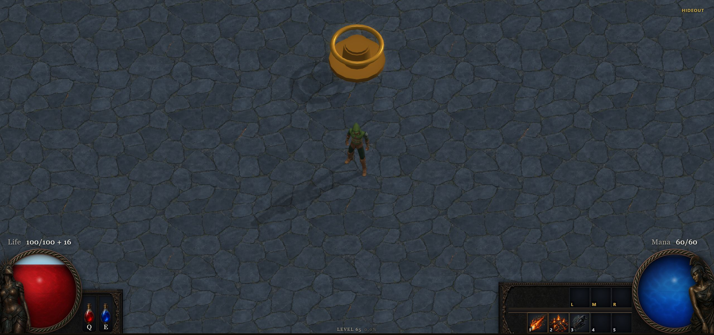 <b>A rail where there was a gap</b> - the reference closes its mouse row on a warm hairline, drops 18px of shadow, then opens the numbered row on a brighter one.</td>
</tr>
<tr>
<td width="33%">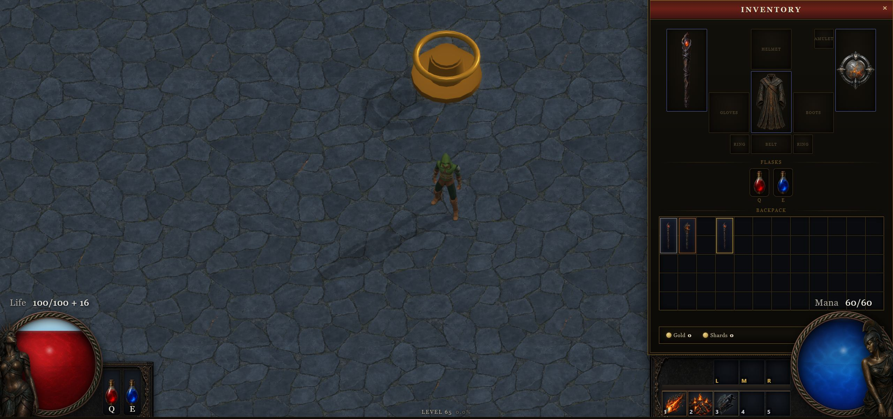 <b>The right column stops being pixels</b> - that leftover gap was not the price of sharing an edge, it was the last fixed-px number in the corner.</td>
<td width="33%">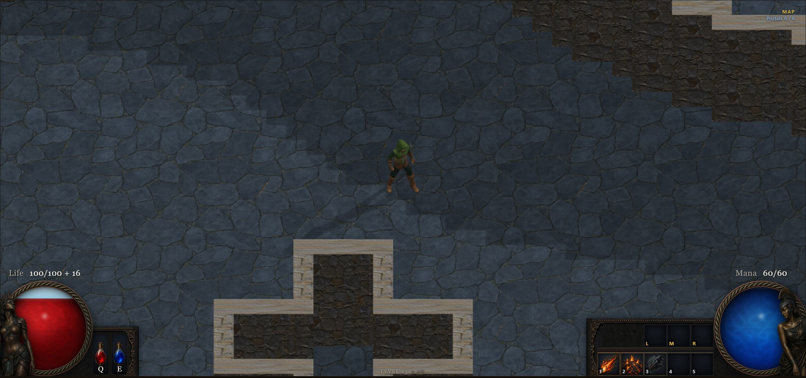 <b>The boss bar waits for the boss</b> - stepping through a portal used to raise the Warden's health bar immediately, with the Warden itself somewhere off in the dark.</td>
<td width="33%">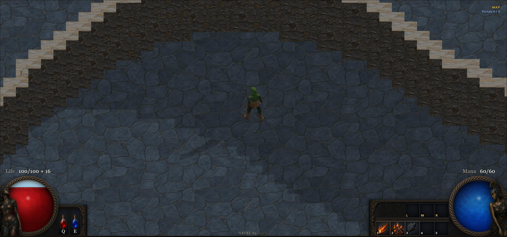 <b>The Warden holds its room</b> - the separate defect above, closed.</td>
</tr>
<tr>
<td width="33%">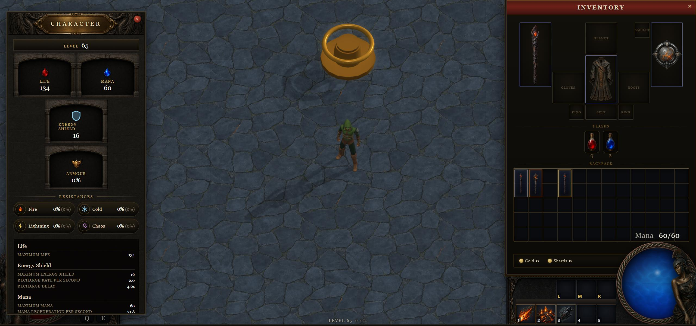 <b>Strength stops being decoration</b> - <code>affix.strength</code> has been rolling on gear since first loot and <code>applyItemMods</code> dropped it on the floor.</td>
<td width="33%"> <b>The Warden pays a burst</b> - the first change made under <code>docs/09-reward-psychology.md</code>, which now outranks every other spec.</td>
<td width="33%">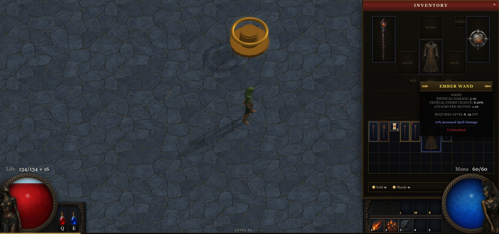 <b>Magic and better arrive unread</b> - rule 1 of <code>docs/09-reward-psychology.md</code> is that the spike fires on anticipation, not on receipt.</td>
</tr>
<tr>
<td width="33%">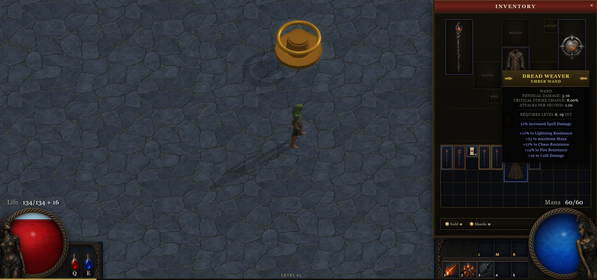 <b>The Scroll of Wisdom buys the reveal</b> - the wand two cells over was an unread rare a second ago.</td>
<td width="33%"> <b>Five orbs make the item the slot machine</b> - the wand in the first cell was a plain <b>Ember Wand</b> until an Orb of Transmutation landed on it.</td>
<td width="33%">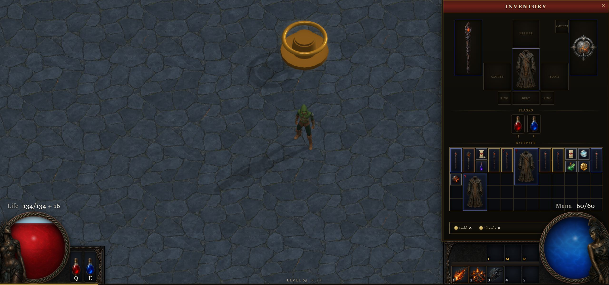 <b>The orbs stop being vector shapes</b> - the five currencies shipped with hand-authored flat SVGs.</td>
</tr>
<tr>
<td width="33%">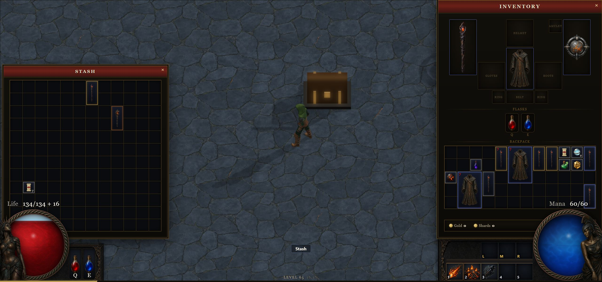 <b>The hideout keeps what the map paid</b> - a full backpack used to have exactly one remedy, which was throwing something on the floor and watching it stay there.</td>
<td width="33%">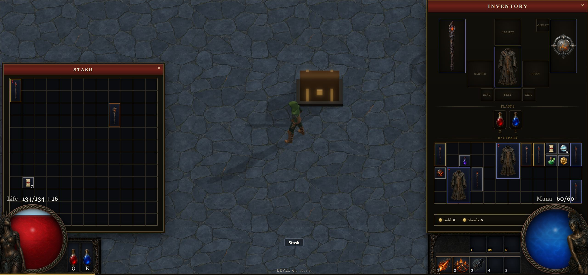 <b>Shift-click sends it across</b> - the stash shipped with exactly one way to move an item, which was picking it up and carrying it to a cell.</td>
<td width="33%">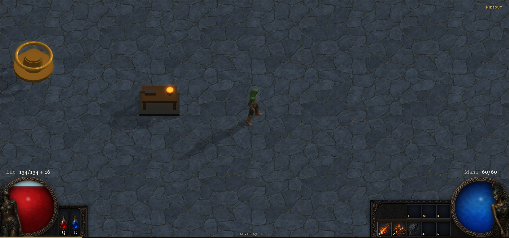 <b>The bench eats the leftovers</b> - ctrl-click a magic, rare or unique at the bench and it becomes currency shards, ten to an orb.</td>
</tr>
<tr>
<td width="33%">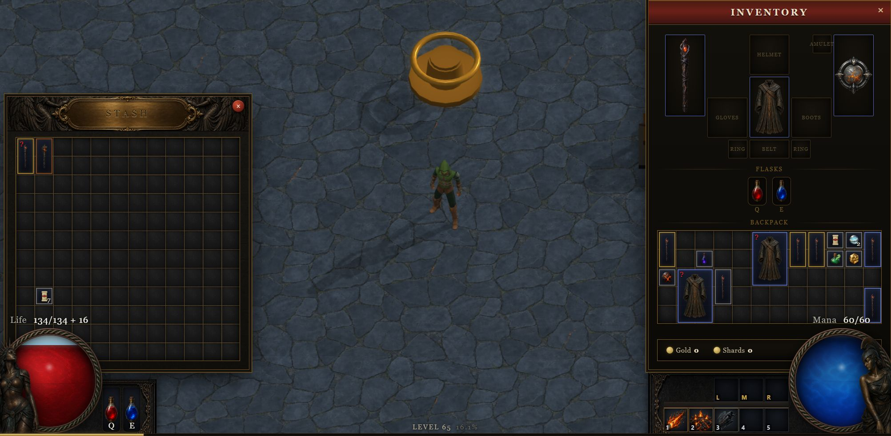 <b>The stash gets its cartouche</b> - the real stash was sampled pixel by pixel: cell floors near black at luminance 1, a 1px warm lattice, an engraved crest in every empty square.</td>
<td width="33%">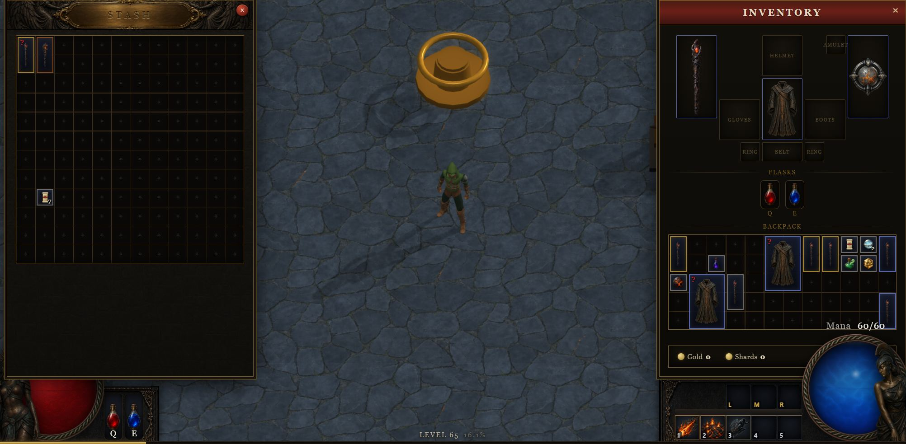 <b>The stash runs the full height</b> - top of the screen down past the bar, its lower corner sliding behind the life orb and the flask panel.</td>
<td width="33%">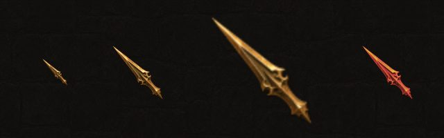 <b>Our own pointer</b> - a gilt blade retires every Windows cursor, cooled to red iron over an item the armed orb cannot touch.</td>
</tr>
<tr>
<td width="33%"> <b>One pane, cut twice</b> - stash and inventory now share a width, a top line and a bottom line, mirrored the way PoE1 opens the pair, with the flask frame raised to the bar's full height so no sliver of floor shows under the stash.</td>
<td width="33%">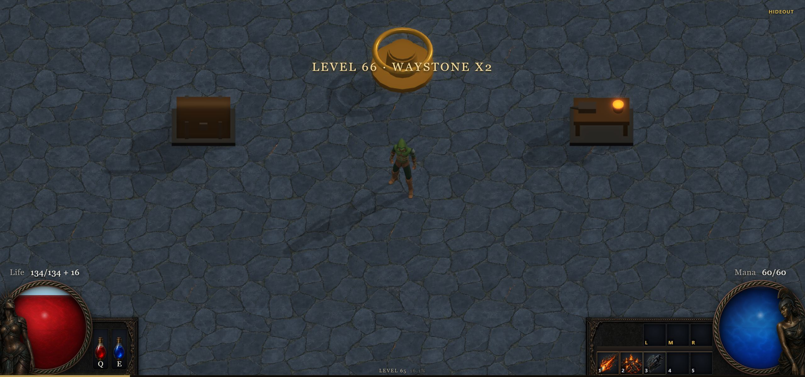 <b>The silent payouts get a voice</b> - a level and the stones a cleared map hands back both used to land with no sound and nothing on screen, which docs/09 rule 1 says means they did not happen.</td>
<td width="33%">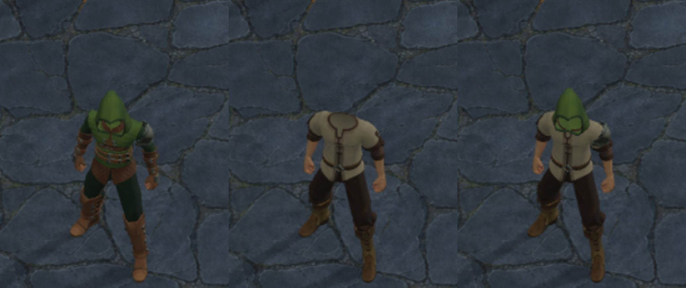 <b>The hood comes off the ranger</b> - both packs turn out to export the same 65 joints at the same bind pose, so a borrowed piece needs no re-rigging at all: clone the mesh, point it at the skeleton already in the scene, and it runs, leans and swings with him.</td>
<td width="33%"> <b>One character, five slots</b> - the packs were never modular (each welds its sleeves to its own forearms, and <i>neither ships a head</i> — the ranger only looked finished because his hood was his head). They are cut apart offline now and re-emitted as one rig whose parts are named <code>slot.look.part</code>, so wearing armour is pure visibility.</td>
</tr>
<tr>
<td width="33%"> <b>The bench becomes a man</b> - the disenchanter is a person now, standing over his brazier, wearing the same wardrobe rig the player does. The shards are identical; being handed them by someone is not.</td>
<td width="33%">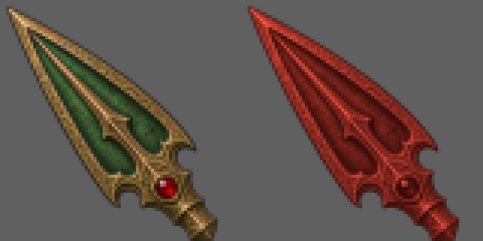 <b>The pointer stops being a needle</b> - a broad gilt arrowhead with a green enamel panel and a set stone replaces the thin spike, cropped to its own alpha so the click lands exactly on the drawn tip.</td>
<td width="33%"> <b>The armour stops disagreeing with its own icon</b> - the item art is charred iron with ember in the seams and the character was wearing green linen, so the inventory and the world looked like two different games. Each base now re-palettizes the authored 512 atlas to its own icon's colours, offline, and the runtime swaps one texture. Done as a pixel transform on the real atlas, so every UV seam still lands where the artist put it. The silhouette is still the ranger's: that is what geometry would cost.</td>
<td width="33%">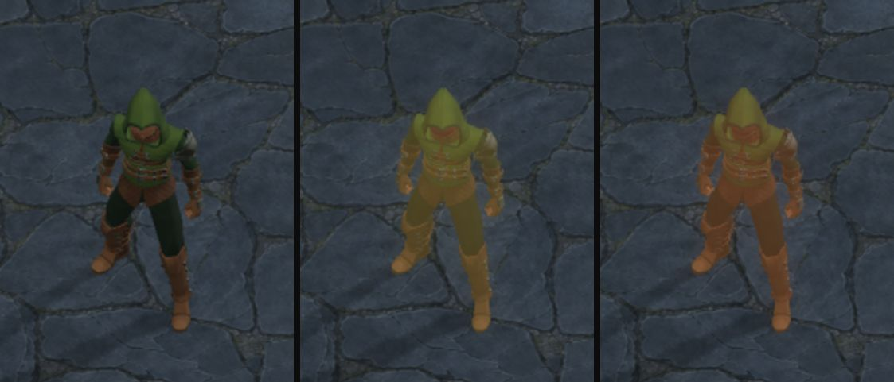 <b>The tint that did not survive contact</b> - rarity recolouring the one armour set (rare gold, unique copper) looked fine in a preview and wrong on a real character: it washes the whole silhouette one colour instead of pointing at the piece that is special. Reverted the same day. Two findings kept: albedo cannot tint these packs at all (a gold factor over their green texture moved the render 3%), and emissive can, but the glow layer blooms it so hard that even 0.04 flattens the armour. A second look needs accent geometry, not a colour pass.</td>
</tr>
<tr>
<td width="33%">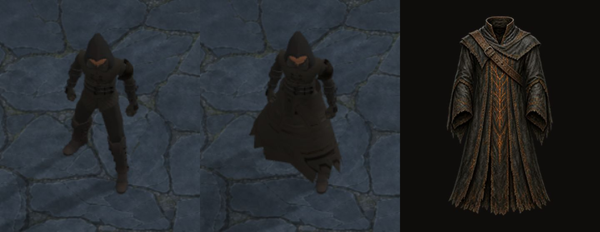 <b>The tunic becomes the coat</b> - re-palettizing the atlas got the armour's colour right and could never get its shape right: every body base is drawn as a floor-length coat and the ranger's authored body stops at the hip. So the missing half of the silhouette is generated now, a lofted skirt hanging from under his belt with the icon's row of hanging tatters at the hem. It is skinned across three bones rather than pinned to the pelvis, because a skirt rigid to the hips is a bell a running knee walks straight through: below the waist each side is carried by its own thigh, so the panel swings with the leg it covers. Its UVs are borrowed from the tunic by nearest angle and height, which is the only way to land on the cloth island of a packed character atlas without dragging a boot buckle into the fabric.</td>
<td width="33%">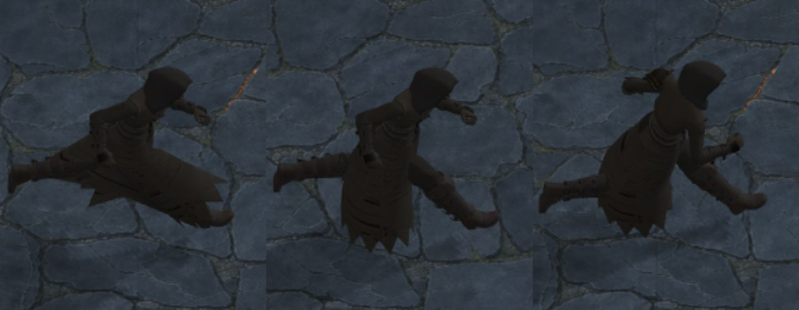 <b>The coat stops being two blades</b> - skinning it to the thighs was the obvious thing and it fails structurally: a thigh rotation is rigid about the hip, so the hem swept a wide arc exactly in phase with the knee (left). Nothing an animation clip drives can lag, and lag is most of what makes cloth read as cloth. So the coat hangs on eight two-joint chains that no clip touches, swung by a verlet solver: springs toward the bind pose rather than toward the floor, which keeps the authored flare and removes gravity as a thing to tune. Its colliders are capsules down every leg bone, not balls at the joints, because balls at the knee and the ankle leave the shin bare between them and that is exactly the height the hem hangs at.</td>
<td width="33%">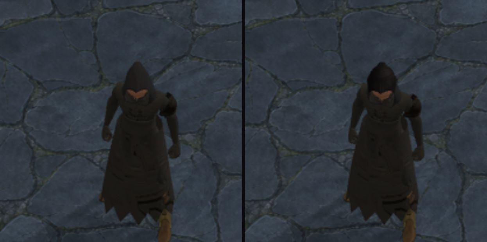 <b>The hood grows a shell</b> - the Cinder Cap icon is riveted iron with a ragged tail hanging out from under it, and the pack's only head covering is a soft cowl, so the character was wearing the tail and nothing else. The iron is made out of the cowl itself: its crown is duplicated, cut off at the brow, and pushed outward onto a dome, which carries the cloth's own skin weights along with it and cannot drift from the head it caps. Pushed outward only - the cowl points forward over the face, and a shell shrink-wrapped onto it would just be a pointed hood in iron. Flat-shaded, unlike everything else on him: at a head ten pixels across, facets catching light are what say plate instead of cloth.</td>
</tr>
</table>
