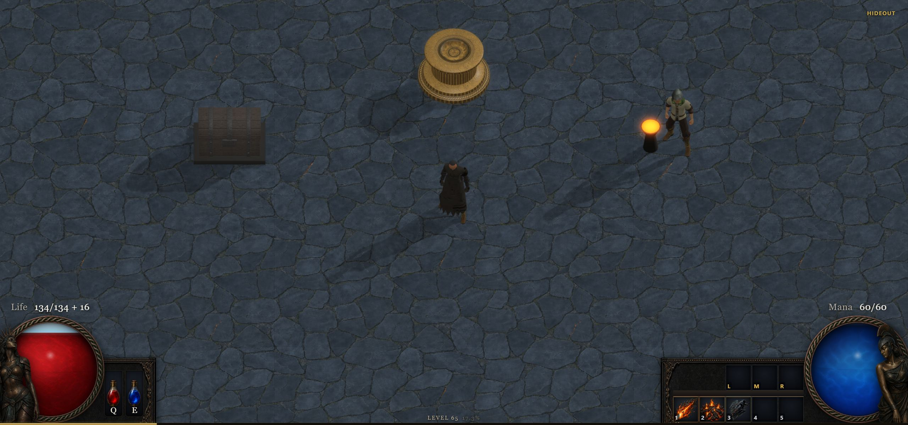

# Devlog

A visual record of Exiled Casual’s first ten days, from prototype combat to a complete game shell.
Design notes and implementation details live in [`../docs/`](../docs/).

## 2026-07-20 · First playable combat

The box prototype became a rigged character with a run loop and readable boss attacks.

<table>
<tr>
<td width="33%"> A rigged humanoid replaces the original box actor.</td>
<td width="33%"> The map device opens six portals for each run.</td>
<td width="33%"> The first boss attack warns players before it lands.</td>
</tr>
</table>

## 2026-07-21 · Procedural maps and boss phases

Generated interiors gained real boundaries while the Warden encounter grew a second phase.

<table>
<tr>
<td width="50%"> Procedural interiors gain textured walls and walkable rooms.</td>
<td width="50%"> The Warden’s second phase leaves burning ground behind.</td>
</tr>
</table>

## 2026-07-22 · Loot and map preparation

The first item loop connected drops, inventory, Waystones, and map activation.

<table>
<tr>
<td width="50%"> Server-authored drops can now be collected and stored.</td>
<td width="50%"> The map device now prepares destinations with Waystones.</td>
</tr>
</table>

## 2026-07-23 · A readable HUD

Painted frames and structured tooltips replaced the prototype interface.

<table>
<tr>
<td width="50%"> Painted frames give the life and mana globes weight.</td>
<td width="50%"> Items expose their base stats, modifiers, and requirements.</td>
</tr>
</table>

## 2026-07-24 · Equipment and item identity

Items gained painted art, unique identities, direct equipment controls, and a cohesive bottom HUD.

<table>
<tr>
<td width="33%"> Unique items carry fixed art, modifiers, names, and flavour.</td>
<td width="33%"> Dragging equipment highlights every legal destination slot.</td>
<td width="33%"> The globes and skill bar settle into one bottom frame.</td>
</tr>
</table>

## 2026-07-25 · Progression, Atlas, and combat stats

The game gained visible progression, functional gear stats, a fullscreen Atlas, and richer loot presentation.

<table>
<tr>
<td width="33%"> The Atlas expands into a navigable fullscreen world.</td>
<td width="33%"> The character sheet exposes defensive and offensive totals.</td>
<td width="33%"> The inventory docks full-height without covering the action bar.</td>
</tr>
<tr>
<td width="33%"> Rarity-colored labels and beams make drops readable instantly.</td>
<td width="33%"> Waystones now change both map danger and rewards.</td>
<td width="33%"> The globes are rebuilt around clearer labels and proportions.</td>
</tr>
</table>

## 2026-07-26 · Rewards, crafting, and stash

Boss rewards became tangible while identification, crafting, and stash management joined the loop.

<table>
<tr>
<td width="50%"> The Warden now pays out with a visible loot burst.</td>
<td width="50%"> Currency orbs turn ordinary items into crafting opportunities.</td>
</tr>
<tr>
<td width="50%"> Inventory and stash become one mirrored interface.</td>
<td width="50%"> Skills now explain their damage, cost, and timing.</td>
</tr>
</table>

## 2026-07-27 · Wardrobe and hideout services

Equipment became visible on the character, while the Atlas and disenchanter gained focused interaction panels.

<table>
<tr>
<td width="33%"> Each Atlas location opens its own anchored preparation panel.</td>
<td width="33%"> A modular wardrobe swaps visible gear by equipment slot.</td>
<td width="33%"> The disenchanting bench becomes a character in the hideout.</td>
</tr>
<tr>
<td width="33%"> Equipped armour now matches its painted inventory identity.</td>
<td width="33%"> The long coat bends around the character’s stride.</td>
<td width="33%"> The disenchanter now buys scraps and sells equipment.</td>
</tr>
</table>

## 2026-07-28 · World art and distinct skills

The hideout, map boundaries, and starter skills received their first production-style visual pass.

<table>
<tr>
<td width="50%"> Modeled props replace the hideout’s placeholder primitives.</td>
<td width="50%"> Natural rock walls give generated maps a believable edge.</td>
</tr>
</table>

<table>
<tr>
<td width="33%"> Ember Bolt becomes a fast, white-hot projectile streak.</td>
<td width="33%"> Cinder Ground burns through animated cracks and embers.</td>
<td width="33%"> Blink leaves a cool violet displacement trail.</td>
</tr>
</table>

## 2026-07-29 · A complete game shell

Menus, character selection, loading screens, options, and the experience rail completed the route into play.

<table>
<tr>
<td width="50%"> The game opens on its own painted main menu.</td>
<td width="50%"> A persistent roster now handles character selection and creation.</td>
</tr>
<tr>
<td width="50%"> Area transitions wait behind a painted loading plate.</td>
<td width="50%"> Graphics, sound, and UI settings apply live in-game.</td>
</tr>
</table>

<table>
<tr>
<td width="100%"> Experience moves into a quiet rail beneath the HUD.</td>
</tr>
</table>
