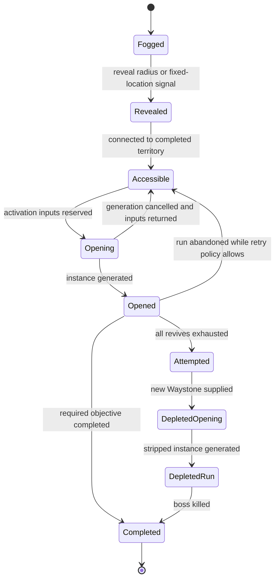

# Atlas and Map Running

Research snapshot: Path of Exile 2 Early Access 0.5.4b, 2026-07-19. The current structural baseline is the 0.5.0 Atlas overhaul. This is a volatile ruleset. Older launch and 0.2 guides are often incompatible with it.

Confidence labels:

- `verified-primary`: current official patch notes or first-party client text.
- `verified-secondary`: current PoE 2 Wiki documentation.
- `inferred`: proposed reconstruction architecture, not a claim about GGG internals.
- `unknown`: proprietary or not responsibly recoverable from public sources.
- `deprecated`: historical behavior that a current clone must not implement.

## 1. The current endgame loop

The Atlas is a personal, seed-generated graph that expands away from the Ziggurat Refuge. A node identifies a map location with a map base, biome, tileset, boss, and possible special content. Opening the node creates a procedural combat area.

The ordinary loop is:

1. Open the Atlas from the Map Device.
2. Select a visible, accessible, incomplete node connected to completed territory.
3. Select an identified Waystone that satisfies any special-node condition.
4. Inspect its tier, affixes, reward modifiers, map revives, and tablet capacity.
5. Optionally insert usable tablets.
6. Select the active Atlas Master.
7. Activate the device and enter through portals.
8. Traverse the generated area, fight packs, and resolve optional encounters.
9. Kill the unique map boss and satisfy any additional objective.
10. Complete the node, reveal or unlock connected territory, update quests, and keep the loot.
11. Craft, trade, equip, or stash rewards, allocate progression, and select another route.

Every ordinary current map has a unique boss. Boss death is the normal completion condition. Some special, noncombat, hideout, or authored progression locations are exceptions.

`deprecated`: Launch-era map completion required the final rare or all marked rares. Patch 0.3.1 replaced that foundation with a boss on every regular map and boss-kill completion.

The Atlas graph itself is personal. Official 0.5.0 notes say completion credit for fixed Atlas locations can be shared with participating party members. That does not imply the party shares one mutable generated graph.

References: [0.5.0 patch notes](https://www.pathofexile.com/forum/view-thread/3932540), [Atlas](https://www.poe2wiki.net/wiki/Atlas), [Map](https://www.poe2wiki.net/wiki/Map), [0.3.1 patch notes](https://www.pathofexile.com/forum/view-thread/3862213).

## 2. Atlas node state

Use one authoritative state machine rather than UI booleans:



Suggested meanings:

| State | Meaning |
|---|---|
| Fogged | Not visible. Geometry may be ungenerated or generated but undiscovered |
| Revealed | Visible, but no completed path reaches it |
| Accessible | Can accept a Waystone |
| Opening | Inputs escrowed while generation/instance allocation occurs |
| Opened | One live run owns the node attempt |
| Attempted | Revival budget exhausted and original extra content depleted |
| DepletedRun | Reopened with a new Waystone under failure penalties |
| Completed | Required objective finished; ordinary node cannot be run again |

Keep discovery, accessibility, attempt state, and fixed-quest completion separate. A fortress objective can be complete even if some visual branch state changes afterward.

## 3. Atlas UI specification

Current documented features:

- Search.
- Extended zoom range.
- Town fast travel from the Atlas, including faster side travel interactions.
- Up to 16 bookmarks with icons and optional labels.
- Hover cards for map base, biome, modifiers, content, and warnings.
- Off-screen destination indicators and a list for relevant remote landmarks.
- Towers revealing a wide surrounding region.
- Powerful map bosses visible through fog as vertical light pillars.
- Fixed endgame hubs occupying consistent compass directions around the origin.

Browser UI requirements:

```text
left click node       select and show activation panel
double click          focus / fast activation only if accessibility option enables it
drag                   pan
wheel / pinch          zoom around pointer
search                 match original map label, biome, content tag, boss tag, modifier text
bookmark               icon + text + optional category
route preview          highlight shortest currently traversable path
modifier comparison    show which effects come from node, Waystone, tablet, tree, master
```

The exact live search grammar is not publicly specified. Implement plain text plus structured internal tags first. Do not claim unsupported syntax parity.

The activation panel must expose before consumption:

- Area/map identity and biome.
- Waystone tier and area level.
- Prefixes, suffixes, corruption, total explicit count.
- Monster Effectiveness, Pack Size, Item Rarity, Monster Rarity, and Waystone Drop Chance.
- Revival budget and any master adjustment.
- Available and locked tablet slots.
- Fixed, forced, random, and incompatible content.
- Boss and powerful-boss status.
- Special failure, quest, cleansing, fortress, or pinnacle rules.

## 4. Atlas graph generation

`unknown`: GGG has not published current node-placement, landmark-spacing, biome-noise, edge-construction, or special-node frequency algorithms.

`inferred` browser algorithm:

1. Divide the infinite plane into deterministic chunks with an overlap margin.
2. Derive chunk seed from account Atlas seed, season, algorithm version, and canonical coordinate.
3. Generate Poisson-disc or blue-noise candidate points, with seam agreement.
4. Create candidate edges from Delaunay adjacency or bounded nearest neighbors.
5. Choose a connected backbone with a minimum spanning tree or forest.
6. Add constrained loops while enforcing node degree, edge length, and crossing limits.
7. Sample layered low-frequency biome fields.
8. Assign map bases from biome-valid, progression-valid weighted pools.
9. Run authored landmark constraints for hubs, towers, corruption clusters, anomalies, cities, gateways, fortress branches, and pinnacles.
10. Validate connectivity, route lengths, landmark access, density, and seam identity.
11. Persist every revealed chunk and exceptional placement. Untouched chunks may regenerate from their original algorithm version.

```ts
interface AtlasChunk {
  key: string;
  algorithmVersion: number;
  seedCommitment: string;
  nodes: AtlasNodeDefinition[];
  generatedHash: string;
}

interface AtlasNodeDefinition {
  id: string;
  coordinate: { x: number; y: number };
  edges: string[];
  mapBaseId: string;
  biomeIds: string[];
  fixedLocationId?: string;
  pointOfInterestIds: string[];
  baseContentIds: string[];
  ancientModifierIds: string[];
}
```

Fixed points in 0.5.x mean pure weighted random placement is insufficient. Build an authored macro-layout constraint layer over ordinary procedural nodes.

## 5. Maps, biomes, and layout grammar

The current [Map table](https://www.poe2wiki.net/wiki/Map) is the best public catalog of current map bases, tilesets, bosses, biomes, and special notes. The table is patch-sensitive and should be imported only with licensing review and provenance, not copied as a product dataset.

### Biomes

Primary biomes:

- Desert.
- Forest.
- Grass.
- Mountain.
- Swamp.
- Water.

City identities:

- Ezomyte / Iron.
- Faridun / Copper.
- Vaal / Stone.

Other regional identities include Breach Strongholds and Ocean Expeditions. A map can count as more than one biome. Atlas passives specialize reward and encounter behavior by biome, and city-history effects can add another biome identity.

### Layout families

Current maps demonstrate authored procedural grammars:

| Family | Grammar |
|---|---|
| Open field | Broad traversable field, islands of blockers, multiple loose approach routes |
| Corridor | Long main spine, controlled branches, combat pockets, low route ambiguity |
| Loop | Circular or figure-eight route with reconnects and optional inner branches |
| Multi-floor | Height-band transitions, stairs/portals, occlusion groups, floor-local objectives |
| Gated | Switch, altar, door, bridge, or interaction changes connectivity |
| Arena sequence | Authored encounter stages and transitions with limited procedural dressing |

Each original browser map base should be data:

```ts
interface MapBase {
  id: string;
  biomeIds: string[];
  tilesetId: string;
  layoutGrammarId: string;
  bossId?: string;
  monsterPoolId: string;
  baseSpecialtyIds: string[];
  minimumTier?: number;
  allowsRandomContent: boolean;
  requiredSocketTypes: string[];
  specialRuleId?: string;
}
```

### Base specialties

Historical official examples and current map behavior support per-base specialties such as:

- More chests or monsters.
- More magic or rare monsters.
- A higher minimum rare-pack count.
- Increased Essence, Strongbox, or Shrine presence.
- Gold or experience conversion.
- No ordinary monster drops.
- Wave bosses or empowered final boss.

Exact current per-base profiles are not comprehensively public. Keep them as versioned content definitions.

### Special-location archetypes to reproduce with original expression

| Live example | Mechanical archetype |
|---|---|
| Moment of Zen | Noncombat merchant/reward node |
| Castaway | Convert drops to Gold and add buried treasure |
| Untainted Paradise | Very high XP, no monster item drops |
| Vaults of Kamasa | No monsters, high-rarity chest area |
| Ezomyte Megaliths | Escalating multi-boss waves |
| Silent Cave | Optional rare encounters empower a prison boss |
| Fractured Lake | Very high rare density, mirrored enemies, exclusive reward |
| Viridian Wildwood | Darkness, altars, and specialized chests |
| Hideout node | Permanent social/hub unlock |
| Anomaly | Authored campaign-boss challenge |
| Citadel | Major boss recreation and fragment reward |

These are mechanics references. A released clone needs new names, environments, bosses, stories, and rewards.

## 6. Procedural area generation

GGG's public procedural-generation talk supports an authored tile-grammar approach rather than arbitrary noise geometry. Important locations form a graph. Typed connections route over a weighted grid, paths become splines or semantic tile keys, and compatible mesh variants realize those keys. Indoor rooms have constrained placement and overlap/merge rules. Endgame areas target a controlled playable area and monster population.

Original outdoor pipeline:

```text
start / boss / objective / exit graph
-> anchor placement and jitter
-> typed route constraints
-> weighted grid pathing
-> path simplification and spline
-> semantic terrain-key raster
-> mesh-variant selection
-> encounter and reward sockets
-> collision and navmesh bake
-> monster budget solve
-> reachability / pickup / boss-arena validation
```

Original indoor pipeline:

```text
room graph
-> room-template placement
-> overlap and merge solve
-> doors and corridors
-> floor / wall / edge semantic keys
-> variant selection
-> occlusion and minimap groups
-> encounter sockets
-> collision / navmesh / reachability validation
```

Store:

```ts
interface GeneratedAreaProof {
  runId: string;
  algorithmVersion: number;
  contentManifestId: string;
  publicGeometrySeed: string;
  chosenVariantIds: string[];
  objectiveAnchors: Record<string, Vec2>;
  monsterBudget: number;
  walkableArea: number;
  validationChecks: Record<string, boolean>;
  mapHash: string;
}
```

The official talk describes generating on the server, communicating a successful seed, reproducing on clients, and using hashes to check synchronization. The browser design can send a compiled map description or successful public seed while keeping combat and loot randomness private.

Reference: [Designing Path of Exile to Be Played Forever](https://www.gdcvault.com/play/1025784/Designing-Path-of-Exile-to), [procedural generation presentation](https://youtu.be/EXnoHTqO7TE).

## 7. Waystones

References: [Waystone](https://www.poe2wiki.net/wiki/Waystone), [client-derived Waystone text](https://poe2db.tw/Waystones), [Reforging Bench](https://www.poe2wiki.net/wiki/Reforging_bench).

### Core rules

- A Waystone is a one-use map-opening item used with an eligible accessible Atlas node.
- It is not bound to one layout.
- Natural progression is tiers I through XV. Tier XVI generally results from corrupting a tier XV.
- Natural area level is `64 + tier`: tier I is 65, tier XV is 79, tier XVI is 80.
- Irradiated can add one area level. Certain corrupted or cleansed conditions can add another.
- Waystones must be identified before use in current 0.5.x.
- They can be Normal, Magic, or Rare.
- The ordinary natural affix limit is six: three prefixes and three suffixes. Corruption can exceed it.

Since 0.3, Waystone affixes pair difficulty with reward. Since 0.5 they are organized broadly as:

- Prefix: monster offence or output pressure.
- Suffix: monster defence or a player debuff.

Reward channels include:

- Monster Effectiveness.
- Pack Size.
- Item Rarity.
- Monster Rarity.
- Waystone Drop Chance.

Monster Rarity influences upgrades to Magic/Rare and the modifier count of rare monsters. Pack Size also increases the chance of extra rare monsters in rare packs. Atlas effects multiply with map-provided channels according to their defined buckets.

### The affix risk triangle

Current community-documented mapping:

| Explicit affixes | Usable tablet slots | Post-death map revives |
|---:|---:|---:|
| 0 | 0 | 5 |
| 1 | 1 | 5 |
| 2 | 1 | 4 |
| 3 | 2 | 3 |
| 4 | 2 | 2 |
| 5 | 2 | 1 |
| 6 or more | 3 | 0 |

```ts
const revives = clamp(6 - Math.max(1, explicitAffixCount), 0, 5);
```

Doryani's current extra-revive Master choice adds one under its current cap/rule. The exact tablet-slot table should be a patch record, not hardcoded into the inventory UI.

This is the central preparation decision:

- More affixes add danger.
- More affixes increase reward.
- More affixes permit more deterministic tablet content.
- More affixes remove safety.

### Corruption

Community-observed corruption families include:

1. No visible change.
2. Reroll modifiers and move tier by plus or minus one.
3. Lock one affix side and replace the other while retaining count, potentially creating unusual prefix/suffix distributions.
4. Preserve existing sides and add zero to four modifiers, allowing up to eight.

GGG has not published authoritative outcome weights. Represent these as a versioned weighted table and label probabilities unknown.

### Sustain and upgrading

- Three Waystones of one tier can reforge into one of the next tier, up to XV.
- Public descriptions conflict on whether rarity must match. Verify current live behavior before making it an invariant.
- Doryani sells a limited stock, generally tier I or one below the highest completed tier, with high-tier caps and level-up refresh behavior.
- Current client-derived text says only the final Powerful Map Boss can drop a Waystone above the current area's tier.
- Waystone Drop Chance and Atlas passives improve sustain.

Exact base drop weights, tier selection, rounding, and any pity behavior are `unknown`.

## 8. Death, portals, and failure

References: [Map](https://www.poe2wiki.net/wiki/Map), [Death](https://www.poe2wiki.net/wiki/Death), [0.5.3 patch notes](https://www.pathofexile.com/forum/view-thread/3968601).

Current rules:

- Portals represent the map retry/revival budget, not ordinary entry charges.
- Leaving and re-entering does not normally consume a retry.
- A death consumes one player's revival opportunity.
- Zero or one explicit affix grants five post-death revives, six total lives including the initial entry.
- Additional affixes after the first remove one revive each.
- Party members have independent revive pools.
- Outside a boss fight, a death returns the player to an available checkpoint or entrance.
- Logging out can reconnect to the instance while its lease remains alive.

### Boss reset

When the map owner chooses to respawn after dying during the boss encounter:

- Boss returns to full life.
- Encounter phase and party fight state reset.
- Other monsters and optional content disappear.
- The remaining instance is effectively boss-only.

After boss death, 0.5.x permits quick revival of dead party members.

### Exhausted map

When all retries are exhausted:

- Node becomes Map Attempted.
- It can be opened again with a new Waystone.
- Additional encounters are stripped.
- Tablet slots are disabled.
- Reopened map is not corrupted.
- Item rewards are reduced.
- It grants 50% less experience since 0.5.3.
- Killing the boss completes it permanently.

### Run state

```ts
type RunState =
  | "preparing"
  | "active"
  | "boss-active"
  | "boss-only-after-respawn"
  | "completed"
  | "attempts-exhausted"
  | "depleted-reopen"
  | "abandoned";
```

Map completion and run finalization must be idempotent. A reconnect or process retry cannot grant a second completion, passive point, fragment, or loot bundle.

## 9. Tablets and towers

References: [Precursor Tablet](https://www.poe2wiki.net/wiki/Precursor_Tablets), [Tower](https://www.poe2wiki.net/wiki/Tower), [0.3.1 patch notes](https://www.pathofexile.com/forum/view-thread/3862213).

### Tablets

Current rules:

- Inserted directly in the Map Device.
- Ordinary base tablet generally has ten uses.
- Each opened map consumes one use.
- Destroyed at zero uses.
- Unique tablets often have five or one use.
- Waystone explicit count controls usable slots.
- Same-type tablets can stack through type-specific behavior.
- Tablets force a mechanic, change density, or change reward behavior.
- Normal and Magic ordinary tablets are available by default.
- Atlas investment can unlock Rare tablets, more modifiers, or special types.
- Special infuser effects can exceed ordinary modifier limits.

Current base identities:

- Abyss.
- Breach.
- Delirium.
- Irradiated.
- Overseer.
- Ritual.
- Temple.

There are also unique tablets. Availability and sources are Atlas-gated for some types.

```ts
interface TabletInstance {
  itemId: string;
  baseTypeId: string;
  rarity: "normal" | "magic" | "rare" | "unique";
  usesRemaining: number;
  modifiers: ModifierRoll[];
  corrupted: boolean;
}
```

### Random-content resolver

0.3.1 introduced random extra content in maps. The initial documented pool included Breach, Delirium, Ritual, Expedition, Shrine, Strongbox, Essence, Wisp, Rogue Exile, and Summoning Circle.

Current 0.5 rules:

- Fixed node/map content resolves first.
- Each empty or locked tablet slot contributes random non-tablet-selected league content.
- Filling every usable slot suppresses ordinary eligible random choices.
- Incompatible duplicate mechanics reroll or combine according to type.
- Multiple same-type tablets use a type-specific stacking rule.

Proposed resolver:

```text
1. Add fixed node and map-base content.
2. Add fortress / Ancient modifier implied content.
3. Add tablet-forced content in slot order.
4. For every empty or locked slot, roll one weighted eligible mechanic.
5. Resolve forbidden combinations and duplicate policies.
6. Apply same-type tablet stacking.
7. Apply main tree, side tree, active Master, biome, and run modifiers.
8. Validate encounter sockets and map entity budget.
```

Exact weights, eligibility rules, and duplicate-reroll ordering are `unknown`.

### Towers

Current towers:

- Reveal a wide surrounding Atlas region.
- Reward a random tablet.
- Establish early Fortress progression.
- Use authored tower layouts.
- Can contain a boss under current rules.
- Precursor Towers in the Fortress wall grant multiple main Atlas points.

`deprecated`: Before 0.3.1, completed towers accepted tablets and projected an effect radius over nearby maps. That system was removed.

## 10. Main Atlas passive tree

References: [Atlas passive tree](https://www.poe2wiki.net/wiki/Atlas_passive_tree), [Atlas Masters data](https://poe2db.tw/Atlas_Masters).

Current foundation:

- More than 300 nodes.
- Can eventually be fully allocated.
- Main points come from fortress bosses, special maps, relays, towers, and fixed progression.
- Ordinary respec pressure is removed because all points can be obtained.
- Multi-choice mastery/keystone options can be switched.
- Upper regions can have area-level or quest gates.

Major axes:

- Pack Size, quantity, Item Rarity, Monster Rarity.
- Rare-monster modifier count and power.
- Waystone sustain.
- Tablet drop, rarity, uses, modifier count, and effect.
- Powerful map bosses.
- Biome specialization.
- Corrupted and Cleansed regions.
- Essence, Strongbox, Shrine, Rogue Exile, Wisp, and Summoning Circle systems.
- Exceptional currency, Fracturing Orbs, and Lineage supports.
- Special tablet types and boss/encounter access.

Biome examples:

| Biome | Current specialization themes |
|---|---|
| Desert | Quantity, XP, rare monsters, Essence, Alchemy/Regal rewards |
| Forest | Gold, rare monsters, spirits, Lineage and uncut gems |
| Grass | Quantity, Pack Size, circles, wisps, high-grade currency |
| Mountain | Rarity, rare chests, shrines, strongboxes, runes, tablets |
| Swamp | XP, Pack Size, essences, unique rarity, Chaos/Exalted conversion |
| Water | Rarity, Gold, magic packs, shrines, currency and jewellery |
| City | Tablet effect, rare modifiers, exiles, circles, fourth tablet slot |

Store nodes as graph data with predicates, stat operations, grants, and choice options. Do not implement each node as a hand-written `if` branch.

## 11. Fixed hubs and major mechanics

0.5.0 organizes major endgame systems around fixed hubs and staged quest/pinnacle paths:

| Direction | Hub | System |
|---|---|---|
| North | Fortress | Main pinnacle structure |
| West | Caer Tarth | Ritual |
| Southwest | Withered Hollow | Delirium |
| South | Monastery | Breach |
| Southeast | Ruins of Kingsmarch | Expedition / Runes of Aldur |
| East | Well of Souls | Abyss |
| Northeast | Vaal Ruins | Temple / Fate of the Vaal |

Each major mechanic should use the generic encounter, progression-tree, key, and pinnacle primitives below rather than custom persistence.

### Delirium

- Enter moving fog through a mirror.
- Kill and move deeper to advance rewards.
- Fog direction guides movement toward the boss.
- Shard events trigger additional fights.
- Grand Mirror progression spreads persistent fog across connected maps.
- Powerful kills can increase stored maps toward 200% Deliriousness.
- A Simulacrum becomes available at progression thresholds.
- Current Simulacrum has seven waves and high Deliriousness scaling.
- Completion progresses its pinnacle encounter.

Core reusable mechanics: moving hazard frontier, distance pressure, kill-based reward bar, persistent map-chain state, wave arena.

### Breach

- Activating a breach opens an expanding timed ring.
- Kills extend expansion.
- Stabilized breaches advance the path.
- Splinters and key-like items lead to domains/strongholds.
- Hive defence, Genesis crafting, named fortress bosses, and pinnacle keys extend the system.

Core reusable mechanics: time extension by kills, expanding boundary, spawned pack sockets, staged key synthesis, reward crafting tree.

### Ritual

- Kill enemies near an altar.
- Activate altar to resurrect a bounded encounter group.
- Earn Tribute.
- Spend on favors, rerolls, or deferrals.
- Sacrifice leftovers toward boss access.
- Progress into a five-map continuous sequence whose risks escalate and whose prior bosses can recur.

Core reusable mechanics: captured-monster snapshot, arena bounds, run-local shop currency, deferred reward contract, chained maps.

### Expedition and Runes of Aldur

- Build a runic shape recipe in a grid, using roughly two to ten slots.
- Shape determines waves, rewards, and monster modifiers.
- Activation produces waves.
- Logbooks open an Ocean Atlas with islands, bosses, underground areas, and Grand Expeditions.
- 0.5.4 added a dedicated side tree and Grand Expedition modifiers.

Core reusable mechanics: spatial recipe, ordered modifier application, wave spawns, sub-Atlas, destructible/opened route graph.

### Abyss

- Follow a moving crack.
- Kill fast enough to keep it advancing.
- Finish at a chest or enter an Abyssal Depth.
- Atlas cracks progress toward boss depths and a pinnacle path.

Core reusable mechanics: moving path objective, pace threshold, branching endpoint, nested area.

### Temple and Fate of the Vaal

- Beacons reward a construction resource.
- A console constructs a room-and-path graph.
- Architect choices upgrade, replace, or remove rooms.
- Tree investment raises room tiers.
- Crystals/medallions and fixed maps gate later bosses.

Core reusable mechanics: persistent directed room graph, limited construction currency, mutually exclusive room mutations, staged boss access.

Official 0.5.0 details: [Return of the Ancients patch notes](https://www.pathofexile.com/forum/view-thread/3932540). Current Expedition adjustment: [0.5.4 data](https://poe2db.tw/Version_0.5.4).

## 12. Atlas Masters

Three masters are configured simultaneously. Each has 12 passives in four rows of three. One option is selected from every unlocked row. Before opening each map, one master is active. Switching between maps is free.

### Progression themes

- Doryani: corrupted nexuses and increasing corruption progression.
- Hilda: campsites and increasingly high-tier Great Beast missions.
- Jado: four Anomaly maps.

### Choice families

| Master | System identity |
|---|---|
| Doryani | Waystone risk/reward, extra revive, irradiation, affix amplification, corruption/cleansing, bosses, expedition explosives, pinnacle recovery |
| Hilda | Rare/unique monsters, powerful bosses, runic monsters, rogue exiles, spirits, scavenging, tablet effects, replacing rares with bosses |
| Jado | Corrupted-Waystone anomalies, unique/chest rewards, anomaly discovery, variable tablet effect, random content, Ancient Modifiers, exceptional currency, Lineage gems |

```ts
interface MasterLoadout {
  masterId: string;
  unlockedRows: number;
  choiceByRow: Record<number, string>;
}

interface MapPreparation {
  activeMasterId: string;
  masterLoadoutSnapshotHash: string;
}
```

Current client data should override stale wiki summaries. For example, the current Jado data lists Partial Translations as a random 0% to 40% increase to explicit tablet effect after its 0.5.2 redesign.

## 13. Corrupted and Cleansed regions

A Corrupted Nexus anchors a corrupted cluster:

- Nexus entry requires a Waystone with at least four explicit modifiers.
- Area contains an additional corruption boss after the ordinary map boss.
- Corrupted maps gain Atlas modifiers and Coalesced Corruption behavior.
- Kills leave orbs that merge and generate more corrupted monsters.
- Killing the Nexus transforms nearby corrupted maps into Cleansed maps.
- Cleansed maps receive cleansed packs, modifiers, and specialized rewards.
- Some high-value rewards require Atlas investment.
- First Nexus is deterministically placed southeast of origin and begins Doryani's path.

The transformation is an atomic persistent Atlas mutation:

```text
lock affected region revision
-> validate nexus completion operation ID
-> mark nexus complete
-> transform every eligible node to cleansed state
-> create master/quest progress and rewards
-> increment region and Atlas revisions
-> commit once
```

Reference: [Coalesced Corruption](https://www.poe2wiki.net/wiki/Coalesced_Corruption).

## 14. Fortress, Citadels, and pinnacles

### Fortress macro-graph

- First nearby tower raises or reveals the Fortress north of origin.
- Ancient Gateway branches lead through authored challenge chains.
- Quest recreations of major bosses gate progression.
- Burning Monolith contains the Arbiter of Ash.
- Origin Tower and two guardian halls provide components.
- Combining components produces the key to the Arbiter of Divinity.
- Defeating Divinity activates and automatically completes one Fortress section.
- Five kills can complete the whole structure.
- Fortress map bosses can spawn Relays that award main Atlas points.
- Special Fortress maps may award multiple points.

### Repeatable loops

Current endgame separates deterministic quest versions from harder, repeatable farming versions. Repeat access uses discovered halls, citadels, fragments, and component synthesis rather than one irreversible quest event.

`deprecated`: old Primary, Secondary, and Tertiary Calamity fragments were removed.

### Ancient Modifiers

Fortress maps can receive Ancient Modifiers, with more than 40 current variants and some availability outside the Fortress. They can:

- Add or transform content.
- Implicitly guarantee the referenced mechanic.
- Alter bosses, rewards, encounters, and map structure.
- Interact with Atlas passives and Masters.

Each must be a versioned area modifier with declared implied content, requirements, scope, stat operations, encounter transforms, and reward transforms. Current overview: [Ancient Modifiers](https://poe2db.tw/us/Ancient_Modifiers).

## 15. Activation and completion transactions

### Activation

```text
1. Validate node accessible and incomplete.
2. Validate character, party ownership, and no conflicting active run.
3. Validate identified Waystone, tier, affix count, and special requirement.
4. Calculate area level, revival budget, tablet slots, and warnings.
5. Validate tablets, types, remaining uses, and compatibility.
6. Snapshot Waystone, tablets, trees, master, biome, node, season, and quest state.
7. Resolve fixed, ancient, tablet, random, and master content.
8. Escrow inputs under one operation ID.
9. Generate and validate area; allocate instance.
10. Consume Waystone and decrement tablet uses exactly once.
11. Publish portals and mark node opened.
```

If generation fails before Ready, return escrow. Once Ready, apply ordinary abandonment policy. Freeze the run snapshot so later equipment, Atlas, master, or patch changes do not alter it.

### Completion

```text
1. Confirm authoritative boss death and every additional required objective.
2. Transition run to finalizing with a compare-and-swap.
3. Mark node completed and unlock neighbors.
4. Apply fixed quest, tower, corruption, relay, fortress, city, and side-tree changes.
5. Generate and materialize final rewards.
6. Commit progression and economy events in one idempotent operation.
7. Mark run committed and publish result.
```

### Reward composition

Model independent channels and explicit scopes:

```text
map base specialty
-> area tier and level
-> Waystone modifiers
-> tablets
-> main Atlas tree
-> mechanic side tree
-> active master
-> biome specialization
-> node / corruption / cleansing state
-> Ancient Modifiers
-> encounter-specific rules
-> boss-specific table
```

Scopes include `area`, `monster`, `magicMonster`, `rareMonster`, `boss`, `encounter`, `chest`, `item`, `currency`, and `waystone`. Exact bucket multiplication and rounding need empirical calibration.

## 16. Public unknowns and capture plan

Not publicly recoverable:

- Atlas graph and biome generation.
- Landmark and special-node weights.
- Per-map room, connector, dead-end, boss-distance, and spawn weights.
- Monster pack composition and upgrade rules.
- Exact Waystone drop/tier/pity rules.
- Random mechanic weights and collision resolution.
- Tablet stacking details for every modifier combination.
- Complete reward tables and rounding order.
- Boss AI timing, hit shapes, and internal cooldowns.
- Server recovery and anti-duplication details.

Clean-room observation tickets:

- Nodes of each type per 1,000 revealed nodes.
- Biome adjacency and multi-biome rates.
- Map walkable area, route length, dead-end rate, start-to-boss distance.
- Pack and rarity counts under controlled Waystones.
- Waystone tiers dropped by source and current tier.
- Random mechanic frequency for each locked/empty/filled slot state.
- Same-tablet stacking matrices.
- Failure, party ownership, reconnect, and reopen behavior.
- Boss reset and side-content removal edge cases.

Record video, patch, input state, area/Waystone details, and counts. Do not inspect client files, network protocols, or extracted assets. Fit our own versioned tables to observable outcomes.

## 17. Patch history that changes the design

| Patch | Structural change |
|---|---|
| 0.1, Dec 2024 | Infinite Atlas, one-death maps, rare-monster completion, tower-radius tablets |
| 0.1.1, Jan 2025 | Checkpoints, base specialties, tower variants, biome hover, bookmarks, visible citadels |
| 0.2, Apr 2025 | Revives based on map mods, boss reset, nonboss purge, corruption and cleansing |
| 0.3, Aug 2025 | Every Waystone affix couples danger/reward, corruption can exceed six mods, Anomalies |
| 0.3.1, Oct 2025 | Boss on every ordinary map, boss-kill completion, tablets move to Map Device, uses/slots, random mechanics |
| 0.4, Dec 2025 | Abyss, Fate of the Vaal, tier/effectiveness changes, tablet-cap changes |
| 0.5, May 29 2026 | Atlas reset, fixed hubs, Fortress, 300+ eventual-full tree, Masters, Ancient Modifiers, quest/farm pinnacles, identified Waystones, biome specialization, 30 new map areas |
| 0.5.1 to 0.5.3 | Point/reward corrections, Master changes, attempted-map 50% XP penalty, league balancing |
| 0.5.4, Jun 25 2026 | Expedition side tree and Grand Expedition changes |
| 0.5.4b, Jul 2 2026 | Boss, pinnacle, reward, Atlas-passive, and UI fixes without replacing the 0.5 structure |

Current official notes: [0.5.4b](https://www.pathofexile.com/forum/view-thread/3980516), [0.5.0](https://www.pathofexile.com/forum/view-thread/3932540).

