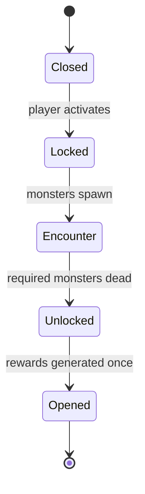
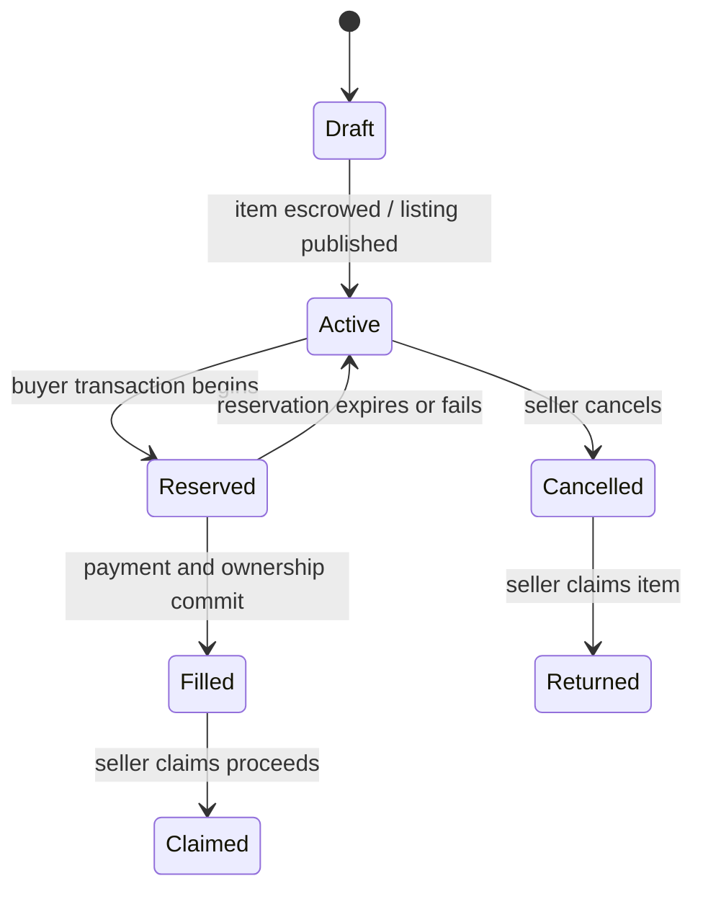
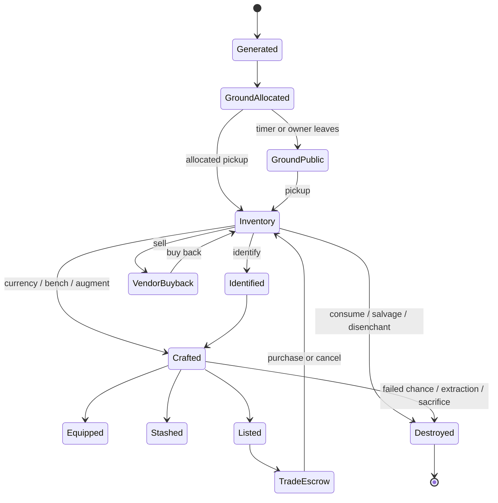

# Items, Loot, Crafting, and Economy

Research snapshot: Path of Exile 2 Early Access 0.5.4b, 2026-07-19. Economy rules are highly patch-sensitive. 0.5.2 through 0.5.4 changed catalysts, Expedition rewards, runeforging, special currency, and unique-granted skills. Every probability and transformation belongs to a content version.

Complete server-side drop tables, player-rarity diminishing returns, many modifier weights, unique selection weights, special-crafting outcome weights, vendor price formulas, and asynchronous-trade fees are not public. A perfect numeric clone cannot be derived from public material. The correct implementation is a deterministic item rules engine with replaceable tables, evidence metadata, and telemetry.

## 1. Item taxonomy and rarity

References: [Item](https://www.poe2wiki.net/wiki/Item), [Rarity](https://www.poe2wiki.net/wiki/Rarity), [Equipment](https://www.poe2wiki.net/wiki/Equipment), [Item class](https://www.poe2wiki.net/wiki/Item_class).

| Rarity | Ordinary presentation | Natural explicit capacity |
|---|---|---:|
| Normal | Grey | 0 |
| Magic | Blue | Up to 2, normally 1 prefix and 1 suffix |
| Rare | Yellow | Normally up to 6, 3 prefixes and 3 suffixes |
| Unique | Brown/orange | Predetermined modifier identity and presentation |

Important exceptions:

- Rare jewels normally cap at two prefixes and two suffixes.
- Flasks, charms, and relics cap at Magic rarity with two affixes.
- Unique eligibility can be global or source-restricted.
- Drop-restricted items cannot be made by generic drops, gambling, or Orb of Chance.
- Natural Magic, Rare, and Unique equipment commonly drops unidentified.
- A Scroll of Wisdom identifies one item. The Hooded One later identifies the carried inventory free of charge.

The current wiki records the natural unidentified Rare affix-count ratio as:

```text
4 modifiers : 5 modifiers : 6 modifiers = 8 : 3 : 1
```

Equivalent probabilities are about 66.67%, 25%, and 8.33%. Treat this as current community data, not a timeless engine constant.

### Item classes

At minimum, distinguish:

- Martial weapons: one-handed, two-handed, bows, crossbows, quarterstaves, spears, maces, and original equivalents.
- Caster weapons: wands, staves, sceptres/talismans or original equivalents.
- Off-hands: shields, foci, quivers, catalysts, and class-specific implements.
- Armour: helmet, body, gloves, boots.
- Jewellery: amulet, two rings, belt.
- Flasks and charms.
- Jewels and passive-socket objects.
- Gems: active, persistent, support, meta, and uncut.
- Currency and fragments.
- Waystones, tablets, logbooks, keys, and encounter items.
- Quest and account-bound objects.

Class determines inventory shape, equipment slot, implicit rules, modifier domain, quality behavior, socket cap, and filter identity.

## 2. Identification, disenchanting, and salvage

Identification reveals generated hidden modifiers. It must not generate them at identify time unless the unidentified-tier system explicitly defers only a culling/finalization stage. The safe deterministic model is to author the complete item at drop time, commit it server-side, and reveal the allowed projection later.

Current disenchant outputs:

- Magic: 1 Transmutation Shard.
- Rare: 1 Regal Shard, or 2 for an item with at least six affixes.
- Unique: 1 Chance Shard.
- Ten matching shards form their orb.

Disenchant is destructive and irreversible.

The [Salvage Bench](https://www.poe2wiki.net/wiki/Salvage_Bench) returns quality currency by:

```text
guaranteed = floor(quality / 5)
chance of one additional = (quality mod 5) / 5
```

Example: 17% yields three guaranteed units and a 40% chance for one more. It also returns one Artificer's Shard per augment socket. Inserted runes or Soul Cores are destroyed.

Salvage, disenchant, sale, sacrifice, failed Chance, and extraction all create explicit economy destruction events.

## 3. Item level, drop level, and hidden loot tiers

### Item level

Item level primarily controls eligible modifier tiers. It does not directly increase an equipment base's fixed stats.

Current public behavior:

- Chests and non-monster sources usually create items near area level.
- Normal and Magic monsters usually create items near area level.
- Rare monsters add one item level.
- Unique monsters add two item levels.
- Irradiation and some map modifiers can raise monster/item level.
- A base item's drop level controls whether the base is eligible.
- Advanced item UI treats Tier 1 as the strongest affix tier.

### Unidentified item tier

Current community research describes a hidden ten-step equipment quality system:

- Internal tier 0 has no benefit.
- Internal tiers 1 through 5 improve equipment/currency/unique selection and suppress obsolete bases.
- Internal tiers 6 through 9 appear as Unidentified Tier 2 through Tier 5.
- Benefits are committed at generation/identification and do not improve later crafting.

Some current tables are explicitly marked stale. Model the mechanism, but keep exact culling thresholds and tier probabilities in confidence-tagged patch data.

At high item level, Atlas specialization can enable rare Exceptional bases with 21% to 30% quality and an additional augment socket. A corruption socket can potentially stack beyond the ordinary cap.

Reference: [Item level](https://www.poe2wiki.net/wiki/Item_level).

## 4. Modifier engine

References: [Modifier](https://www.poe2wiki.net/wiki/Modifier), [official API reference](https://www.pathofexile.com/developer/docs/reference).

```ts
interface ModifierDefinition {
  id: string;
  patchId: string;
  domain: string;
  generationType:
    | "prefix"
    | "suffix"
    | "implicit"
    | "enchant"
    | "rune"
    | "corruption"
    | "desecrated"
    | "crafted"
    | "mutated";
  groups: string[];
  tags: string[];
  requiredItemLevel: number;
  displayTier?: number;
  stats: Array<{ statId: string; min: number; max: number; rounding?: string }>;
  spawnWeights: Array<{ predicateId: string; weight: bigint }>;
  displayTemplateKey: string;
}
```

### Affix generation

The following reproduces visible behavior but is inferred, not GGG source code:

1. Build the eligible pool by domain, class, base tags, item level, generation type, and content version.
2. Remove zero-weight definitions.
3. Remove definitions whose exclusive groups conflict with existing modifiers.
4. Confirm prefix or suffix capacity.
5. Choose a definition by integer weighted random selection.
6. Roll every stat value in the selected tier.
7. Add the complete modifier atomically.
8. Repeat until the requested affix count is met.

Hybrid modifiers remain one modifier with multiple stat lines. Parsing tooltip lines as independent affixes breaks capacity, annulling, fracture, reforging, and trade search.

### Local and global values

Example local weapon calculation:

```text
local physical damage =
  (base physical + local added physical)
  * (1 + local increased physical / 100)
  * local quality factor
```

For a 50 to 100 base with 25 to 50 flat and 100% local increased:

```text
(50 + 25) * 2 = 150
(100 + 50) * 2 = 300
```

Other local distinctions:

- Local attack speed changes the weapon's local rate/base time.
- Local critical chance changes its base critical chance.
- Local critical bonus changes its local critical value.
- Local Armour, Evasion, Energy Shield, and Runic Ward modify the item before actor/global scaling.
- Quality applies at the class-specific local stage, with defined rounding.

Derived tooltips must be recalculated from base definition plus rolls. Never store tooltip totals as authority.

## 5. Quality

Reference: [Quality](https://www.poe2wiki.net/wiki/Quality).

Default maximum is 20%. Quality applies after other local modifiers, including relevant corruption and sanctification effects.

| Item | Effect per 1% quality |
|---|---|
| Martial weapon | 1% more local physical damage |
| Armour | 1% more local Armour, Evasion, Energy Shield, and applicable Runic Ward |
| Wand, staff, sceptre | 1% quality for inherent granted skill |
| Flask | 1% more local recovery |
| Charm | 1% increased duration |
| Skill gem | Skill-specific quality effect |
| Catalyst-compatible jewellery/jewel | 1% magnitude adjustment to matching tagged modifiers |

Ordinary quality generally does not apply to belts, quivers, or jewels. Typed catalysts are a separate compatible quality mechanism.

```ts
interface ItemQuality {
  type: "weapon" | "armour" | "flask" | "charm" | "skill" | `catalyst:${string}`;
  value: number;
  cap: number;
}
```

Exceptional and special rules can raise caps, add quality at corruption risk, allow unusually high Breach Ring quality, or alter maximum through essences. Gemcutter's Prism gives a fixed 5% gem-quality increment under current rules.

## 6. Inventory and equipment

References: [Inventory](https://www.poe2wiki.net/wiki/Inventory), [Equipment](https://www.poe2wiki.net/wiki/Equipment).

### Character inventory

- Grid is 12 columns by 5 rows, 60 cells.
- Titan's Colossal Capacity adds 20 cells.
- Every base has integer width and height.
- Pickup requires a legal placement.
- Dragging outside drops the item into the world when area policy permits.
- Modified clicks transfer to stash or another applicable container.

```text
pickup transaction:
  lock ground entity and inventory revision
  verify allocation and interaction range
  find legal placement
  if none: return failure without ownership change
  else: move ownership/location and commit one revision
```

Use a row bitset for fast collision and first-fit placement. The client previews placement, but the server validates it.

### Equipment slots and requirements

Core slots:

- Two weapon sets with main/off hand policies.
- Helmet, body armour, gloves, boots.
- Amulet, two rings, belt.
- Flask and charm positions.
- Passive jewel and gem systems are distinct.

Requirements can include level and attributes. If an equipped item becomes invalid:

- Slot is disabled/marked.
- Its modifiers, augments, and granted skills stop functioning.
- Derived stats and other requirements recompute to a stable fixed point.

Current maps prevent equipment changes during a boss fight. This is an authoritative area command guard, not only disabled UI.

## 7. Augment sockets and runes

References: [Augment socket](https://www.poe2wiki.net/wiki/Augment_socket), [Rune](https://www.poe2wiki.net/wiki/Rune).

Ordinary socket maxima:

- Body armour and two-handed weapons: 2.
- Other socket-capable weapons and armour: 1.
- Jewellery and quivers do not receive ordinary Artificer sockets.
- Exceptional/corruption effects can exceed normal caps.
- Absolute socket count cannot exceed item inventory-cell count.

Transitions:

- Artificer's Orb adds a socket up to current cap.
- Rune or Soul Core insertion adds one structured augment/enchantment modifier.
- Replacing an augment destroys the previous one.
- Orb of Extraction destroys the host and returns augments that are not Socket-Bound.
- Corrupted/sanctified items can still receive ordinary augments where permitted.
- Mutating augments reject states that cannot accept their required item mutation.

Runes have Lesser, ordinary, and Greater progression, commonly with three-to-one upgrades. Some endgame runes have a character-wide one-copy limit. Loadout validation, not item validation alone, must handle duplicates and disable affected equipment deterministically.

## 8. Crafting state transitions

References: [Crafting](https://www.poe2wiki.net/wiki/Crafting), [Currency](https://www.poe2wiki.net/wiki/Currency).

| Currency | Preconditions | Result |
|---|---|---|
| Scroll of Wisdom | Unidentified | Reveal generated modifiers |
| Orb of Transmutation | Normal eligible item | Magic with one random modifier |
| Orb of Augmentation | Magic with open capacity | Add one random modifier |
| Regal Orb | Magic | Rare, retain existing and add one modifier |
| Orb of Alchemy | Normal or Magic eligible item | Rare with exactly four newly generated modifiers |
| Exalted Orb | Rare with open capacity | Add one random modifier |
| Orb of Annulment | Magic/Rare with explicit modifier | Remove one random explicit modifier |
| Chaos Orb | Rare | Remove one random explicit, then add one |
| Divine Orb | Has rollable modifier values | Reroll values inside current modifier definitions |
| Orb of Chance | Normal eligible base | Transform to eligible Unique or destroy input |
| Vaal Orb | Eligible item | Add Corrupted and apply class-dependent outcome |
| Mirror of Kalandra | Eligible non-Unique equipment | Create a Mirrored copy |
| Fracturing Orb | Rare with at least four eligible mods | Permanently lock one random eligible explicit modifier |

Invariants:

- Regal and Exalted preserve existing rolls.
- Alchemy regenerates the modifier set instead of filling current capacity.
- Annulment does not automatically downgrade rarity.
- Divine changes values, not modifier tier/definition.
- Chance failure destroys its input.
- Fractured modifiers cannot be removed or Divine-rerolled.
- Desecrated modifiers can count for fracture eligibility but are not selected for fracture.
- Mirrored items reject most crafting.

### Greater and Perfect currency

Current minimum generated-modifier levels include:

| Currency family | Greater minimum | Perfect minimum |
|---|---:|---:|
| Chaos, Exalted, Regal | 35 | 50 |
| Augmentation, Transmutation | 44 | 70 |

These values and drop levels belong in currency definitions.

### Pure transformation API

```ts
interface ItemTransformContext {
  manifestId: string;
  operationId: string;
  rng: DeterministicRng;
  actor: CharacterSnapshot;
  craftingEffects: ActiveCraftingEffect[];
}

interface ItemTransformResult {
  updated?: ItemInstance;
  created: ItemInstance[];
  destroyedItemIds: string[];
  consumedItemIds: string[];
  choices: RecordedRandomChoice[];
}
```

The transform is pure. Ownership locks, consumption, economy events, and retries wrap it in a database transaction.

## 9. Essences, Omens, sanctification, and corruption

### Essences

Current [Essence](https://www.poe2wiki.net/wiki/Essence) behavior distinguishes:

- Lesser, ordinary, and Greater upgrades from Magic to Rare with a guaranteed modifier.
- Perfect and Corrupted effects that remove a random Rare modifier and add a guaranteed crafted modifier.

Community prose and current individual tooltips sometimes conflict. In a source ingestion pipeline, current official/client tooltip data has priority over generic prose.

### Omens

Reference: [Omen](https://www.poe2wiki.net/wiki/Omen).

```text
activate while carried
-> register pending trigger
-> perform matching craft/gameplay event
-> modify the operation atomically
-> consume Omen with that operation
```

Effects include:

- Prefix-only or suffix-only Regal, Exalted, Annulment, or Chaos operations.
- Greater Exalted/Annulment counts.
- Preventing Chance destruction.
- Same-class Unique transformation.
- Catalyst-tag weighting for Exalted selection.
- Making a Divine operation sanctify.

One non-crafting Omen can generally be consumed per area; multiple crafting Omens may be used. Store trigger family, scope, priority, consumption limit, and operation transform as data.

### Sanctification

Reference: [Sanctified](https://www.poe2wiki.net/wiki/Sanctified).

The current wiki records Rare-item sanctification as independently multiplying eligible values by a random factor from 0.78 through 1.22 in steps of 0.01, then rounding upward:

```ts
for (const value of eligibleValues) {
  const multiplier = rng.integer(78, 122) / 100;
  value = Math.ceil(value * multiplier);
}
item.sanctified = true;
```

It then locks most further crafting. This distribution is community data and must remain version-scoped.

### Corruption

Reference: [Corrupted](https://www.poe2wiki.net/wiki/Corrupted).

Reported ordinary equipment outcomes include:

- No visible change.
- Reroll up to three modifiers.
- Add a Vaal enchantment.
- Add a socket beyond ordinary cap.

Exact weights are not public. Some item classes can produce an effective no-change outcome when a socket is impossible. Corruption usually terminates ordinary crafting, while ordinary augment insertion/replacement can remain legal. 0.5.4 added an Atziri Orb of Sacrifice that can improve a corrupted enchantment while removing one random explicit modifier.

## 10. Reforging Bench

Reference: [Reforging Bench](https://www.poe2wiki.net/wiki/Reforging_Bench).

General equipment recipe:

- Three identified items.
- Same base and rarity; ordinary equipment is not Normal.
- Unique inputs share unique identity.
- No corrupted or mirrored inputs.
- Input width no greater than two under current equipment rule.

Output:

- Same base and rarity.
- Item level equals the lowest input.
- New modifiers, quality, and sockets.
- Inserted augments are lost.

Special recipes include:

- Three same-tier Waystones become next tier, through XV.
- Three compatible tablets become another tablet of that type.
- Three emotions/runes/essences advance or reroll according to their family.
- Soul Cores and catalysts use weighted pools.

The recipe engine needs predicates, consumed-input cardinality, grouping key, output-level policy, property carry policy, and reward table. Do not write one endpoint per recipe.

## 11. Runeforging and Runic Ward

References: [Runeforging](https://www.poe2wiki.net/wiki/Runeforging), [Runic Ward](https://www.poe2wiki.net/wiki/Runic_Ward), [Verisium Remnant](https://www.poe2wiki.net/wiki/Verisium_Remnant).

Armour runeforging:

- Retains existing identity, modifiers, sockets, and properties.
- Converts item to Runeforged form.
- Adds Runic Ward.
- At level 55 and below, Ward can be added without losing normal defence.
- Higher-level items trade some base defence for Ward.
- 0.5.3 reduced high-level defence loss by about 20%.
- Corrupted items are ineligible.

Runic Ward resolution:

1. A damaging hit would reduce Life below one.
2. Life stops at one.
3. Overflow damage is applied to Runic Ward.
4. Character survives if Ward covers overflow, otherwise dies.
5. Nondamage Life loss bypasses it.
6. Base Ward regeneration is 5% maximum per second.

This requires a lethal-proposal stage before final death. It cannot be implemented as ordinary Energy Shield.

## 12. Gems as items

References: [Gem](https://www.poe2wiki.net/wiki/Gem), [Gem socket](https://www.poe2wiki.net/wiki/Gem_socket), [Uncut Skill Gem](https://www.poe2wiki.net/wiki/Uncut_Skill_Gem).

- Uncut Skill Gems create or upgrade a chosen active skill to their level.
- Uncut Spirit Gems create/level persistent Spirit skills.
- Uncut Support Gems create supports.
- Active gems begin with two support sockets.
- Lesser, Greater, and Perfect Jeweller's Orbs set sockets to three, four, and five.
- Ordinary skill maximum is 20, with 21 possible through corruption.
- Meta gems contain active and support gems but cannot recursively contain another meta gem.
- Supports have compatibility tags, category exclusivity, attribute budget, and cost/reservation transforms.

```ts
interface SupportDefinition {
  id: string;
  compatibility: Predicate;
  transforms: SkillTransform[];
  costMultiplier?: number;
  reservationMultiplier?: number;
  attribute: "strength" | "dexterity" | "intelligence" | "none";
  exclusiveCategory?: string;
  globalLimit?: number;
}
```

Tooltip text is rendered from these operations. Never parse it into behavior.

## 13. Loot generation

### Authoritative pipeline

```text
monster / chest / encounter reward event
-> resolve eligible recipients and party snapshot
-> calculate base reward rolls
-> apply source, area, encounter, and party quantity channels
-> select reward pool
-> decide Gold conversion where allowed
-> select rarity or hidden item tier
-> select eligible base or unique family
-> generate implicits, affixes, values, quality, sockets, and special state
-> commit item identity and provenance
-> assign ground allocation
-> evaluate each client's item filter presentation
-> spawn ground entity and label
```

Separate RNG streams:

- Drop count.
- Reward pool.
- Gold conversion.
- Rarity/unidentified tier.
- Base selection.
- Unique selection.
- Affix definitions.
- Affix values.
- Quality/sockets.
- Corruption/special states.

Keep economy seeds secret. Diagnostics retain stream IDs and ordinals or committed choice records so a run can be audited without exposing future rolls.

### Drop scaling, reverse-engineered from PoE1

PoE1's drop tables are server-side and were never shipped, so this is datamined stat blocks plus
GGG's documented order of operations, not decompilation. Implemented in `packages/rules/src/loot.ts`.

Four channels. Within a channel increases add; between channels they multiply. **Only the player
channel diminishes** — which is why map quantity is worth so much more than gear ever was, and why
GGG eventually deleted quantity from equipment (3.25.0).

Monster rarity is a channel, not a special case. PoE's hidden blocks, exact:

| Monster | inc. Quantity | inc. Rarity | dropped ilvl | quantity multiplier |
|---|---|---|---|---|
| Normal | – | – | area level | 1.0x |
| Magic | +600% | +200% | +1 | 7.0x |
| Rare | +1400% | +1000% | +2 | 15.0x |
| Unique / boss | +2850% | +1000% | +2 | 29.5x |

Fractional counts resolve as PoE resolves them: the whole part is guaranteed, the remainder is one
coin flip. Scaling a monster past 100% gives it a chance at a *second* item, never a bigger first one.

The player channel's diminishing returns are unpublished. Fitted to the only two data points the
wiki gives (50% -> 1.35x, 200% -> 1.77x): `DR(x) = 1 + x/(1 + x/1.25)`, hard asymptote 2.25x. One
free parameter against two points, so the constant is a knob; the shape is the part worth keeping.
Patch 0.9.9 says rarity's returns bite harder on the rarer tiers, so each tier passes its own `kPct`.

The rarity roll **does not read item level**. A level 2 monster and a level 84 one use identical
odds; a high map only feels richer because its area and monster rarity are larger. Item level gates
the affix pool and (once bases carry a drop level) which bases can appear — nothing else.

Two deliberate deviations from PoE1:

- **Unique is rolled after the category, not before.** PoE checks unique first, which is why
  extreme rarity there cannibalises currency drops. That is a wart, not a feature.
- **Normal monsters pay mostly currency.** 3.28 moved PoE the same way; a white base is noise.

The one number that must not be copied is the base rate. PoE's ~8% per normal monster is calibrated
against 200-600 monsters per map and we run six, so it is solved from a target payout per map
instead (14% at the time of writing).

The reveal economy is solved the same way. Every drop above normal is unidentified, so the map has to
pay for reading itself, and it pays at **1.35 scrolls per unidentified item** (weight 120 of 170 in
`CURRENCY_DROPS`, guarded by a 1.15-1.6 band in `death.test.ts`). Break-even was the first cut and it
is not enough: the player who spends each scroll as it lands is one bad map from holding a rare he
cannot read. PoE1 buys that headroom without spending it on the drop table, because scrolls arrive
there in stacks and as Scroll Fragments from vendoring what you just identified. We have neither tap
yet, so the weight carries it alone, and the price is paid by the orbs, whose share of currency
drops falls from 45% to 29%. When the vendor lands, take the weight back down.

### Gold

Reference: [Gold](https://www.poe2wiki.net/wiki/Gold).

- Account-bound within a league.
- Does not occupy inventory.
- Automatically collected in range.
- Not directly tradeable or itemized.
- Used by vendors, passive respec, currency exchange, and asynchronous trade.
- Some potential item drops convert to Gold.
- Normal items convert more readily than higher-rarity items.
- Up to half a Unique monster's drops can become Gold under current documentation.
- Party members receive separate equal-value Gold drops.

### Item-rarity channels

Keep distinct:

- Player Item Rarity from credited killer, inherited by minions.
- Area Item Rarity from Waystones, tablets, corruption, and area modifiers.
- Monster Rarity and monster rarity-upgrade mechanics.
- Encounter-specific rarity and Deliriousness.

These are broadly multiplicative buckets, but player Item Rarity uses an undisclosed diminishing-return curve. Player rarity does not ordinarily affect chests/strongboxes; area rarity does. There is no central generic player Item Quantity affix equivalent. Quantity comes mainly from area, monster, party, and encounters.

### Unique selection

Community analysis proposes:

1. Choose a unique rarity tier such as Common, Uncommon, Rare, or Mythic.
2. Choose an eligible unique within it.
3. Natural drops can fall back when none are eligible.
4. Orb of Chance does not fall back and destroys the item on failure.
5. Item Rarity biases higher unique tiers.

Treat all weights and exact fallback behavior as calibratable. Reference: [community unique-tier analysis](https://www.poe2wiki.net/wiki/Guide:Analysis_of_unique_item_tiers).

## 14. Strongboxes and reward containers

Reference: [Strongbox](https://www.poe2wiki.net/wiki/Strongbox).



Strongbox type controls reward pool: generic, caster, armour, martial, currency, jewellery, Waystone, and other original equivalents.

- Can be crafted with affixes.
- Ordinary capacity is up to three prefixes and three suffixes.
- Atlas effects can raise it toward four and four.
- Ignore player-equipment rarity.
- Use area rarity and box modifiers.
- Gain innate quantity/rarity in later campaign and endgame.
- Corruption can make resulting items corrupted.

0.5.3 changed Grand Expedition chest categories and reward emphasis, proving these pools must be patch data rather than code.

## 15. Party allocation

Reference: [Party](https://www.poe2wiki.net/wiki/Party).

Allocation modes:

- Free For All: public immediately.
- Short Allocation: randomly reserved to one nearby eligible player for a limited time, then public.
- Permanent Allocation: reserved until picked up and dropped, or owner leaves.

```ts
interface GroundAllocation {
  mode: "ffa" | "short" | "permanent";
  allocatedPlayerId?: string;
  eligiblePartySnapshot: string[];
  reservedUntilTick?: number;
  ownerStillPresent: boolean;
}
```

Waystones are assigned to the map creator and do not gain ordinary party-size drop chance. Only nearby members at the kill count for reward scaling. Public sources conflict on exact party quantity curves, so keep them unresolved until controlled current tests.

## 16. Loot filters

References: [official item-filter documentation](https://www.pathofexile.com/item-filter/about), [PoE 2 item filter](https://www.poe2wiki.net/wiki/Item_filter).

Semantics:

- Blocks evaluate top to bottom.
- Conditions within a block are ANDed.
- First matching block wins unless `Continue` appears.
- Items are visible by default.
- A filter changes presentation only, never generation, ownership, or allocation.

Relevant conditions:

```text
Class, BaseType, Rarity, ItemLevel, DropLevel, AreaLevel,
Quality, StackSize, Identified, Corrupted, Fractured,
Sockets, Width, Height, UnidentifiedItemTier, WaystoneTier,
HasVaalUniqueMod, IsVaalUnique, TwiceCorrupted, AlwaysShow
```

Actions:

- Show/Hide.
- Text, border, and background color.
- Font size.
- Sound.
- Beam/effect.
- Minimap icon.

Architecture:

```ts
const presentation = compiledFilter.evaluate(publicItemSnapshot, areaContext);
```

Compile filters into ordered predicate bytecode or optimized decision nodes. Preserve source line mapping for errors. Hot reload must be safe during combat. A parse error keeps the previous valid filter and explains the failing line.

## 17. Vendors and gambling

Reference: [Vendor](https://www.poe2wiki.net/wiki/Vendor).

Roles:

- Weapon/armour seller.
- Caster/jewellery/trinket seller.
- Disenchanter.
- Gambler.

Stock behavior:

- Item levels roughly follow progression with caps.
- A portion refreshes on level-up.
- Gold-purchased items can enter buyback.
- Disenchant/salvage are not reversible.

Gambling:

- Presents obscured base/rarity in a category.
- Campaign charges rise on qualifying Unique kills.
- Current charge cap is 100.
- Publicly documented progression caps are approximately 15, 32, 44, 53, 64, and 82 across successive stages.
- Exact level and Gold formulas are not public.

Use data tables/server policies, not guessed continuous formulas.

## 18. Stash

Reference: [Stash](https://www.poe2wiki.net/wiki/Stash).

- Shared by an account within the same league/rule flags.
- Standard, Hardcore, challenge, and SSF boundaries differ.
- Four basic tabs are free.
- Basic tab is 12 by 12 cells.
- Premium public tabs support labels, color, and trade listing.
- League migration creates remove-only tabs.
- Remove-only tabs disappear after emptying and a later logout.

Affinities include currency, essences, flasks/charms, delirium, uniques, gems, maps, augments, fragments, breach, expedition, ritual, and abyss.

- Modified click routes into affinity tab.
- A bypass chord ignores affinities.
- Specialty stacks can reach 5,000.
- Unique tab stores one supported copy per identity.
- Gem/flask tabs can hold around 500.
- Map storage partitions by tier.
- Folders contain tabs, not loose items.

Every move uses authoritative container revisions. Two browser tabs cannot race the same item into two containers.

## 19. Trade and economy

References: [Trading](https://www.poe2wiki.net/wiki/Trading), [Currency exchange](https://www.poe2wiki.net/wiki/Currency_exchange), [Asynchronous trade](https://www.poe2wiki.net/wiki/Asynchronous_trade), [official asynchronous trade FAQ](https://www.pathofexile.com/forum/view-thread/3828185).

### Direct trade

Each player places items into an offer. Any offer change clears both accepts. Completion atomically:

1. Verify both offer revisions and acceptance flags.
2. Verify ownership, league, tradeability, and no locks.
3. Verify both recipients can fit all incoming items.
4. Transfer all items and currencies.
5. Commit everything or nothing.

### Currency exchange

1. Choose wanted and offered commodities.
2. Set quantity/ratio or accept a market ratio.
3. Pay Gold fee when placing the order.
4. Offered commodity enters escrow.
5. Matching consumes escrow.
6. Purchased commodity becomes claimable.
7. Cancellation returns an equivalent fresh stack, not necessarily original item identity.

Supported families include currencies, emotions, catalysts, essences, runes, Omens, Soul Cores, and encounter items. Gold fees are patch-configured by item class.

### Asynchronous equipment trade

- Merchant-capable stash tabs create listings.
- Seller chooses price/currency and pays no Gold listing fee.
- Buyer pays a Gold transaction fee.
- Listing grace and edit/removal cooldown policies apply.
- Search can be in-game or through a site.
- Seller may be offline.
- First committed purchase wins a race.
- Proceeds enter an Earnings container.
- A full Earnings container can block listings.
- SSF cannot use Merchant trade.

Buyer Gold fee formula is undisclosed and depends on item/progression properties. Patch changes have altered relative fees, proving it is live configuration.

### Order state



Use operation IDs, row versions, escrow ownership, database constraints, and one transaction. Never implement a listing as a mutable public stash pointer with no reservation.

## 20. Canonical item instance

The [official API reference](https://www.pathofexile.com/developer/docs/reference) exposes a useful public compatibility vocabulary, including size, stacks, sockets, socketed items, names/types/bases, rarity, properties, requirements, skills, modifier categories, corruption/fracture/sanctification flags, item level, unidentified tier, identification, and prefix/suffix counts.

Recommended internal model:

```ts
interface ItemInstance {
  id: string;
  templateId: string;
  templateRevision: number;
  generatedManifestId: string;
  leagueId: string;
  ownerAccountId?: string;

  itemLevel: number;
  dropLevel: number;
  rarity: "normal" | "magic" | "rare" | "unique";
  identified: boolean;
  unidentifiedTier?: number;

  quality?: ItemQuality;
  modifiers: ModifierRoll[];
  implicits: ModifierRoll[];
  enchants: ModifierRoll[];
  runes: ModifierRoll[];

  sockets: ItemSocket[];
  stackCount: number;
  maxStack: number;
  width: number;
  height: number;

  flags: {
    corrupted?: boolean;
    doubleCorrupted?: boolean;
    mirrored?: boolean;
    fractured?: boolean;
    sanctified?: boolean;
    desecrated?: boolean;
    mutated?: boolean;
    characterBound?: boolean;
    accountBound?: boolean;
  };

  provenance: {
    sourceType: string;
    sourceId?: string;
    areaLevel: number;
    monsterRarity?: string;
    contentManifestId: string;
    rewardOperationId: string;
  };

  location:
    | { kind: "ground"; areaInstanceId: string; entityId: string }
    | { kind: "inventory"; characterId: string; x: number; y: number }
    | { kind: "equipment"; characterId: string; slot: string }
    | { kind: "stash"; tabId: string; x: number; y: number }
    | { kind: "tradeEscrow"; orderId: string }
    | { kind: "vendorBuyback"; sessionId: string }
    | { kind: "destroyed"; operationId: string };

  revision: number;
}
```

## 21. Item lifecycle



Corrupted, mirrored, fractured, sanctified, desecrated, and mutated are orthogonal state flags and guards, not rarities.

## 22. Patch manifest and acquisition

Official sources:

- [Developer docs](https://www.pathofexile.com/developer/docs).
- [API reference](https://www.pathofexile.com/developer/docs/reference).
- [Data exports](https://www.pathofexile.com/developer/docs/data).
- [Item-filter syntax](https://www.pathofexile.com/item-filter/about).
- Official patch notes.

PoE 2 APIs and official game-data exports are incomplete for clone-grade content. Community sources such as [PoE 2 Wiki](https://www.poe2wiki.net/), [RePoE fork](https://repoe-fork.github.io/), and [PoE2DB modifiers](https://poe2db.tw/us/Modifiers) can inform research, but may contain datamined content and have noncommercial/share-alike restrictions. Do not import them blindly into a commercial product.

Every source/import record needs:

```ts
interface DataSourceRecord {
  sourceUrl: string;
  retrievedAt: string;
  sourceRevision?: string;
  gamePatch: string;
  contentHash: string;
  license: string;
  permittedUse: "research" | "prototype" | "commercial" | "unknown";
  confidence: "official" | "community" | "observed" | "inferred";
}
```

```ts
interface ItemPatchManifest {
  patchId: string;
  baseItemsVersion: string;
  modifiersVersion: string;
  currenciesVersion: string;
  recipesVersion: string;
  lootPolicyVersion: string;
  rewardTablesVersion: string;
  migrations: MigrationRule[];
}
```

A balance change must declare whether it affects new items only, all existing base values, live granted-skill behavior, current roll ranges, vendor/economy behavior, or a forced migration.

## 23. Unknowns and calibration

Keep configurable with confidence metadata:

- Player Item Rarity diminishing-return curve.
- Base reward count by monster/source/area.
- Gold-conversion probabilities.
- Hidden unidentified-tier probabilities and culling tables.
- Missing modifier spawn weights.
- Unique tier weights and fallback behavior.
- Vaal and special-crafting outcome weights.
- Party quantity/rarity curves.
- Strongbox counts and innate bonuses.
- Vendor level/price and gambling distributions.
- Asynchronous-trade buyer fee formula.
- Encounter jackpot/reward weights.
- Runeforging costs and exact high-level defence conversion.

Calibration harness:

1. Define a controlled observable scenario and patch.
2. Record thousands of independent outcomes without extracting client data or protocols.
3. Store censored conditions, source rarity, level, party, map modifiers, and filter-off counts.
4. Fit candidate distributions and confidence intervals.
5. Run our simulator against the observation set.
6. Adjust patch configuration, not engine code.
7. Keep uncertainty visible when samples cannot distinguish models.

## 24. Implementation order

1. Stable item/base/modifier/patch schemas.
2. Ownership ledger, inventory grid, container revisions, and idempotency.
3. Rarity, affix generation, identification, and explainable tooltips.
4. Equipment requirements and derived stats.
5. Core currency state transitions.
6. Ground drops, allocation, labels, and filters.
7. Vendors, salvage, disenchant, and buyback.
8. Stash, affinities, and specialty containers.
9. Gem/support item state and skill integration.
10. Reward tables, Strongboxes, and encounter containers.
11. Direct trade, exchange escrow, and asynchronous listings.
12. Omens, catalysts, essences, fracture, corruption, sanctification, runeforging, and desecration.
13. Calibration, economy dashboards, migrations, and seasonal reset tools.

The critical boundary is server authority. A browser client can predict dragging, compare tooltips, and evaluate visual filters. It cannot decide that an item exists, moved, rolled, crafted, sold, or traded.
