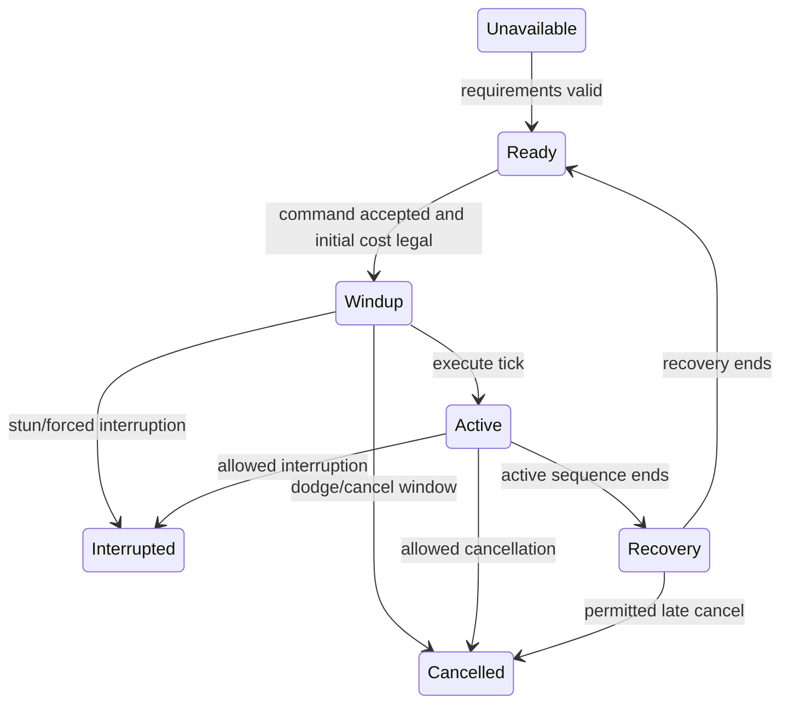
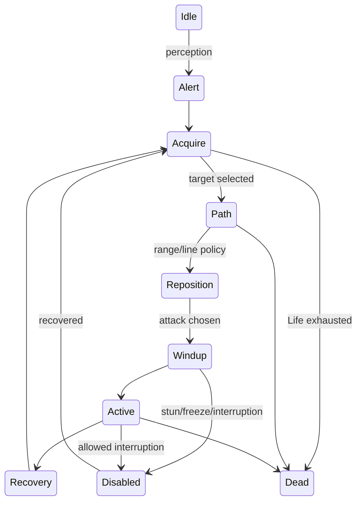

# Combat, Skills, and Character Systems

Research snapshot: Path of Exile 2 Early Access 0.5.4b, 2026-07-19. Current official baseline: [0.5.4b](https://www.pathofexile.com/forum/view-thread/3980516), [0.5.0](https://www.pathofexile.com/forum/view-thread/3932540), [0.4.0](https://www.pathofexile.com/forum/view-thread/3883495), and [0.3.0](https://www.pathofexile.com/forum/view-thread/3826682).

Public information cannot establish exact AI timings, server cadence, hidden monster coefficients, animation cancel ticks, input buffers, target scoring, boss collision volumes, or every damage-order edge case. This document separates current rules from reconstruction choices and capture work.

## 1. Character model

### Classes and Ascendancies

The current game has eight playable classes from a planned twelve. Class determines passive-tree starting area, local variants, Ascendancy options, and some quest rewards. Skills and equipment are generally gated by attributes and weapons rather than hard class locks.

| Class | Attribute identity | Combat identity | Current Ascendancies |
|---|---|---|---|
| Warrior | Strength | Maces, shields, warcries, slams | Titan, Warbringer, Smith of Kitava |
| Ranger | Dexterity | Bows, projectiles, mobility | Deadeye, Pathfinder |
| Huntress | Dexterity | Spears, melee/ranged hybrid | Amazon, Ritualist, Spirit Walker |
| Witch | Intelligence | Minions, chaos, occult magic | Infernalist, Blood Mage, Lich |
| Sorceress | Intelligence | Elemental spellcasting | Stormweaver, Chronomancer, Disciple of Varashta |
| Mercenary | Strength/Dexterity | Crossbows, ammunition, grenades | Witchhunter, Gemling Legionnaire, Tactician |
| Monk | Dexterity/Intelligence | Quarterstaves, combos, elemental melee | Invoker, Acolyte of Chayula, Martial Artist |
| Druid | Strength/Intelligence | Shapeshifting, talismans, nature magic | Shaman, Oracle |

Unavailable planned classes are Marauder, Duelist, Shadow, and Templar. The current roster contains 22 ordinary Ascendancies by this table. Abyssal Lich is an alternate Lich configuration, not a normal extra class.

Ascension:

- Four trial tiers award two points each, eight total.
- Trial of the Sekhemas and Trial of Chaos are current families.
- All points can be earned through one family.
- Changing Ascendancy requires a sufficient trial, unallocating Ascendancy nodes, and using its altar.

References: [Character class](https://www.poe2wiki.net/wiki/Character_class), [Ascension Trial](https://www.poe2wiki.net/wiki/Ascension_Trial), [PoE2DB class data](https://poe2db.tw/us/Character_class).

The browser game should begin with fewer original classes, but preserve open cross-class skill/equipment access. Class identity comes from starting topology and synergistic choices, not a closed skill list.

### Attributes

Current baseline:

- Strength: +2 maximum Life each.
- Intelligence: +2 maximum Mana each.
- Dexterity: official 0.3 changed it to +6 Accuracy each.
- Attributes do not inherently give broad percentage damage/defence.

There is a current source conflict: some wiki/tooltips have shown +8 Accuracy while official 0.3 says +6. Treat `accuracy_per_dexterity` as versioned and add a live verification ticket.

Core starting formulas currently documented:

```text
maximum Life = 28 + 12 * player level + 2 * Strength + other modifiers
maximum Mana = 34 + 4 * player level + 2 * Intelligence + other modifiers
base Mana regeneration = 4% maximum Mana per second
Low Life / Low Mana = 35% or less
```

References: [Attribute](https://www.poe2wiki.net/wiki/Attribute), [Life](https://www.poe2wiki.net/wiki/Low_life), [Mana](https://www.poe2wiki.net/wiki/Low_mana).

## 2. Resources and counters

### Life, Mana, Spirit, and reservation

Current community documentation says skill costs are paid across the action rather than always consumed as one up-front amount. Cancelling or stun stops the unpaid remainder. Insufficient Mana produces a failed-use response. Default Attack has no Mana cost.

Spirit powers persistent effects:

- No inherent starting Spirit.
- Current campaign rewards total 100: 30, 30, and 40.
- Persistent buffs, permanent minions, and meta gems reserve it.
- Some item/Ascendancy-granted effects do not reserve Spirit.
- Weapon sets can have different Spirit totals and persistent configurations.
- Reserved resource remains in maximum but cannot be spent, recovered into, or used as defence.

References: [Spirit](https://www.poe2wiki.net/wiki/Spirit), [Reservation](https://www.poe2wiki.net/wiki/Reserved).

Persistent loadout validation:

```text
calculate current-set Spirit
-> compile enabled persistent effects and support multipliers
-> reserve in deterministic priority order or reject invalid edit
-> spawn/maintain buffs and minions
-> on weapon-set swap, re-evaluate immediately
```

The UI must explain why a persistent effect became inactive instead of silently removing it.

### Charges

Current [Charge](https://www.poe2wiki.net/wiki/Charge) behavior:

- Endurance, Frenzy, and Power Charges are fuel, not inherent statistical bonuses.
- Default maximum is three.
- Default duration is 15 seconds.
- Gaining another charge refreshes all charges of that type.
- Charge duration pauses while a charge-consuming skill executes.

`deprecated`: Do not give charges PoE 1-style passive bonuses unless a current modifier explicitly grants them.

### Rage

Current [Rage](https://www.poe2wiki.net/wiki/Rage):

- Each Rage gives 1% more Attack Damage.
- Default maximum 30.
- After four seconds without gaining Rage, ignoring a Rage cost, or taking a hit, decay begins at one every 0.2 seconds.
- Rage on hit shares a 0.5-second gain cooldown.

### Glory

Current [Glory](https://www.poe2wiki.net/wiki/Glory):

- Stored separately per consuming skill.
- Generated from qualifying actions according to monster Power.
- One monster can generate it for a skill once per 0.5 seconds.
- After 15 seconds without gain, loses two per second.
- Normally cannot be gained while that skill's current instance is active.

### Combo

Current [Combo](https://www.poe2wiki.net/wiki/Combo):

- Usually counts successful melee strikes in an eight-second window.
- One strike adds one event regardless of targets hit.
- Each consuming skill tracks its own value.
- Actual weapon swap loses relevant combo if its skill is not active on the new set.

### Meta-gem Energy

Current [Energy](https://www.poe2wiki.net/wiki/Energy):

- Each meta gem has independent storage.
- At threshold, all eligible nested skills trigger, then Energy resets.
- Overflow is discarded.
- Nested skills share the enclosing threshold.
- Invocation-style meta gems store Energy for manual use.
- Triggered skills do not directly generate Energy; channelled skills cannot be triggered.

Represent every counter as a typed resource definition with gain filters, loss/decay policy, cap, per-skill/per-actor scope, persistence, and UI projection. Do not create one field per named mechanic in the actor class.

### Leech and recoup

Current [Leech](https://www.poe2wiki.net/wiki/Leech):

- Hit-based recovery occurs over one second.
- One leech instance per resource applies at a time.
- Highest rate acts first; others wait.
- Instances clear when unreserved resource becomes full.
- Hit damage above 40,000 is treated as 40,000 for leech, preserving type proportions.
- Monsters have hidden level-based leech resistance.

Current [Recoup](https://www.poe2wiki.net/wiki/Recoup):

- Recovers a percentage of hit damage over eight seconds.
- Instances operate independently.
- They continue while resource is full.
- Damage over time does not create recoup.
- Duration changes rate, not total recovery.

## 3. Skills and gems

### Count caveat

Current public pages count the catalogue differently. The general Gem page, engravable-skill lists, meta-gem lists, tiered support rows, lineage variants, and internal definitions do not produce one consistent total. Do not hardcode marketing or wiki counts. Generate counts from the pinned content manifest and expose category definitions.

The finished-game store ambition is 240 active gems and 200 support types. That is not a promise that the current Early Access dataset has those exact comparable counts.

References: [Gem](https://www.poe2wiki.net/wiki/Gem), [skill-gem list](https://www.poe2wiki.net/wiki/List_of_skill_gems), [meta-gem list](https://www.poe2wiki.net/wiki/List_of_meta_gems).

### Skill inventory

Important current rules:

- Characters normally have nine main skill rows; weapons/items/Ascendancies/nesting can grant more.
- One Skill Gem cannot normally occupy multiple main rows.
- Non-gem skills and nested structures can be exceptions.
- Most skills can be cancelled by dodge roll.
- Instant skills do not interrupt the current action.
- Triggering is not the same as using.
- A skill can bind to weapon set A, B, or both.
- Many ranged attacks and spells allow movement during execution.

### Support gems

- Active skills have two to five support sockets.
- Lesser, Greater, and Perfect Jeweller's Orbs set three, four, and five.
- Granted skills gain sockets by level, currently three at 10, four at 15, five at 20.
- Supports have tiers and compatibility predicates.
- Same support Category cannot repeat inside one skill.
- Since 0.3, an ordinary support can be used in several skills on one character.
- Each five Strength allows one red support, five Dexterity one green, five Intelligence one blue under current rules.
- An invalid support is disabled, not the whole skill.
- Skill gems can receive quality; support gems currently cannot.

Persistent skills are toggled/configured in the Skills Panel. Supports can modify flat or multiplicative reservation. Some persistent systems also expose an active hotbar action.

### Skill definition

```ts
interface SkillDefinition {
  id: string;
  version: number;
  tags: string[];
  levelTableId: string;
  requirements: AttributeRequirements;
  weaponPredicate?: Predicate;
  targeting: TargetingPolicy;
  costs: CostDefinition[];
  reservation?: ReservationDefinition;
  timing: {
    windupTicks: number;
    executeTick: number;
    recoveryTicks: number;
    cancelWindows: CancelWindow[];
    moveAllowed: boolean;
    moveMultiplier: number;
    trackingCutoffTick: number;
  };
  cooldown?: CooldownDefinition;
  baseCriticalChance?: number;
  damageEffectiveness?: number;
  effectGraphId: string;
  qualityCurveId?: string;
  socketCap: number;
}
```

Action state:



Costs, snapshots, triggers, facing, movement penalty, animation phase, and cancellation are explicit transitions. Animation does not author the authoritative hit.

## 4. Minions

References: [Minion](https://www.poe2wiki.net/wiki/Minion), [Command](https://www.poe2wiki.net/wiki/Command).

- Player offensive/defensive modifiers do not automatically apply to minions. Effects must target minions/allies.
- Permanent minions reserve Spirit and automatically resummon.
- Revive timer begins at 7.5 seconds; additional deaths extend current timer, capped at 7.5.
- Temporary minions pay ordinary cost and do not auto-revive.
- Player minion attacks always hit since 0.3.
- Permanent minions can contain Command skills.
- Eligible supports affect the creature and its Command skill.
- Current Command use applies a 50% movement penalty.
- Default Companion limit is one unless modified.

AI configuration:

```ts
interface MinionBehaviorProfile {
  aggression: number;
  followRadius: number;
  teleportRadius: number;
  targetScoringId: string;
  formationId?: string;
  commandSkillIds: string[];
  focusFire: boolean;
  interactPolicy: string;
  leashPolicy: string;
}
```

Keep owner-derived stats snapshot/live policies explicit. Do not silently share the entire player stat bag.

## 5. Passive tree and weapon sets

### Passive tree

Current [Passive skill tree](https://www.poe2wiki.net/wiki/Passive_skill_tree):

- Connected graph of travel nodes, small passives, notables, sockets, and keystones.
- Travel nodes can choose +5 Strength, Dexterity, or Intelligence.
- Baseline maximum is 123 normal points: 99 from levels and 24 from quests.
- Refund uses level-scaled Gold.
- Changing one travel-node attribute costs half its normal refund.
- Keystones trade a major benefit for a major constraint.
- Current tree has 12 jewel sockets.

### Weapon sets

Current [Weapon set](https://www.poe2wiki.net/wiki/Weapon_set):

- Two equipment sets.
- Manual or automatic swap when a skill requires the alternate set.
- Swap is instant since 0.3.
- Stats recalculate immediately.
- Values above new maximum: Life and Energy Shield clamp, Mana rapidly decays, Spirit toggles unaffordable persistent effects.
- Skills snapshot active-set offensive modifiers when used.
- Campaign grants up to 24 specialization points.
- These do not add to total passive budget. They allow up to 24 ordinary passive points to differ between A and B.
- Set-specific allocation requires an equivalent unallocated normal point.
- Jewel sockets and keystones cannot be set-specific.
- A specialization point can instead become an ordinary point.
- Refund connectivity must validate both effective set graphs.

Model:

```text
shared allocated nodes
+ set A replacement allocation
+ set B replacement allocation
```

Compile an effective stat/skill loadout per set. An auto-swap skill chooses its set before cost and offensive snapshot.

## 6. Movement and targeting

### Dodge roll

Current [Dodge roll](https://www.poe2wiki.net/wiki/Dodge_roll):

- Available to every class.
- No resource cost or cooldown.
- About 3.7 metres travel.
- No universal invulnerability.
- Initial phase avoids projectiles and melee attacks.
- Increases stun resistance.
- Character collision size becomes zero during the roll, allowing narrow-gap passage but not complete wall/encirclement escape.
- Cannot cross fences, gaps, or elevation blockers.
- Similar total distance/time to ordinary movement, but front-loaded.
- Action Speed affects it; Skill Speed does not.
- Cancels most skills; cannot cancel itself.
- Unpaid continuous Mana cost stops after cancel.

### Sprint

Current [Sprint](https://www.poe2wiki.net/wiki/Sprint), introduced in 0.3:

- Hold dodge after the roll to transition into sprint.
- 50% increased movement speed.
- Unlimited duration.
- Reduced turning agility.
- Ends on skill use, release, collision, or impassable terrain.
- Stop animation can be cancelled with skill or dodge.
- A hit after startup grace knocks down the player in a heavy-stun-like state.

### Input adapters

Support one authoritative intent schema through:

1. Click-to-move plus cursor-directed skills.
2. WASD with movement independent from aim.
3. Controller twin-stick, configurable dead zone, and aim assist.

Targeting policies:

```text
Self
GroundPoint
Direction
Unit
UnitOrGround
AutoNearestInCone
ProjectileTrajectory
AreaPlacement
```

Use deterministic scoring and hysteresis. Exact PoE 2 target priorities and input buffer are unknown and need observation. Do not deliberately copy reported target sticking or loot-click interference just because they are observable bugs.

## 7. Damage pipeline

PoE 2 uses Physical, Fire, Cold, Lightning, and Chaos damage. Reference: [Damage](https://www.poe2wiki.net/wiki/Damage).

### Base scaling

```text
flat = base + applicable added damage
scaled = flat * (1 + sum(increased) - sum(reduced))
scaled *= every independent more/less multiplier
```

### Conversion

Current [Damage conversion](https://www.poe2wiki.net/wiki/Damage_conversion):

- Any type can convert to another.
- Stage one is inherent skill conversion.
- Stage two is item, support, buff, and passive conversion.
- Ordinary conversion removes source portion.
- Gain-as-extra preserves source.
- More than 100% conversion normalizes within its stage.
- Converted damage scales from its final type rather than inheriting every source-type scaler as in PoE 1.
- Damage over time cannot ordinarily convert or gain as extra.

### Critical strikes

Current [Critical strike](https://www.poe2wiki.net/wiki/Critical_strike):

- Attack base critical normally comes from weapon.
- Unarmed base is usually 5%.
- Spells specify a base.
- Player/minion criticals default to +100% bonus, total 2x.
- Monsters have 40% less bonus critical damage.
- Chance applies base additions, increased/reduced, then more/less.
- An evadable critical hit gets a second independent evasion check that can downgrade it to a normal hit.

## 8. Accuracy and evasion

Current official Accuracy generation:

- +6 per player level.
- +6 per Dexterity, subject to the current +6/+8 source conflict noted above.
- Spells do not use Accuracy.
- Player minion attacks always hit.

Community-tested formula:

```text
uncapped hit chance = 1.25 * Accuracy / (Accuracy + 0.3 * Evasion)
final hit chance = clamp(uncapped, 0.05, 0.95)
```

Player attack range penalty:

- None within two metres.
- Linear reduction after two.
- Reaches 90% less hit chance at nine metres or farther.

Current [Evasion](https://www.poe2wiki.net/wiki/Evasion) documentation describes entropy:

1. Initialize a shared incoming entropy value from 0 through 99.
2. Add integer chance-to-hit on every evasion attempt.
3. At 100 or above, attack hits and subtract 100.
4. Otherwise it evades.
5. Reset after a period with no check, documented as about 100 server ticks.

Player attacks can be evaded; player spells cannot. Incoming monster hits are usually evadable except explicit red-flash attacks.

## 9. Defences

### Armour

Community-tested [Armour](https://www.poe2wiki.net/wiki/Armour):

```text
physical reduction = Armour / (Armour + 10 * raw Physical Hit)
```

- Normally applies only to Physical Hits.
- Not ordinary physical damage over time.
- Capped at 90%.
- Cannot reduce a hit below one.
- Fully broken monster Armour causes 20% increased Physical Hit damage taken.

Because the wiki flags historical sections as needing updates, keep the strategy versioned and prove it with current fixtures.

### Resistance

Current [Resistance](https://www.poe2wiki.net/wiki/Resistance):

```text
damage after resistance = damage * (100 - resistance) / 100
```

- Default resistance 0%.
- Default maximum 75%.
- Absolute maximum 90%.
- Negative values increase damage.
- Progression penalties reach -60% through staged -10 increments.
- Penetration applies late, affects positive resistance, and cannot push it below zero.
- Ignore Resistance treats it as zero and blocks further manipulation.

### Deflection

Official 0.5 formula:

```text
chancePercent = 150 * (1 - Accuracy / (Accuracy + 0.12 * DeflectionRating))
```

- Cap 95%.
- Deflected hit normally deals 40% less damage.
- Works against red-flash attacks.

Reference: [Deflection](https://www.poe2wiki.net/wiki/Deflection), [0.5.0 patch notes](https://www.pathofexile.com/forum/view-thread/3932540).

### Block

Current [Block](https://www.poe2wiki.net/wiki/Block):

- Passive block can negate most hits except explicit unblockable red-flash attacks.
- Damage over time cannot be blocked.
- Default maximum block chance 50%.
- Blocked hits still create stun, freeze, and ailment buildup.
- Passive block does not create player heavy-stun buildup.

`deprecated`: Do not assume PoE 1's default 75% maximum or limited strike/projectile-only block.

### Raise Shield

Current [Raise Shield](https://www.poe2wiki.net/wiki/Raise_Shield):

- Directional 100% block while held.
- Movement reduced to 25% base.
- Evasion cannot avoid the hit, but its roll can avoid heavy-stun buildup.
- Immune to light stun while raised.
- Blocking builds heavy-stun gauge.
- Releasing just after block creates a shield bash, always light-stuns, with 600% more heavy-stun buildup.
- Facing resolves toward attacker rather than only the hit-origin vector.

### Parry

Current [Parry](https://www.poe2wiki.net/wiki/Parry):

- Directionally blocks next eligible hit and retaliates.
- Enemy within one metre, or projectile source within 1.5 metres.
- 400% more stun buildup.
- Parried target takes 50% increased Attack Damage for two seconds and cannot evade attacks.
- Evasion becomes chance to avoid heavy-stun buildup.

### Energy Shield

Current [Energy Shield recharge](https://www.poe2wiki.net/wiki/Recharging):

- Absorbs before Life.
- Bleed and Poison bypass.
- Chaos removes twice as much Energy Shield without doubling underlying damage.
- Recharges at 12.5% maximum per second after four seconds with no Life/ES loss.

```text
recharge delay seconds = 400 / (100 + fasterStartPercent)
```

### Runic Ward

Current [Runic Ward](https://www.poe2wiki.net/wiki/Runic_Ward):

- Final lethal-hit protection.
- On lethal damaging hit, Life stops at one and overflow drains Ward.
- Dies if Ward is insufficient.
- Nondamage Life loss bypasses it.
- Base regeneration 5% maximum per second.
- Monster with any Ward is immune to culling.

## 10. Receiving-damage order

The wiki's [Receiving damage](https://www.poe2wiki.net/wiki/Receiving_damage) article is incomplete and partially inherited from PoE 1. The following is a capture hypothesis, not verified final truth:

```text
avoidance / projectile avoidance / evasion
-> before-hit effects
-> attacker base, additions, conversion, scaling, critical
-> damage-taken-as conversion
-> armour, resistance, penetration
-> damage-taken modifiers
-> Deflection
-> stun, pin, ailment buildup
-> block
-> guard/interception, Energy Shield, Mana-before-Life, Life, Runic Ward
-> on-hit / after-hit
```

The important known consequence is that blocked hits can still build ailments/stun. Before freezing a production order, build targeted tests for Deflection versus block, block versus ailments, ES bypass, Mana-before-Life, Runic Ward, and death-prevention triggers.

## 11. Ailments and control

Players use half maximum Life as base ailment threshold. Monsters use independent level/rarity threshold tables, not simply displayed Life. Reference: [Elemental Ailments](https://www.poe2wiki.net/wiki/Elemental_Ailments).

### Damaging ailments

| Ailment | Current base behavior |
|---|---|
| [Ignite](https://www.poe2wiki.net/wiki/Ignite) | 20% of source Fire hit per second for 4 seconds, 80% total; strongest damages |
| [Bleed](https://www.poe2wiki.net/wiki/Bleeding) | 15% of pre-mitigation Physical hit per second for 5 seconds, 75% total; strongest; bypasses ES; monsters take extra while moving/aggravated, players no longer do in 0.5 |
| [Poison](https://www.poe2wiki.net/wiki/Poison) | 20% of combined pre-mitigation Physical+Chaos hit per second for 2 seconds, 40% total; default one active strongest stack; bypasses ES |

Fire hits use Flammability rather than unconditional inherent ignite chance:

- 1% ignite chance per 5% ailment threshold dealt.
- Newly added Flammability participates in the current hit roll.
- Stacks last 8 seconds on monsters, 4 on players.
- Effective ignite chance caps at 100%.
- Non-hit "ignite as if" effects generally need at least 50 Flammability.

Reference: [Flammability](https://www.poe2wiki.net/wiki/Flammability).

### Shock

Current [Shock](https://www.poe2wiki.net/wiki/Shock):

- Default 20% increased damage taken.
- Maximum magnitude 100%.
- Base chance 25% per 100% threshold, equal to 1% per 4%.
- Strongest active applies.
- Duration 8 seconds on monsters, 4 on players.

### Chill

Current [Chill](https://www.poe2wiki.net/wiki/Reverse_chill):

- Cold hits automatically attempt.
- Under 30% magnitude discarded.
- Maximum magnitude 50%.
- Duration 8 seconds on monsters, 2 on players.
- Higher monster rarities reduce slows.
- Monsters cannot fall below 25% base action speed.

### Freeze

Current [Freeze](https://www.poe2wiki.net/wiki/Freezing):

- Cold hits build Freeze.
- At 100%, target freezes and buildup resets.
- Action speed becomes zero.
- Killing frozen monster shatters and removes corpse.
- Bosses gain escalating temporary resistance after freezes.
- Blocked hits still add buildup.

### Electrocute

Current [Electrocute](https://www.poe2wiki.net/wiki/Electrocute):

- Action speed zero.
- Default 5 seconds.
- Lightning does not inherently build it; skill/support opts in.
- Priming thresholds: Magic 50%, Rare 60%, Unique 70%.

## 12. Stun, Pin, and Culling

### Stun

Current [Stun](https://www.poe2wiki.net/wiki/Stun):

- Light-stun chance scales with damage relative to threshold.
- Very small chances are discarded; hit equal to threshold guarantees it.
- Non-Cold hits build heavy stun; Cold usually builds Chill/Freeze instead.
- Player Physical damage has 50% more buildup.
- Player melee has 50% more. Together Physical melee has 125% more.
- Monster Physical has 100% more; monster melee 33% more; together 166% more.
- Player threshold is maximum Life.
- Players are normally not heavy-stunned directly except active block, Parry, mount, or sprint states.
- Player heavy stun lasts 3 seconds and disables block/evasion.
- Targets gain temporary resistance and cannot build more during stun/drain.

### Pin

[Pin](https://www.poe2wiki.net/wiki/Pinning) is poise-based immobilization buildup. No reliable universal coefficient is public. Keep buildup, threshold transforms, and duration in skill/content data.

### Culling

Current [Culling Strike](https://www.poe2wiki.net/wiki/Culling_strike) checks remaining Life before hit:

- Normal: 35%.
- Magic: 20%.
- Rare: 10%.
- Unique: 5%.
- Damage over time cannot cull.
- Avoided hit cannot cull.
- On success it bypasses mitigation, ES, and guards.
- Any Runic Ward makes a monster immune.
- Party threshold uses solo Life.

## 13. Enemies and boss AI

References: [Enemy](https://www.poe2wiki.net/wiki/Enemies), [Monster modifier](https://www.poe2wiki.net/wiki/Monster_modifier).

- Normal enemies are pack building blocks.
- Magic and Rare enemies add data-driven modifiers.
- Current Rare enemies commonly have two to four affixes.
- Unique bosses have authored attack sets, phases, arenas, and audio/visual cues.
- Red-flash attacks are unblockable and unevadable with a distinct sound cue.
- Boss encounters reset on player death.
- Bosses have anti-burst damage reduction on emergence/engagement that tapers. Exact coefficients are hidden.

0.5.4b adjusted tracking, telegraph gaps, voice cues, hitboxes, and dodge windows across several bosses. This is evidence for authored timelines rather than generic warning circles.

```ts
interface EnemyAttackDefinition {
  id: string;
  selectionConditions: Predicate;
  rangeBand: [number, number];
  cooldownTicks: number;
  windupTicks: number;
  trackingStartTick: number;
  trackingCutoffTick: number;
  telegraph: {
    shapeTimelineId: string;
    colourFamily: string;
    audioCueId: string;
    redFlash: boolean;
  };
  hitShapes: HitShapeAtTick[];
  damagePackets: DamageTemplate[];
  interruptRules: InterruptRules;
  repositionRules?: RepositionRules;
  recoveryTicks: number;
}
```

Ordinary AI can use utility scoring or behavior trees:



Bosses need deterministic phase graphs with health thresholds, timers, arena-object state, transition invulnerability, target policy, and wipe/reset scripts.

### Monster Power

Current [Power](https://www.poe2wiki.net/wiki/Power) weights:

- Normal 1.
- Magic 2.
- Rare 5.
- Unique fixed 20.

Power is used by flask/charm recovery, Glory, Energy, warcries, and encounter budgets. It is distinct from level and rarity modifiers.

## 14. Death, checkpoints, and parties

References: [Death](https://www.poe2wiki.net/wiki/Death), [Checkpoint](https://www.poe2wiki.net/wiki/Checkpoint), [Party](https://www.poe2wiki.net/wiki/Party).

### Death policies

- Campaign softcore has no XP penalty.
- Campaign area death respawns most monsters and removes ground items, with protected exceptions.
- Boss resets.
- Endgame area level 65+ death loses 10% progress toward next level, never deleveling.
- Pinnacle bosses currently avoid that XP penalty.
- Map death consumes an attempt/revive.
- Owner respawn during a boss restores boss and revives party state per map policy.
- Boss death followed by player death can remove unfinished side content.
- Campaign party revive channels, roughly 2.5 seconds plus 1.5 per prior instance death, and interrupts on damage.
- Endgame maps do not use the same free in-map party revive.

Death policy is selected by area definition:

```ts
interface DeathPolicy {
  xpPenalty: Expression;
  canDelevel: boolean;
  respawnTarget: "checkpoint" | "entrance" | "town" | "leagueMigration";
  resetOrdinaryMonsters: boolean;
  resetBoss: boolean;
  clearGroundItems: boolean;
  consumeMapRevive: boolean;
  allowPartyChannelRevive: boolean;
}
```

### Checkpoints

- Restore Life and Mana.
- Restore flask and charm charges.
- Permit local-area travel.
- Normally near entrances, bosses, and important objectives.

### Party scaling

- Up to six online players and two-player couch co-op in the source game.
- Current wiki gives approximate added monster Life per additional player: Normal +50%, Magic +60%, Rare +80%, Unique +100%.
- Current visible item-drop group bonuses for party sizes two through six: +11%, +22%, +32%, +42%, +51%.
- Ailment/stun duration is intended to use solo monster Life, but needs regression testing.
- Presence base radius is four metres.
- Same-type Presence modifiers generally no longer stack since 0.5, with explicit exceptions.
- Identical allied buffs normally use strongest instance.

Exact party curves are secondary and should remain patch-configured.

## 15. Server-authoritative combat contract

Client sends:

- Sequenced movement/aim/buttons.
- Requested skill and target intent.
- UI configuration and loadout transactions outside restricted combat state.

Server owns:

- Legal movement and collision.
- Weapon-set swap and requirement state.
- Action start, cost, cooldown, cancellation, and trigger eligibility.
- Target, hit shape, evasion, block, critical, damage, ailment, and stun.
- Buff/debuff expiry and resource recovery.
- Death, objective, XP, and loot.

Every damaging action carries deterministic attack/hit IDs. Retries or duplicate messages cannot double-spend or double-hit. Boss telegraph events include authoritative start and impact ticks and must arrive early enough for the client to render them.

## 16. Combat UI

Minimum HUD:

- Life and Mana globes.
- Energy Shield overlay.
- Runic Ward meter.
- Rage.
- Flasks and charms with charges.
- Relevant Glory, Combo, Energy, and charge counters.
- Heavy-stun gauge only in states where the player can build it.
- Buff/debuff icons with stacks, magnitude, duration, and source.
- Boss Life, phase markers, ailments, heavy-stun, and armour break.
- Strong red-flash visual and sound for unblockable attacks.

Skills panel:

- Nine main rows and nested meta/minion structures.
- Support sockets and category conflict.
- Exact invalid-support reason.
- Attribute support-budget counters.
- Reservation toggles and Spirit calculation.
- Per-weapon-set assignment.
- Permanent-minion quantity controls.
- Damage, cost, speed, cooldown, critical, ailment, and support breakdown.

Telegraph payload:

```ts
interface TelegraphEvent {
  sourceEntityId: number;
  attackId: string;
  startTick: number;
  impactTick: number;
  shapeTimelineId: string;
  damageFamily: string;
  blockable: boolean;
  evadable: boolean;
  dodgeInteraction: string;
  trackingCutoffTick: number;
}
```

## 17. Obsolete assumptions

Do not implement:

- One copy of an ordinary support per character. Removed in 0.3.
- Block only affecting strikes/projectiles. Current block covers most hits except explicit unblockables.
- Default maximum block 75%. Current default is 50%.
- Old Accuracy generation values. Official 0.3 moved level and Dexterity to +6.
- No universal sprint. Added in 0.3.
- Player Bleed taking extra while moving. Removed in 0.5.
- Universal dodge-roll invulnerability.
- Charges automatically granting PoE 1 bonuses.
- Converted damage inheriting every source-type multiplier.
- Player spells checked against Evasion.
- Armour as a fixed reduction percentage.

## 18. Required clean-room capture tickets

1. Record every original-reference skill at several action-speed values to derive windup, execute, recovery, aim update, and dodge-cancel windows.
2. Measure authoritative cadence, reconciliation, input buffering, and continuous cost timing only through ordinary play and video/input capture.
3. Measure target selection with overlapping units across mouse, WASD, and controller.
4. Record every boss move: range, selection conditions, tracking cutoff, shape, active ticks, damage family, recovery, red-flash semantics.
5. Resolve current Dexterity-to-Accuracy value.
6. Prove receiving order around Deflection, block, ailments, stun, ES, Mana-before-Life, and Runic Ward.
7. Verify ailments/stun under party scaling.
8. Build a licensed/original versioned skill, support, passive, monster, modifier, and threshold dataset.
9. Measure minion targeting, leash, teleport, command interruption, and revive order.
10. Maintain golden command/replay traces so patches reveal behavioral drift.

Do not inspect client files or protocols. Do not copy animations, hitbox data, art, audio, text, or names. Use the source game's visible behavior as a design reference, then author original content and tune independently.
