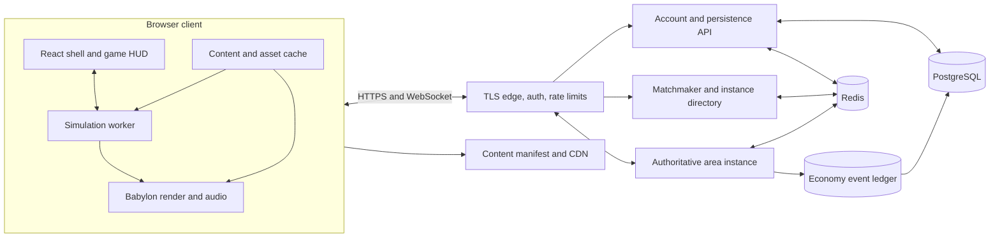
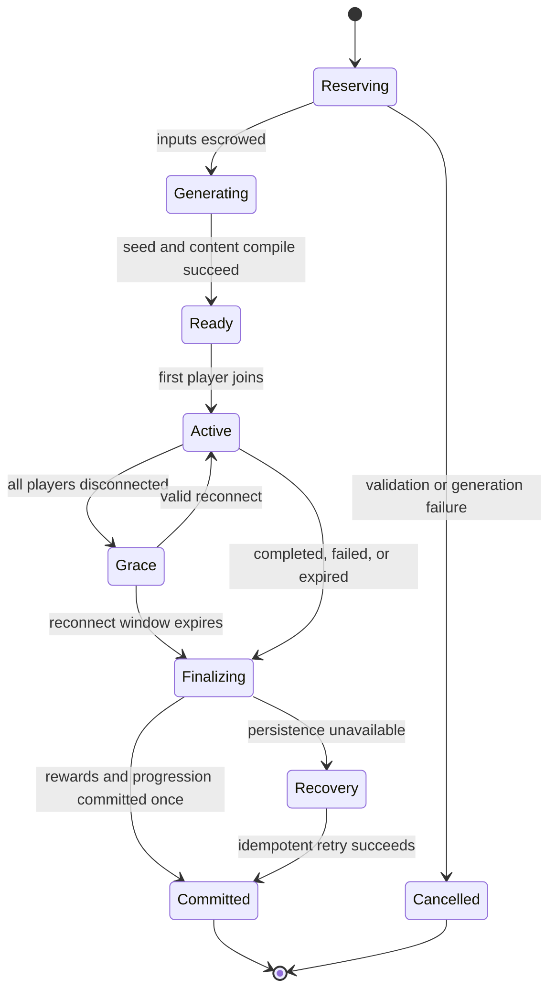

# Browser Architecture

All architecture in this document is proposed for the reconstruction. It is not a claim about Grinding Gear Games' private implementation. Public talks establish that PoE uses a proprietary C++ engine, procedural terrain tooling, seed-based area generation, and authoritative online instances. The concrete browser stack below is our design.

Implementation checkpoint, 2026-08-05: the React/Babylon client, Web Worker simulation, shared
fixed-point rules, intent/snapshot protocol, IndexedDB persistence, and replay checksums are built.
Node services, PostgreSQL, Redis, WebSockets, reconnect, parties, and remote authority remain future
architecture. See the [current implementation contract](specs/2026-08-05-current-implementation-contract.md).

## Architecture decision

Build a server-authoritative TypeScript game first, with Babylon.js on the client, a dedicated simulation worker, and a shared pure-rules package. Keep the transport and simulation boundaries language-neutral so a proven hot service can later move to Rust without rewriting content.

Recommended initial stack:

| Layer | Choice | Reason |
|---|---|---|
| Shell and account UI | React + TypeScript | Mature form, accessibility, routing, and state tooling; do not put per-frame game state in React |
| 3D renderer | Babylon.js on WebGL2 | Production-oriented scene, material, particle, instancing, asset and inspector support. WebGL2 only, deliberately: one render path is one set of shader bugs, and nothing here is GPU-compute bound |
| Local simulation | Dedicated Web Worker | Keeps fixed-step rules, pathing, prediction, and snapshots away from main-thread rendering/UI stalls |
| Shared rules | Framework-free TypeScript package | Same definitions, fixed-point helpers, validation, serialization, and tests on browser and server |
| Authoritative instance | Node.js TypeScript initially | Fastest path to one-language determinism and iteration; isolate each area in a worker/process |
| Persistent API | TypeScript service | Accounts, characters, inventory, stash, Atlas, matchmaking, content manifests |
| Database | PostgreSQL | Transactions, constraints, JSONB where content shape varies, mature backup and migration support |
| Ephemeral state | Redis | Sessions, presence, matchmaking, leases, rate limits, short reconnect windows |
| Assets | Object storage + CDN | Immutable hashed bundles, range-friendly glTF/KTX2/audio delivery |
| Transport | Secure WebSocket baseline | Universal and adequate for 30 Hz snapshots; add WebTransport only after measurement |
| Observability | OpenTelemetry + metrics/logs/traces | Correlates a run, seed, content version, client build, and server instance without logging secrets |

Three.js is viable, but Babylon.js reduces the amount of engine glue needed for a content-heavy 3D game. A custom WebGPU renderer would give maximum control at the cost of several staff-years before gameplay quality improves. Godot Web export or Unity WebGL may shorten editor work but adds large payloads, memory constraints, engine-specific deployment issues, and less control over deterministic client/server code sharing. Prototype those only if the team already has deep expertise.

## System topology



The authoritative instance never trusts client positions, hit targets, damage, item rolls, crafting results, completion, or currency balances. The client sends intent. The server validates intent against authoritative state and emits results.

## Repository shape

```text
apps/
  web/                  React shell, HUD, render host, input, service worker
  game-server/          authoritative area process
  api/                  account, character, inventory, Atlas, trade
  content-studio/       browser authoring and preview tools
  admin/                support, economy, moderation, release controls
packages/
  protocol/             versioned network schemas and codecs
  rules/                stat graph, effects, combat, items, crafting
  simulation/           ECS world and fixed-step systems
  content-schema/       source schemas, IDs, validators, migrations
  content-runtime/      compact read-only compiled content
  mapgen/               Atlas and area generation primitives
  replay/               commands, checkpoints, checksums, diff tooling
  ui-system/            accessible non-game UI and shared tokens
tools/
  content-compiler/
  balance-sim/
  seed-inspector/
  asset-pipeline/
  migration-auditor/
content/
  src/                  reviewed YAML/JSON and source references
  tests/                golden content fixtures and encounter scripts
```

Avoid a generic microservice split during the vertical slice. The boundaries above can live in a monorepo and deploy as three processes: web/CDN, API, and instance host. Split services only when ownership, scaling, or fault isolation justifies the operational cost.

## Simulation model

### Fixed step

Use a 30 Hz authoritative step, 33.333 ms per tick, as an explicit design choice to balance bandwidth and action-game response. Render at display refresh rate, normally 60 to 120 Hz, interpolating between confirmed or predicted states. The exact PoE 2 server tick is not publicly verified and must not be presented as copied.

```text
network input ingest
-> validate and sequence commands
-> advance action state machines
-> movement intent and steering
-> broad-phase collision
-> narrow-phase collision and position solve
-> projectile and persistent-area movement
-> target acquisition and AI decisions
-> skill triggers and effect graph
-> damage, ailments, death, on-event triggers
-> encounter and objective state
-> item/reward events
-> cleanup and lifetime expiration
-> snapshot/checksum
```

Systems must have a single documented order. Changing order is a simulation migration because `on hit`, death, trigger, recovery, and cooldown behavior can change even when formulas do not.

Use integers or carefully bounded fixed-point values for authoritative spatial coordinates, time, resource values, and percentages. IEEE floating point may be used in rendering. If authoritative TypeScript uses numbers, quantize after every public operation and prove identical results in Node and target browsers. Do not rely on iteration order of object properties, map entries, physics callbacks, or unordered database rows.

### Entity model

Use a lightweight ECS with structure-of-arrays storage for hot components:

- Transform: fixed-point position, facing, radius, height band.
- Motion: velocity, desired direction, acceleration, speed modifiers, collision flags.
- Actor: faction, alive state, level, rarity, targetable flags.
- Resources: life, mana, energy shield, Spirit reservation, stun, guard resources.
- Action: current state, skill, phase, start/end tick, target, interruption policy.
- Stats: immutable base reference plus cached aggregate handles and invalidation versions.
- Effects: buff/debuff/ailment instances, source, magnitude, duration, stacks.
- Skill loadout: gem instances, supports, weapon assignment, cooldown groups.
- Projectile: source, skill, trajectory, collision policy, pierce/fork/chain counters.
- AI: behavior state, target memory, perception cadence, cooldown blackboard.
- Loot: item instance ID, allocation, label state, pickup bounds.
- Encounter: objective, stage, participants, timer, reward ownership.

Cold or irregular data can be sparse. Do not force item affix arrays or boss-script state into hot SoA memory if they are read once per event.

### Spatial systems

Use a uniform spatial hash for dynamic actors and projectiles, with static collision compiled per map chunk. Navigation should be a tile or polygon navmesh with hierarchical sectors for long routes. Local avoidance is steering, not a full path query every tick.

Collision primitives should be deliberately simpler than visual meshes:

- Player and ordinary monster: vertical capsule or 2D disc plus height band.
- Projectile: swept circle/capsule to prevent tunneling.
- Melee: authored arc, cone, box, or capsule sampled against historical transforms when latency compensation applies.
- Ground effect: convex polygon, circle, ring, beam, or raster mask.
- Terrain: static convex segments and height portals.

Keep terrain traversal mostly two-dimensional. A fixed isometric-style camera can visually show stairs, bridges, and layers while simulation uses explicit height bands and portals. This is more stable in a browser than general 3D character physics.

## Client prediction and reconciliation

The local player needs immediate motion and action feedback. Use this sequence:

1. Client samples device input and creates a monotonically sequenced command.
2. Local simulation predicts legal motion and starts eligible actions.
3. Command is sent with sequence number, local tick, aim, buttons, and selected skill.
4. Server validates it at its authoritative tick and simulates.
5. Snapshot acknowledges the last processed sequence.
6. Client replaces local state with authoritative state, replays unacknowledged inputs, then visually smooths small error.

Hard-snap when the error is dangerous or semantically important, such as crossing a wall, escaping a boss arena, changing height band, or surviving a lethal hit. Smooth only presentation transforms, never the logical state used to aim or display resources.

Remote actors use buffered snapshot interpolation. Extrapolate sparingly, cap it, and prefer a short pause over allowing a monster to pass through terrain. Boss telegraphs should carry authoritative start tick, shape ID, target basis, and execution tick so the client renders the same safe and unsafe space despite jitter.

### Command schema

```ts
interface PlayerCommand {
  protocolVersion: number;
  sequence: number;
  clientTick: number;
  moveX: Int8;             // -127..127
  moveY: Int8;
  aimAngle: UInt16;        // quantized full rotation
  buttonsPressed: UInt32;
  buttonsReleased: UInt32;
  heldButtons: UInt32;
  selectedTarget?: EntityId;
}
```

Do not send a claimed world hit position as proof that a skill hit. An aim point is intent. The authoritative effect graph queries collision and targets.

## Snapshot and bandwidth design

Snapshots should be interest-managed and delta-compressed:

- Full baseline on join, teleport, protocol recovery, or periodic safety interval.
- Delta snapshots at 10 to 30 Hz based on combat density and measured bandwidth.
- Near and dangerous entities at higher frequency.
- Distant decorations and noncombat state at lower frequency.
- Static map chunks referenced by content and seed, not resent as geometry.
- Small integer field masks and quantized deltas, encoded with a binary schema.

Each snapshot includes server tick, content version, instance epoch, acknowledged input sequence, entity creates/updates/deletes, reliable events, and a rolling simulation checksum. Separate unreliable-looking high-rate state from reliable semantic events even if both travel over ordered WebSocket. The application can replace superseded state messages rather than queueing stale snapshots.

WebSocket head-of-line blocking is acceptable for the first slice if messages remain small and the server disconnects slow consumers. Measure before introducing WebTransport's deployment and browser-support complexity.

## Area instance lifecycle



The Map Device transaction creates a `run_id` and escrows the Waystone/tablet inputs before instance generation. A generation failure returns escrow. Once the run becomes Ready, normal abandonment policy applies. Completion and rewards commit with an idempotency key based on `run_id` and finalization revision.

Area processes should be disposable. Persistent truth is the run envelope plus event/checkpoint data, not a forever-lived process. A crash recovery policy can either restore from a recent checkpoint or fail safely and return inputs during early development. Never reconstruct rewards from a client claim.

## Procedural Atlas generation

The Atlas can be generated in deterministic chunks so it appears unbounded:

1. Derive a chunk seed from account Atlas seed, content season, and signed chunk coordinate.
2. Generate jittered points with boundary overlap so adjacent chunks agree.
3. Compute candidate edges using Delaunay adjacency or k-nearest neighbors.
4. Select a connected backbone with a minimum spanning forest across chunk seams.
5. Add controlled loops based on distance, angle, and route-density budgets.
6. Sample low-frequency biome noise and high-frequency variation.
7. Place ordinary nodes from biome-valid map pools.
8. Run constraint solvers for towers, gateways, hubs, fortresses, boss chains, and minimum path lengths.
9. Store only discovered state, completion, placed authored landmarks, and exceptional overrides. Regenerate untouched geometry from the seed.
10. Validate graph connectivity, degree bounds, landmark reachability, and no edge crossings that break the chosen visual grammar.

This algorithm is an original proposal. Fixed points of interest in current PoE 2 mean the content layer also needs authored coordinates or deterministic constraint anchors. Do not assume every landmark is purely random.

## Procedural combat-area generation

The official procedural-generation presentation gives a useful high-level grammar: begin with an abstract graph of important locations, route typed connections over a weighted grid, turn routes into tile keys or splines, select compatible mesh variants, and enforce an area/monster budget. Rebuild the idea with original tools and tiles.

### Outdoor pipeline

```text
objective graph
-> jittered anchors
-> typed route constraints
-> weighted grid routing
-> curve simplification and spline
-> semantic tile-key raster
-> compatible terrain variant selection
-> encounter sockets and blockers
-> navmesh and collision bake
-> spawn-budget solve
-> reachability and checksum validation
```

### Indoor pipeline

```text
room graph
-> room template placement
-> allowed overlap/merge solve
-> door and corridor connection
-> tile-key wall/floor/edge selection
-> occlusion groups and minimap bake
-> encounter socket placement
-> navmesh, reachability, and budget validation
```

The generated map records algorithm version, content version, master seed, stream seeds, chosen variants, objective anchors, validation result, and hash. A developer can paste a run ID into the seed inspector and reproduce the exact area.

### Generation quality gates

- Start, boss, exits, and required objectives are mutually reachable.
- No mandatory route is narrower than player diameter plus encounter safety margin.
- Boss arena has valid teleport, spawn, and safe-zone sockets for every scripted phase.
- Monster budget and walkable area stay within the chosen variance, proposed at plus or minus 15 percent.
- Long empty traversal and dead-end ratios remain within biome-specific bounds.
- Occluders fade correctly from the camera's playable region.
- Loot cannot spawn outside reachable navigation or pickup projection.
- Every map generation completes under a strict server time budget, with deterministic fallback templates.

## Content and asset pipeline

Content source should be human-reviewable, but runtime content should be immutable and compact:

```text
YAML/JSON sources + glTF + textures + audio
-> schema validation
-> stable ID and reference resolution
-> semantic validation
-> derived stat/effect compilation
-> encounter and map socket validation
-> balance and drop-table simulations
-> asset compression and dependency graph
-> signed immutable content manifest
-> CDN bundles keyed by content hash
```

Use stable namespaced IDs such as `skill.storm_lance.v3`, not array indexes or display names. Display text is localized data. Renaming a label must not change identity or saved objects.

Recommended asset formats:

- Mesh and animation: glTF/GLB with mesh optimization and quantization.
- Textures: KTX2/Basis Universal, texture arrays or atlases where practical.
- Audio: Opus in Ogg/WebM, with short critical sounds preloaded.
- Effects: data-authored emitters, curves, decals, trails, lights, and material parameters.
- UI: original vector or compressed raster assets, never extracted game icons.

Partition bundles by hub, biome/tileset, common actors, skill family, boss, and encounter. The pre-entry screen knows the selected map and can prefetch its critical bundle before activation. Late optional cosmetics load behind gameplay-critical content.

## Rendering design

Use a fixed perspective or orthographic-like three-quarter camera with authored limits. A true orthographic camera simplifies scale but weakens depth and large boss presentation; a long-focal-length perspective camera is a practical compromise.

Rendering priorities:

1. Ground hazards and attack telegraphs.
2. Player, monsters, projectiles, and hit confirmation.
3. Terrain silhouette and navigation readability.
4. Loot labels and interactables.
5. Environmental and cosmetic effects.

When GPU time exceeds budget, shed work in reverse priority. Never degrade away a lethal telegraph while keeping decorative particles.

Use GPU instancing for repeated props and monsters, texture arrays/atlases, pooled effect objects, clustered or limited dynamic lights, baked ambient terms, screen-space decals, and biome-scoped reflection/environment maps. Provide explicit particle tiers and per-effect quotas. Transparent overdraw is likely the browser bottleneck in dense fights, so particle authors need an overdraw heat map.

The public GGG rendering talk describes advanced proprietary effects such as flowing materials and global illumination techniques. They are visual references, not requirements. Reproduce readability and mood with original shaders that fit browser budgets.

## Main-thread and worker boundaries

Main thread:

- Babylon scene submission and presentation transforms.
- React UI, inventory, Atlas, labels, menus, accessibility.
- Device input capture and timestamping.
- Audio graph and haptics/controller integration.
- WebSocket ownership or a thin relay, based on browser compatibility.

Simulation worker:

- Fixed-step predicted local world.
- Command assembly and replay buffer.
- Content-rule evaluation needed for prediction.
- Local path queries, target previews, and deterministic checksums.
- Snapshot decode and reconciliation.

Avoid sending entire world objects through `postMessage`. Use compact transferable binary buffers or a SharedArrayBuffer ring when cross-origin isolation is correctly configured. Start with transferable buffers for operational simplicity, then profile.

## Persistence and economy

PostgreSQL is the source of truth for account-owned state. Important writes use transactions and optimistic revisions:

- Character build and equipped item IDs.
- Inventory/stash placement and item ownership.
- Item instances and immutable provenance.
- Currency and gold ledger entries.
- Atlas seed, discovery, completion, points, and master choices.
- Run inputs, state, objectives, death count, and final result.
- Trade listings, reservations, fill, cancellation, and fees.

Every item-changing operation has an operation ID and expected owner/container revision. The server either commits the complete move/craft/trade or none of it. An append-only economy event records creation, destruction, transformation, transfer, and sink. The current materialized item row is a projection used for fast play, not the sole audit record.

Never let the area process directly invent persistent item IDs without a durable allocation/commit protocol. It can reserve an ID range or emit deterministic reward candidates that the finalization transaction materializes exactly once.

## Authentication, abuse, and integrity

- Short-lived signed access token for HTTPS APIs.
- Separate single-use area ticket bound to account, character, run, instance, and expiry.
- Same-site secure refresh cookie or a carefully designed OAuth flow.
- Per-command rate and plausibility validation.
- Server-side cooldown, resource, distance, line-of-sight, ownership, and sequence checks.
- Content manifest signature and protocol compatibility check.
- No secrets or authoritative drop tables embedded unnecessarily in the client.
- Audit privileged admin operations and economy corrections.
- Encrypt transport and encrypted backups, hash passwords with a modern memory-hard KDF if passwords are hosted directly.

A browser cannot be trusted, obfuscated, or made cheat-proof. Detection comes from authority, invariants, telemetry, and statistical review. Do not build invasive client scanning. It is ineffective on the web and creates privacy risk.

## Performance budgets

These are proposed gates for a representative mid-range desktop, measured in a production build:

| Budget | Target |
|---|---|
| Visual frame | 16.7 ms at 60 FPS, 99th percentile under 25 ms during ordinary maps |
| Render CPU submission | 4 ms typical |
| GPU | 8 ms typical, 13 ms stress target |
| Main-thread non-render UI | 2 ms typical, no task over 50 ms during combat |
| Predicted simulation worker | 4 ms per 30 Hz tick typical, 10 ms stress |
| Authoritative instance | 12 ms per 30 Hz tick at target density, 25 ms 99th percentile |
| Input to local presentation | under 50 ms excluding display scanout |
| Snapshot payload | target under 20 KB/s/player median, verify rather than assume |
| Initial playable download | target under 35 MB compressed, stream map-specific bundles afterward |
| Reconnect | resume ordinary map within 10 seconds while grace lease remains |
| Map generation | 500 ms target, 2 s hard fallback threshold on instance host |

Maintain explicit entity and effect budgets per map. A useful initial stress fixture is 1 local player, 5 remote party actors/minions, 250 active monsters, 300 projectiles, 100 persistent areas, 1,000 visible loot labels before filtering, and 500 decorative particles/effect instances. This is a test scenario, not a promise of live PoE density.

## Browser lifecycle hazards

- Background tabs throttle timers. The server continues authority; on resume, request a fresh baseline and never fast-forward gameplay from a suspended local timer.
- Mobile and laptop memory pressure can evict cached assets. All handles need recoverable placeholders and bundle revalidation.
- A refresh is equivalent to disconnect, not logout or character death. Preserve a bounded reconnect lease.
- Service-worker updates must not mix JavaScript, protocol, and content versions. Activate only after all clients are closed or route each connection to compatible servers.
- WebGL context loss requires renderer reconstruction from simulation state. The client
  takes the cheap route: it reloads once on `webglcontextlost` and rebuilds from the save.
- Browser audio requires a user gesture. Prime the audio context during the first explicit start interaction.
- Keyboard layouts, IME, browser shortcuts, pointer lock, high-DPI scaling, and accessibility zoom need explicit tests.

## Scaling path

Stage 1: one region, one API deployment, Redis, PostgreSQL, and an instance host pool.  
Stage 2: regional instance pools with a global account/control plane; characters enter one region per run.  
Stage 3: partition trade read models and content CDN globally, retain a single serialized authority per item/order.  
Stage 4: migrate the measured simulation bottleneck to Rust or another systems language behind the same protocol and golden replay suite.

Do not begin with multi-region active-active item writes. Economy duplication is more damaging than a short maintenance window.

## Definition of architectural success

The architecture is ready for content scale when all of these are true:

- The same command log and content version reproduce the same authoritative checksum.
- A client refresh, instance crash, and API retry cannot duplicate or lose a map input or reward.
- A new skill made only from existing effect primitives requires no simulation code change.
- A new affix, item base, monster pack, or map tile variant is validated and previewed by tools.
- Old items and replays remain readable after a content migration.
- Server load tests meet the fixed-step budget at declared density.
- A malicious client cannot award itself movement, damage, loot, completion, crafting, or trade results.
- The game remains mechanically readable when cosmetic effects are disabled or degraded.

