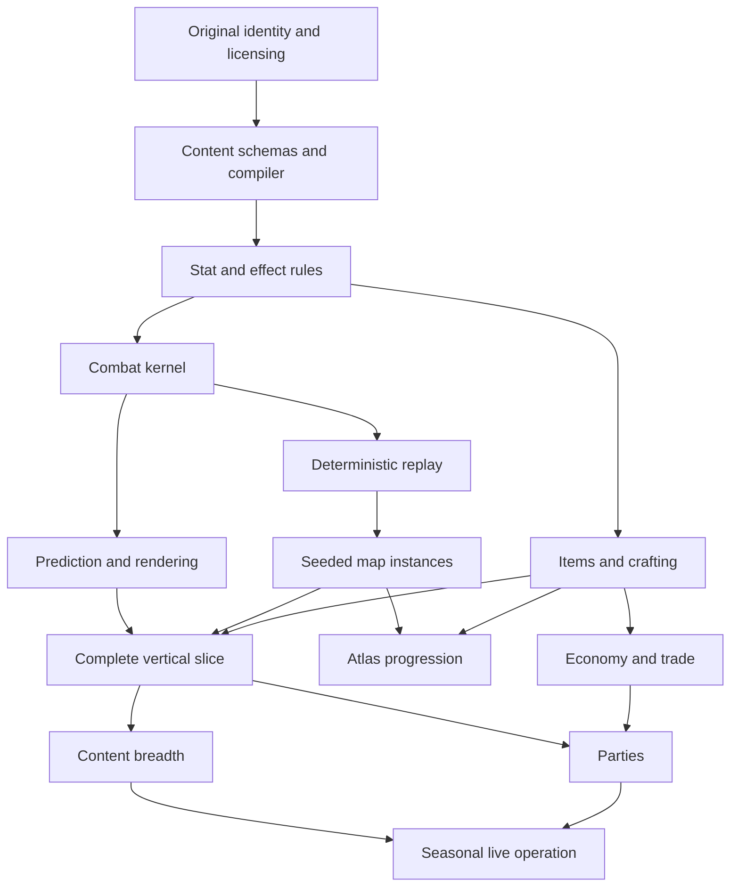

# Build Plan and Validation

This plan targets an original browser action RPG that reproduces the observed systems grammar without copying protected expression or reverse engineering private implementation. Time and staffing ranges are planning estimates, not sourced facts.

## 1. What "perfect" can mean

A useful fidelity contract has four measurable dimensions:

| Dimension | Target |
|---|---|
| Mechanical completeness | Every promised skill, modifier, map, craft, death, reward, and progression interaction resolves through documented data/rules |
| Interaction quality | Movement, aiming, cancellation, telegraphs, hit feedback, inventory, and map preparation remain responsive and legible under stress |
| System integrity | Deterministic runs, server authority, no item duplication, safe reconnects, valid migrations, explainable calculations |
| Content coherence | Original art and fiction with enough monster, skill, boss, item, and map variety to sustain the progression loop |

It cannot mean byte-for-byte, asset-for-asset, formula-for-formula parity with a closed, changing game. Hidden data makes that unknowable, and protected expression makes it a bad release target.

## 2. Delivery strategy

Build one complete map-run economy slice before breadth:

```text
account and character
-> build and equipment
-> Atlas node and crafted map input
-> deterministic generated area
-> combat, death, boss, completion
-> dropped items and filter
-> inventory, identify, craft, equip, stash, sell
-> progression unlock
-> reconnect and replay proof
```

Do not start by authoring hundreds of item names or passive nodes. Every piece of breadth increases migration and test cost. First prove that the content compiler and primitives can express it.

## 3. Workstreams

| Workstream | Owns |
|---|---|
| Rules and simulation | Fixed step, ECS, stats, effects, actions, damage, AI, RNG, replay |
| Client | Input, prediction, reconciliation, Babylon rendering, audio, HUD, menus |
| Backend/economy | Auth, characters, items, containers, Atlas, run transactions, trade, admin |
| Content tools | Schemas, compiler, validators, editors, preview, balance simulator, migrations |
| Game/content design | Original classes, skills, supports, items, monsters, bosses, maps, encounters, progression |
| Art/audio | Original visual language, assets, animation, VFX, telegraphs, music/sound |
| QA/data | Test automation, replay corpus, compatibility, perf, observation studies, telemetry |
| Legal/production | IP boundary, licensing, policies, releases, moderation, operations |

One person may cover several streams in a prototype. Each stream still needs an explicit owner and gate.

## 4. Phase plan

### Phase 0: legal boundary and design grammar

Duration estimate: 2 to 4 weeks.

Deliverables:

- New product name, terminology, fiction premise, visual direction, and audio direction.
- Written prohibited-material policy: no extracted files, copied icons, music, dialogue, lore, map layouts, or private protocol/client inspection.
- Source/evidence ledger and licensing field in content ingestion.
- Original mechanics vocabulary mapping that avoids confusingly similar branding.
- Browser support matrix and measurable performance tiers.
- Vertical-slice feature contract and explicit non-goals.

Exit gate:

- Counsel or qualified reviewer has assessed the intended public/commercial direction.
- Every planned source has a permitted-use status.
- Designers can explain the product without using protected names.

### Phase 1: deterministic kernel

Duration estimate: 6 to 10 weeks.

Deliverables:

- Fixed-step world and entity/component storage.
- Quantized units, deterministic RNG streams, canonical serialization/checksum.
- Command log, replay runner, checkpoint, and first-difference tool.
- Movement, collision, target queries, projectiles, persistent areas.
- Typed stat definitions, modifiers, predicates, aggregation, explainability.
- Action state machines, costs, cooldowns, effects, buffs, death.
- Headless test host and one synthetic benchmark arena.

Exit gate:

- One 10-minute scripted encounter produces identical checksums on supported Node and browser engines.
- Fuzzed commands never create non-finite values, leave the nav bounds, or hang a tick.
- Stat explanation accounts for every final value.
- Stress arena meets declared simulation budget without rendering.

### Phase 2: combat lab

Duration estimate: 8 to 14 weeks.

Deliverables:

- Babylon renderer, original greybox assets, camera, animation state, hit/VFX/audio cues.
- Click-to-move and WASD using one intent schema.
- Prediction, server reconciliation, remote interpolation, latency/loss harness.
- Original player archetype with six active skills and twelve supports.
- Two weapon sets, dodge, sprint, resources, reservation, charges/counters.
- Normal, Magic, Rare, and one multi-phase boss.
- Armour, Evasion, resistance, block, Energy Shield, ailments, stun.
- Combat HUD and advanced value breakdown.

Exit gate:

- Inputs remain playable at 80 ms round trip and 1% simulated loss.
- Boss telegraphs are visible and audible before authoritative impact under network jitter.
- A skill built only from existing primitives requires no custom combat callback.
- Twenty golden combat scenarios cover conversion, critical, avoidance, block, ailments, death, and cancellation.
- 60 FPS stress target is met at vertical-slice density.

### Phase 3: one complete map run

Duration estimate: 8 to 12 weeks.

Deliverables:

- One indoor and one outdoor procedural grammar.
- Seed inspector, reachability checks, navmesh/collision compile, spawn budget.
- Map item with tier, rarity, six affixes, reward channels, and revive rule.
- Map Device activation escrow and area instance lifecycle.
- Checkpoints, portals, death, boss reset, boss-only retry, failure/depleted reopen.
- Map objective and idempotent completion.
- Original timed side encounter and reward chest.
- Reconnect after refresh and server process restart policy.

Exit gate:

- 100,000 generated maps have no unreachable required objective and stay within generation budget.
- Forced crash at every activation/finalization boundary cannot duplicate or lose inputs/rewards.
- Replay recreates map hash and combat checksum.
- Player can complete the entire run loop from map choice to progression result.

### Phase 4: item and crafting loop

Duration estimate: 8 to 14 weeks.

Deliverables:

- 45 original equipment bases and 120 affix families for the slice.
- Normal/Magic/Rare/Unique state, item level, requirements, local/global stats.
- Server item generation, provenance, ground allocation, labels.
- 12 by 5 inventory, equipment, two weapon sets, stash, vendors, buyback.
- Identification, quality, sockets/augments, and core currencies.
- Loot filter parser/evaluator with error mapping and hot reload.
- Economy event ledger, idempotency, support/admin item history.

Exit gate:

- Property tests prove affix capacity/group/level constraints across millions of items.
- Concurrent move/craft/list attempts cannot duplicate ownership.
- Every item tooltip derives from the authoritative definition/rolls.
- The item filter never changes server generation/allocation.
- Expected-value simulations for each area/reward table fall within design tolerances.

### Phase 5: Atlas meta-progression

Duration estimate: 8 to 12 weeks.

Deliverables:

- Chunked deterministic graph, fog, access, route, search, bookmarks.
- 8 original map bases and several biomes.
- Waystone tiers for the slice, sustain, reforging, corruption table.
- Tablet uses/slots/random-content resolver.
- Main Atlas passive graph, one Master-like choice system, towers, one region transform.
- One fortress chain and one repeatable pinnacle loop.
- Seasonal content/version reset and migration rehearsal.

Exit gate:

- Chunk seams are stable across generation order.
- No discovered graph changes after service deploy.
- Atlas completion and region transformations are idempotent.
- Simulated progression reaches every required landmark and sustains declared map tiers.
- Old Atlas snapshots migrate or intentionally remain on an old manifest.

### Phase 6: content alpha

Duration estimate: 6 to 12 months, parallelized.

Suggested alpha scope:

- 3 original archetypes, 24 actives, 36 supports, 60 passive nodes, 3 keystones.
- 45 equipment bases, 120 affix families, 20 currencies, 15 uniques.
- 8 tilesets, 25 monster families, 20 bosses.
- 2 deep encounter systems, each with side progression and one pinnacle.
- 15 map tiers after sustain tuning.
- Original art, VFX, audio, lore, icons, and UI.
- Solo plus closed party tests.

Exit gate:

- New content passes compiler, simulation, visual, accessibility, performance, economy, and replay gates.
- Ninety-minute playtests complete with no blocker, duplication, unrecoverable run, or unexplained death.
- Build diversity data shows several viable routes, not one dominant mandatory package.
- Content download and memory fit declared browser tiers.

### Phase 7: multiplayer and market

Duration estimate: 4 to 8 months, overlapping later alpha.

Deliverables:

- Party formation, ownership, scaling, independent revives, allocation modes.
- Region-aware instance placement, reconnect, party migration, host ownership rules.
- Direct trade with atomic dual offers.
- Bulk commodity exchange with escrow.
- Asynchronous equipment listing and buyer fee.
- Abuse limits, economy monitoring, moderation/support workflows.

Exit gate:

- Six-client or chosen party-size soak succeeds under loss/reconnect/failure injection.
- Offer mutation clears acceptance and no trade can partially commit.
- One item cannot back multiple orders or exist in two containers.
- Market retries return the first committed result.
- Load test and bot simulations do not starve ordinary players or corrupt prices.

### Phase 8: public operations

Deliverables:

- PWA/CDN release process and compatible client/server/content rollout.
- Database backup/restore rehearsal and economy reconciliation.
- Regional capacity, queues, incident response, status page.
- Support tooling, account recovery, moderation, privacy and retention policies.
- Seasonal migration, rollback, content hotfix, and replay compatibility.
- Security review and dependency/asset supply-chain controls.

Exit gate:

- Restore drill meets recovery objectives.
- A failed content release cannot mix incompatible manifests.
- Economy reconciliation detects and quarantines anomalies.
- Support can trace a run, item, craft, trade, and progression event without reading secrets.

## 5. Realistic scale

Very rough estimates for an experienced team using the proposed scope:

| Outcome | Team | Calendar range |
|---|---:|---:|
| Greybox deterministic combat lab | 2 to 4 | 4 to 8 months |
| Complete map-run vertical slice | 4 to 7 | 9 to 15 months |
| Credible original public alpha | 10 to 18 | 18 to 30 months |
| Broad live ARPG with seasonal operation | 25 to 50+ | Multiple years |
| Literal PoE 2 content parity | Not a responsible estimate | Proprietary content, ongoing studio-scale production, and legal barriers |

Art, animation, VFX, audio, bosses, and balance dominate the path from a correct engine to a convincing game. Browser technology does not remove that content labor.

## 6. Dependency map



The critical path is content compiler -> rules -> combat -> replay -> map transaction -> complete slice. Trade is not on the first playable critical path.

## 7. Testing pyramid

### Pure rule tests

- Stat aggregation, caps, rounding, local/global order.
- Conversion and gain-as-extra normalization.
- Costs, reservation, cooldown, charges, counters.
- Accuracy/evasion, Armour, resistance, critical, block, Deflection.
- Ailment magnitudes, stacks, refresh, thresholds, expiration.
- Item eligibility, affix groups, tiers, capacity, crafting transforms.
- Map affix count, tablet slots, revives, area level, objective policy.
- Passive connectivity and weapon-set overlays.

Every rule test names content version and evidence status.

### Property-based tests

Generate wide inputs and prove invariants:

- Final damage/resource values are finite and nonnegative where appropriate.
- Conversion never loses/gains value outside declared extra channels.
- Evasion/Deflection/Block chance respects caps.
- Item never exceeds prefix/suffix/socket capacity unless one explicit exception permits it.
- Craft either commits a legal state or rejects without consuming.
- Grid items never overlap or leave bounds.
- Passive allocation remains connected for both weapon sets.
- Run completion can occur at most once.

### State-machine/model tests

- Skill action and cancellation.
- Boss phase/reset.
- Strongbox and wave encounter.
- Ground allocation expiry.
- Map activation, crash, retry, completion, failure, depleted reopen.
- Trade order reservation/fill/cancel race.
- Item movement between ground, inventory, equipment, stash, escrow, destruction.

Use a small reference model, then generate command sequences against both model and implementation.

### Golden replays

Curate versioned fixtures for:

- Movement/collision corner cases.
- Projectile pierce/fork/chain.
- Critical downgrade by evasion.
- Block still causing ailment/stun buildup.
- Energy Shield and chaos behavior.
- Runic Ward lethal protection.
- Weapon-set auto-swap and stat snapshot.
- Boss wipe/reset and map side-content purge.
- Encounter completion and loot materialization.

Run them on every supported JS runtime and after content/compiler changes. Intentional checksum changes require a reviewed fixture migration.

### Map generation tests

- 100,000 or more seeds per grammar in CI/nightly.
- Start, boss, exit, and objectives reachable.
- Required path width and arena sockets valid.
- Walkable area, route length, dead ends, pack spacing within design distributions.
- Loot/interactables project to reachable pickup space.
- Chunk seams stable regardless of generation order.
- Generation time and asset dependencies bounded.
- Failed generation produces deterministic fallback.

### Economy tests

- Concurrent browser tabs crafting/moving/listing same item.
- Duplicate requests and response loss.
- Database failure before/after ledger append.
- Server crash during map finalization and trade fill.
- Escrow timeout and reclaim.
- Container capacity changes during trade.
- Seasonal migration and remove-only containers.
- Full earnings/reward containers.
- Ledger-to-projection reconciliation.

### Network tests

Simulate:

- 20 to 200 ms latency.
- Jitter, burst loss, duplication, and reordered application messages.
- Slow consumer and snapshot backpressure.
- Browser background suspension and resume.
- Client refresh and token/ticket expiry.
- Instance migration or crash policy.
- Version mismatch and content rollout.

Acceptance is based on authoritative correctness first, then visual smoothness.

### Browser compatibility

Test current stable plus one previous major version for:

- Chromium, Firefox, Safari on supported desktop OSes.
- WebGPU path where supported and WebGL2 fallback.
- GPU/device/context loss.
- Pointer lock, high DPI, layout keyboards, IME, controller.
- Service-worker update and offline shell failure.
- Memory pressure and asset eviction.
- Background timer throttling.
- Accessibility zoom and reduced motion.

## 8. Performance validation

### Representative fixtures

1. Quiet hub with stash and Atlas UI.
2. Ordinary map traversal.
3. Dense rare-pack combat.
4. Timed expanding encounter at maximum pack budget.
5. Boss with layered telegraphs and party/minions.
6. One thousand unfiltered ground labels, then filtered.
7. Atlas with thousands of revealed nodes.
8. Inventory/stash with thousands of stored item rows.

Track median, 95th, 99th, and worst frame/tick. Averages hide fatal stutters.

### Degradation order

When over budget:

1. Reduce distant decoration animation.
2. Reduce shadow quality and secondary lights.
3. Reduce cosmetic particles/decals.
4. Lower terrain/prop LOD.
5. Reduce cosmetic audio voices.
6. Keep player, enemies, projectiles, ground danger, telegraphs, and loot interaction intact.

Combat correctness never degrades. The server does not drop simulation steps to catch up. It reports overload, limits instance admissions, or reduces authorable encounter density within declared design policy.

## 9. Content authoring gates

### New skill checklist

- Stable ID, tags, requirements, weapon predicate.
- Level and quality table.
- Timing, movement, turning, cancellation, snapshot rules.
- Costs/reservation/cooldown/stored uses.
- Target policy and effect graph.
- Support compatibility and incompatibility reasons.
- Network prediction class.
- Original animation, VFX, audio, icon, localization.
- Unit/property/golden replay tests.
- Tooltip and advanced explanation.
- Entity/effect budget worst case.
- Controller and keyboard/mouse usability.

### New boss checklist

- Arena traversal and camera bounds.
- Phase graph and wipe/reset state.
- Attack selection, cooldown, range, tracking cutoff.
- Telegraph start/impact, shape, audio, red-flash semantics.
- Hit shapes and damage packets.
- Stun/freeze/ailment and anti-burst behavior.
- Adds, objects, hazards, transitions, death.
- Loot/objective/progression transaction.
- Solo and party scaling.
- No-hit, low-DPS, high-DPS, minion, ranged, melee tests.
- Reduced-effects/readability and color-vision review.
- Golden replay and disconnect/rejoin tests.

### New item or modifier checklist

- Stable identity, class/domain/tags, level, group, tier, weights.
- Local/global scope and rounding.
- Capacity, fracture, corruption, sanctification, trade, filter behavior.
- Tooltip and search representation.
- Interaction simulator against all skills/stats it touches.
- Migration policy.
- Economy source and sink.

### New map grammar checklist

- Original tileset and biome assets.
- Start/boss/objective/exit constraints.
- Route, area, dead-end, occlusion, pickup, socket budgets.
- Monster/encounter pool compatibility.
- Minimap and checkpoint rules.
- 100,000-seed structural validation.
- Low-end browser render fixture.

## 10. Balance program

### Metrics per map

- Entry inputs and declared risk.
- Completion/failure/abandon rate.
- Death tick, cause, attack, reaction window, defence state.
- Duration, travel fraction, combat fraction, boss fraction.
- Monsters and Power killed by rarity.
- Reward count/value by source and filter visibility.
- Waystone inputs/outputs and tier sustain.
- XP and Gold per minute.
- Encounter chosen/skipped/completed.
- Skill use, hit, damage, kill, cost failure, cancellation.
- Item identified, equipped, crafted, sold, destroyed, listed.

Pseudonymize account identifiers and define retention. Do not log raw chat, secrets, or unnecessary personal data.

### Balance simulators

- Item-affix distribution and expected stat curves by level.
- Craft transition expected cost and terminal-state chance.
- Reward expected value and variance by map/modifier.
- Waystone sustain Markov simulation by player success rate.
- Atlas route/landmark reachability and point acquisition.
- Effective health/damage across representative builds.
- Market source/sink and inflation model.

Simulation identifies candidates. Playtests decide whether the experience is readable and fun.

### Build benchmark suite

Maintain original representative builds:

- Slow heavy Physical melee.
- Fast evasive ranged.
- Elemental spellcaster.
- Permanent minions.
- Block/armour tank.
- Energy Shield caster.
- Ailment damage-over-time.
- Weapon-set hybrid.

Each patch tests clear, boss, survivability, cost, screen clutter, and input load. A build can be deliberately weak in one dimension, but no required content should be mechanically impossible without a clearly signposted build change.

## 11. Clean-room observation program

For publicly visible mechanics that remain unknown:

1. Write a narrow question and competing hypotheses.
2. Pin game patch, platform, area, build, and modifiers.
3. Record ordinary gameplay video and input timing.
4. Collect enough independent trials.
5. Annotate observable event timestamps and outcomes.
6. Publish an internal aggregate dataset with no extracted client data.
7. Fit distributions and confidence intervals.
8. Mark the result `observed`, not `official`.
9. Implement as a replaceable original constant/table.
10. Re-run after relevant patches.

Priority questions:

- Skill phase and cancel timing.
- Boss tracking/hit shape/telegraph windows.
- Target selection and aim assist.
- Damage-receiving order.
- Waystone and reward distributions.
- Tablet random-content and stacking.
- Atlas node/biome/special-location distributions.
- Party scaling/allocation edge cases.

Do not inspect private protocols, client binaries, memory, extracted art/data, or undocumented endpoints.

## 12. Risk register

| Risk | Probability / impact | Mitigation |
|---|---|---|
| IP/trade-dress claim | Medium / existential | Original brand/content/UI, source licensing, legal review, no extraction |
| Rules breadth overwhelms code | High / high | Shared stat/effect primitives, content compiler, no one-off callbacks |
| Browser GPU overload | High / high | WebGPU/WebGL tiers, instancing, effect quotas, stress fixtures, shed cosmetics first |
| Nondeterministic replay | Medium / high | Integer/quantized math, fixed ordering, named RNG, cross-runtime golden suite |
| Item duplication | Medium / existential economy impact | Server authority, revisions, escrow, idempotency, ledger, failure injection |
| Content migrations corrupt saves | Medium / high | Immutable manifests, explicit policies, old-fixture round trips, dry-run audit |
| Network feel is sluggish | High / high | Prediction/reconciliation from combat lab, latency harness, immediate presentation cues |
| Content production too slow | High / high | Tooling before breadth, reusable tiles/effects, strict authoring templates |
| One dominant build | High / medium | Benchmark builds, reward/content diversity, telemetry, targeted balance patches |
| Hidden source formulas drift | Certain / medium | Confidence labels, calibration tables, current patch ledger, avoid claims of exactness |
| Service-worker version mix | Medium / high | Immutable hashes, protocol/content compatibility, controlled activation |
| Early microservice complexity | Medium / medium | Monorepo and three deployments first, split only from measured need |

## 13. First 12 weeks

### Weeks 1 to 2

- Approve original identity boundary and vertical-slice contract.
- Create monorepo, CI, schema package, content manifest, browser smoke target.
- Define numeric units, simulation order, RNG, replay envelope, performance fixture.
- Write first rule fixtures before implementation.

### Weeks 3 to 5

- Implement deterministic ECS, movement/collision, command runner, checksum.
- Implement stat/modifier/predicate engine and explainability.
- Add headless replay and first-difference tool.
- Prove cross-runtime 10-minute deterministic fixture.

### Weeks 6 to 8

- Add action state, costs, cooldown, target query, projectile, damage, death.
- Add two skills assembled from effect primitives.
- Build authoritative instance loop and local WebSocket protocol.
- Add prediction/reconciliation skeleton and Babylon greybox.

### Weeks 9 to 10

- Add dodge, one defence, one ailment, one normal pack, one rare modifier.
- Implement original character, arena, HUD, VFX/audio placeholders made in-house.
- Run latency and dense-entity benchmarks.

### Weeks 11 to 12

- Add one boss timeline and wipe/reset.
- Add seeded arena generation and replay hash.
- Conduct first external usability/readability playtest.
- Re-estimate based on actual content-authoring and performance throughput.

Week 12 output is a combat lab, not a released game. Its purpose is to retire the highest technical risks before map, item, and Atlas breadth.

## 14. Release gates

No public test until:

- Original IP policy and licences are auditable.
- Server is authoritative for combat, loot, crafting, progression, and trade.
- Known duplication/finalization races pass failure injection.
- Replays and content versions identify every serious combat/economy incident.
- All required map objectives are reachable and generated areas meet bounds.
- A browser refresh reconnects without duplicating or silently killing a run.
- Low/reduced-effects mode preserves every lethal telegraph.
- Supported browser/GPU tiers meet declared targets.
- Privacy, retention, support, backup, restore, and incident procedures exist.

No seasonal update until:

- Old saves/items/Atlas states migrate in a dry run.
- Old and new clients cannot mix incompatible protocols/content.
- Economy source/sink and Waystone sustain simulations pass.
- Golden replay changes are reviewed.
- Rollback and forward-fix paths are rehearsed.

## 15. Definition of done for the research-to-build handoff

Before implementation begins, the team should decide:

- Original game name and art direction.
- Solo-only first slice or early party requirement.
- Exact supported browsers and minimum GPU tier.
- 2D isometric, 2.5D, or full 3D presentation. This pack assumes 3D terrain/actors with a constrained camera.
- TypeScript-only first server or immediate Rust simulation. This pack recommends TypeScript first.
- Vertical-slice archetype, six skills, twelve supports, boss, two map grammars, and one encounter.
- Which PoE-like constants are design references versus independent tuning targets.
- Whether the product is private research, free fan work, or commercial. Legal and data permissions change materially.

Once those are fixed, convert each phase exit gate into tracked engineering and content tickets. A feature is not complete when it appears on screen. It is complete when authored through the common model, validated, deterministic, recoverable, performant, accessible, and migrated.

