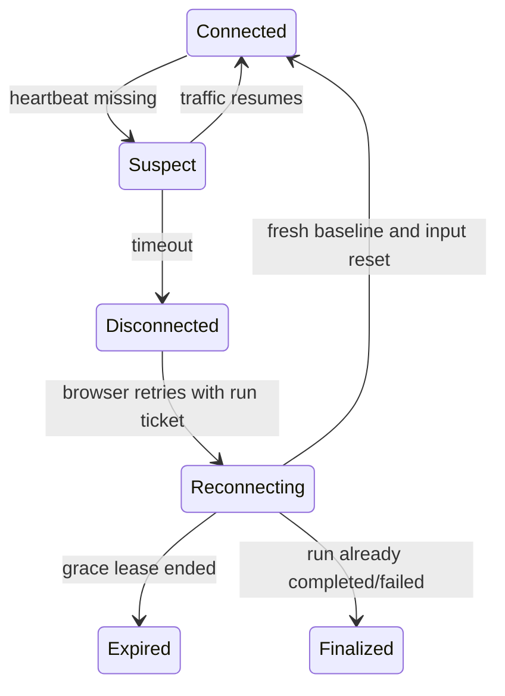

# Product, UI, and API Contracts

This document closes the gap between rules and a buildable browser product. UI and endpoint names are proposed. The released product needs original visual design and terminology.

## 1. Supported product shape

- Desktop browser first.
- Keyboard/mouse first, controller through the same intent abstraction.
- Online server-authoritative sessions.
- Installable PWA shell optional, but no offline gameplay authority.
- Solo vertical slice; parties after deterministic instance and economy integrity are proven.
- Responsive account/settings pages, fixed minimum playable viewport for combat.
- Mobile browser is a separate product decision, not a scaled-down desktop HUD.

Proposed minimum combat viewport: 1280 by 720 CSS pixels. Below it, show an explicit unsupported-play warning while still allowing account, settings, and support pages.

## 2. Product surfaces

### Account and boot

| Surface | Required states |
|---|---|
| Boot/update | Manifest check, asset progress, integrity error, retry, browser/GPU support warning |
| Sign in | Loading, invalid credentials, locked/rate-limited, MFA if enabled, recovery |
| Character select | Empty, loading, create, rename policy, migrate, delete confirmation, unavailable league |
| Character create | Original class/archetype, league/rules, name, appearance, accessibility preset |
| Region select | Measured latency, capacity, automatic recommendation, manual override |

The browser sends build, protocol, content cache, GPU/API, locale, and accessibility capabilities before entering play. It does not send unnecessary device fingerprint data.

### Hub / hideout

Required interactables:

- Map Device and Atlas.
- Stash and specialty containers.
- Identification, salvage/reforge, and original crafting workstations.
- Vendors and buyback.
- Skills, passive tree, character/equipment.
- Party/social panel when enabled.
- Trade/exchange entry when enabled.
- Waypoint/area navigation.
- Settings, help, bug report, logout.

Hub state is authoritative but low-frequency. Combat instance logic should not run merely because the player opens stash UI.

### Atlas and Map Device

Atlas layers:

```text
graph and fog
-> biome/region tint
-> node state
-> fixed landmarks and quest path
-> corruption/cleansing/fortress overlays
-> boss/content signals
-> bookmarks/search/route
-> selection and preparation panel
```

Preparation panel:

- Selected node identity, biome, status, objective, boss, fixed content.
- Waystone inventory search and sort.
- One Waystone slot and calculated area level.
- Tablet slots showing usable/locked state and contribution of unfilled slots.
- Active Master-like selector and current choices.
- Modifier provenance grouped by node, map input, tablet, passive, master, and quest.
- Total risk/reward channels.
- Revival count and special failure warning.
- Activate button with exact consumption summary.
- Disabled reason that names the failing rule.

Activation is never optimistic. UI enters `reserving`, then `generating`, then receives portals. It can cancel only while the server reports a cancellable state.

### Game HUD

Layer order:

1. World, actors, projectiles, ground danger.
2. Interactable and loot labels.
3. Player resources and action bar.
4. Boss/encounter objective and timer.
5. Minimap, party, buffs/debuffs.
6. Short combat messages and warnings.
7. Menus that may pause only in a true private pause-capable area.

Do not let React re-render on every entity snapshot. HUD subscribes to small derived stores. Babylon receives presentation snapshots directly.

### Inventory and character

- 12 by 5 inventory grid.
- Equipped items and two weapon-set tabs.
- Attribute/level requirement states.
- Character stat categories with source explanations.
- Item compare against relevant slot/set.
- Advanced tooltip: base, item level, quality, sockets, modifier tier/group/source, flags, provenance where appropriate.
- Modified-click transfers, keyboard navigation, controller focus, and server-confirmed drag.
- Pending command indicator only when latency makes it material.

On a rejected drag/craft/equip, restore from the returned authoritative container revision, not from an assumed local undo.

### Skills panel

- Main skill rows and nested/meta structures.
- Support sockets, drag/drop, compatibility highlighting, category conflicts.
- Attribute support budgets.
- Skill level, quality, cost, speed, critical, damage, ailment, cooldown, reservation.
- Weapon-set assignment and auto-swap preview.
- Persistent toggles and Spirit calculation.
- Minion quantity and Command action.
- Exact disabled reason and stat derivation.

### Passive tree

- Pan/zoom/search.
- Shortest allocation preview and total cost.
- Shared, weapon-set A, and weapon-set B layers.
- Travel attribute choices.
- Keystone tradeoff confirmation.
- Refund preview, Gold cost, and post-refund connectivity validation.
- Current and previewed stat differences.
- Atlas passive tree uses the same graph component with different point/choice policy.

### Loot filter editor

- Text editor with syntax highlighting and source-line errors.
- Live sample item preview.
- Safe hot reload: invalid version leaves previous filter active.
- Sound preview with volume limit.
- Emergency "show all" binding.
- Import/export of original syntax only where legally and technically intended.

### Trade surfaces

- Direct trade: dual offer, item inspection, capacity status, acceptance invalidated on any change.
- Commodity exchange: want/have, ratio, Gold fee, escrow, partial fill, claim, cancel.
- Equipment market: search facets, exact item inspection, price, buyer fee, purchase race result.
- Seller: listing source container, grace/cooldown, earnings capacity, claim.

Never show a purchase as successful before the authoritative fill transaction commits.

## 3. Input contract

Normalize device events into one per-tick intent:

```ts
interface InputIntent {
  sampledAtMs: number;
  move: { x: number; y: number };
  aim: { x: number; y: number };
  pressed: bigint;
  released: bigint;
  held: bigint;
  pointerWorld?: { x: number; y: number };
  hoveredEntityId?: number;
  source: "mouse-keyboard" | "controller";
}
```

Rules:

- Bind physical controls to semantic actions, never directly to skill indices in simulation.
- Support hold, toggle, and press modes where safe.
- Do not issue movement from a UI click that was consumed by a panel or loot label.
- Ground-loot interaction and combat targeting have explicit priority and modifier keys.
- Input buffer stores semantic action plus expiry and target basis.
- A device switch updates prompts without resetting held action state incorrectly.
- Browser focus loss sends an immediate neutral-input command and server remains authoritative.

## 4. Accessibility contract

Minimum requirements:

- Full key rebinding, controller remapping, dead zones, and left/right-stick swap.
- UI scale and text scale independent of render resolution.
- High-contrast labels and color-vision-safe telegraph alternatives.
- Every lethal telegraph uses at least two channels among shape, motion, color, audio, and icon.
- Reduced motion, reduced flashes, camera shake sliders, effect-density tiers.
- Separate music, ambience, dialogue, effects, UI, and loot-filter volume.
- Subtitle and combat-caption support for gameplay-critical boss cues.
- Hold/toggle options for movement, shield, persistent targeting, and item comparison where feasible.
- Keyboard and controller navigation for every noncombat surface.
- Screen-reader semantics for account/settings/support pages and structured item/passive details. Real-time combat is not claimed screen-reader playable without a dedicated design.
- Safe-zone and HUD-position presets for unusual aspect ratios.

Reduced effects must never hide ground danger, projectile identity, target tracking, or red-flash/unblockable cues.

## 5. HTTP API

All mutation endpoints accept:

- Bearer/session authentication.
- `Idempotency-Key`.
- Client build, protocol, and content manifest headers.
- Expected entity/container revision where relevant.

All return an operation ID, authoritative revisions, and structured error code.

Representative surface:

```text
GET    /v1/bootstrap
GET    /v1/characters
POST   /v1/characters
GET    /v1/characters/{id}
POST   /v1/characters/{id}/select

GET    /v1/characters/{id}/build
POST   /v1/characters/{id}/passives/preview
POST   /v1/characters/{id}/passives/commit
POST   /v1/characters/{id}/skills/configure
POST   /v1/characters/{id}/equipment/equip

GET    /v1/characters/{id}/containers
POST   /v1/items/move
POST   /v1/items/identify
POST   /v1/items/craft
POST   /v1/items/salvage
POST   /v1/items/sell
POST   /v1/items/buyback

GET    /v1/characters/{id}/atlas
GET    /v1/characters/{id}/atlas/chunks
POST   /v1/characters/{id}/atlas/bookmarks
POST   /v1/map-runs/prepare
POST   /v1/map-runs/activate
GET    /v1/map-runs/{id}
POST   /v1/map-runs/{id}/join-ticket

GET    /v1/exchange/markets
POST   /v1/exchange/orders
POST   /v1/exchange/orders/{id}/cancel
POST   /v1/exchange/claim
GET    /v1/trade/search
POST   /v1/trade/listings
POST   /v1/trade/listings/{id}/purchase

GET    /v1/content/manifest
POST   /v1/client-reports
```

`prepare` is read-like and returns a signed, short-lived preparation quote with computed slots, revives, content, warnings, and current input revisions. `activate` consumes that quote after revalidating all state.

### Error envelope

```ts
interface ApiError {
  error: {
    code: string;
    messageKey: string;
    operationId?: string;
    retryable: boolean;
    retryAfterMs?: number;
    fieldErrors?: Array<{ path: string; code: string; messageKey: string }>;
    authoritativeRevisions?: Record<string, number>;
  };
}
```

Stable codes include:

```text
AUTH_EXPIRED
CLIENT_UPDATE_REQUIRED
CONTENT_MISMATCH
REVISION_CONFLICT
ITEM_NOT_OWNED
ITEM_STATE_INVALID
NO_CONTAINER_SPACE
REQUIREMENTS_NOT_MET
CRAFT_PRECONDITION_FAILED
NODE_NOT_ACCESSIBLE
WAYSTONE_NOT_IDENTIFIED
TABLET_SLOT_LOCKED
RUN_ALREADY_ACTIVE
RUN_FINALIZED
TRADE_ALREADY_FILLED
RATE_LIMITED
SERVICE_UNAVAILABLE
```

The UI localizes `messageKey` and uses structured details. Do not expose stack traces or sensitive identifiers.

## 6. Real-time protocol

Handshake:

```text
ClientHello { protocol, build, contentManifest, areaTicket, assetCapabilities }
ServerHello { protocol, instanceId, epoch, serverTick, tickRate, baselineId, contentManifest }
BaselineSnapshot
ClientReady
```

Client to server:

```text
InputBatch
InteractIntent
ReviveIntent
PortalIntent
Ping
ClientPerformanceSample
```

Server to client:

```text
StateDelta
ReliableGameEvents
TelegraphEvents
ObjectiveUpdate
LootCreate / LootRemove
PortalUpdate
DeathResult
RunStateUpdate
ServerNotice
Pong
DisconnectReason
```

Every envelope contains protocol, instance epoch, message sequence, and server/client tick as applicable. Commands are deduplicated by input sequence and scoped to one epoch. A ticket cannot join a different run or character.

## 7. Reconnect contract



Rules:

- Client never simulates authoritative time while background-suspended.
- Reconnect sends last baseline/event acknowledgements, but server may require full baseline.
- Unacknowledged predicted actions are discarded at epoch change.
- Character remains subject to the declared disconnect policy. Do not promise immunity.
- Instance status endpoint distinguishes reconnectable, finalized, expired, and invalid ticket.
- Refreshing the page is disconnect/reconnect, not logout or automatic death.

## 8. Persistence boundaries

Persist immediately/transactionally:

- Item creation, destruction, transformation, transfer, and trade.
- Gold/currency and passive-refund costs.
- Map activation input escrow/consumption.
- Map completion/failure and permanent Atlas mutations.
- Quest/pinnacle keys and account unlocks.

Checkpoint during a run:

- Character authoritative state needed for crash policy.
- Remaining revives.
- Boss/encounter/objective state.
- Ground item identities or a recoverable reward event projection.
- RNG counters and checksum.

Presentation-only local storage:

- Keybinds before server sync.
- HUD layout.
- Graphics/audio settings.
- Cached content/assets.
- Last valid local loot-filter source, with server/cloud sync optional.

Never place authoritative inventory, item rolls, currency, progression, or run completion only in IndexedDB/localStorage.

## 9. Content/version handshake

- HTML boot loader is short-lived and asks for active build manifest.
- JavaScript, shaders, schemas, content, and assets are immutable hashed bundles.
- Server advertises accepted protocol/content range.
- Area run pins one manifest for its lifetime.
- New client waits for all required critical bundles before activation.
- Service worker does not activate an incompatible shell over an active run.
- If update is mandatory, return to a safe hub before replacing client unless a security emergency requires disconnect.

## 10. Settings and local preferences

Categories:

- Display: renderer, resolution scale, FPS cap, shadows, effects, texture quality, UI scale.
- Gameplay: movement scheme, target policy, item interaction, label behavior, damage numbers.
- Input: bindings, controller, dead zones, hold/toggle.
- Audio: buses, dynamic range, subtitles, critical-cue boost.
- Accessibility: color, flash, motion, shake, telegraph contrast, captions.
- Network: region, latency graph, diagnostics opt-in.
- Privacy: telemetry level, social visibility, data/export/delete links.

Settings changes declare `instant`, `nextArea`, or `restartRenderer` application scope. The UI explains it.

## 11. Telemetry contract

Required event dimensions:

```text
eventId, schemaVersion, occurredAt, pseudonymousAccount,
characterArchetype, levelBand, league, contentManifest,
clientBuild, browserFamily, renderer, region, runId,
areaDefinition, mapTier, encounter, partySize
```

High-value events:

- Boot/update/cache and renderer/device failure.
- Area join/reconnect/disconnect/finalize.
- Tick/frame/network percentile summaries.
- Skill action/cost-failure/cancel aggregate.
- Death cause and reaction window.
- Map input, modifier, completion/failure/duration.
- Reward source/type aggregate.
- Item generation/craft/source/sink aggregate.
- Trade order/fill/cancel aggregate.
- UI error and accessibility-setting adoption.

Do not emit every raw position or combat event to analytics. Replays for diagnostics have separate controlled retention and access. Never log credentials, access tokens, chat bodies, or private customer data.

## 12. Support and admin surfaces

Read-only by default:

- Account/character/league status.
- Run timeline, content version, checksums, reconnects, finalization.
- Item provenance and economy event chain.
- Container and listing ownership.
- Atlas node and quest mutations.
- Client/server error correlation.

Privileged mutations:

- Account lock/unlock.
- Return/refund through an explicit compensating economy event.
- Quarantine duplicated/suspicious item.
- Cancel stuck order and release escrow.
- Repair a run/quest through a reviewed command.

Every privileged mutation requires role, reason, case reference, before/after state, and audit record. Never edit item JSON directly in a database console as an operational workflow.

## 13. UX failure states

| Failure | UX |
|---|---|
| Asset bundle failed | Keep safe shell, show bundle and retry, offer lower renderer if relevant |
| Content mismatch | Do not join; update or route to compatible service |
| Map generation failed before Ready | Return escrow, retain accessible node, explain retryable failure |
| Client disconnect | Show reconnect overlay without asserting character safety |
| Instance expired | Return to hub with authoritative final state |
| Inventory revision conflict | Refresh affected containers, preserve unsubmitted local UI selection |
| Craft conflict | Show committed/rejected operation by idempotency result, never blindly retry with new key |
| Trade race lost | Return item/order state and Gold status; no generic unknown failure |
| Database/service outage | Disable mutations, avoid local optimistic ownership, keep read-only UI where safe |
| Renderer device lost | Pause presentation, rebuild renderer, request fresh baseline; server policy remains active |

## 14. Product acceptance journey

A release candidate must pass this scripted journey in each supported browser:

1. New account creates an original character.
2. Loads hub, opens stash, equips item, configures skills/supports and two weapon sets.
3. Opens Atlas, searches/bookmarks, selects reachable node.
4. Chooses and crafts a map input, adds optional content, sees exact revives and warnings.
5. Activates once and receives portals, including simulated API response loss.
6. Enters, fights with mouse/WASD/controller test profiles, completes encounter.
7. Dies during boss, reconnects after refresh, observes authoritative reset and revival budget.
8. Kills boss, completes Atlas node, receives rewards once.
9. Filters, picks up, identifies, crafts, equips, stashes, sells, and buys back an item.
10. Replays the run on developer tooling with matching checksum.
11. Simulated concurrent tab cannot move/craft/list the same item twice.
12. Reduced-effects and color-vision settings still expose every lethal cue.

That journey is the practical contract connecting all other documents.

